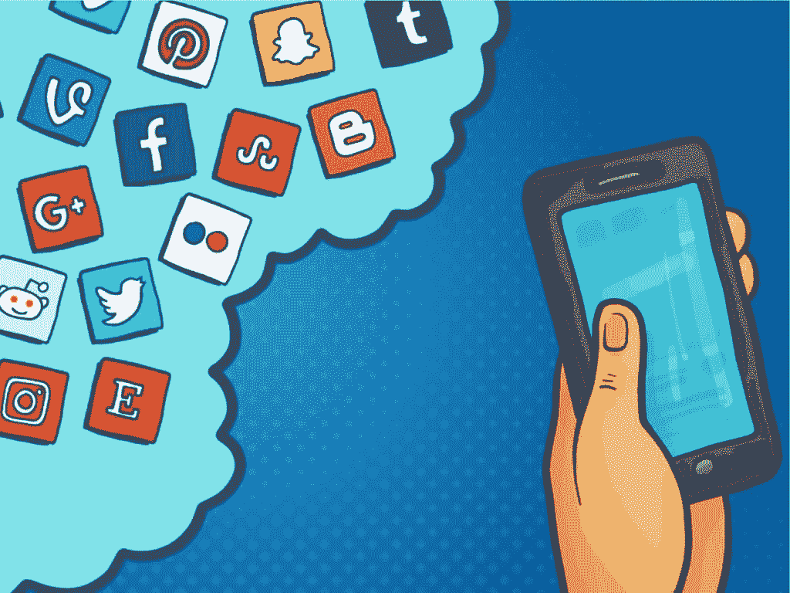

# Web 3.0 将如何改变社交媒体

> 原文：<https://medium.com/coinmonks/how-web-3-0-will-change-social-media-cb8e88ba4500?source=collection_archive---------8----------------------->

世界正在以数字化的方式发展，如果一个人不小心并意识到他们周围的技术，他们就有落后的风险。其中包括关于 web 3.0 和区块链技术在各行各业的广泛应用的讨论。

在新千年的早期，Web 2.0 取代了互联网的第一次迭代。然后，随着 21 世纪第三个十年的开始，被称为 Web 3.0 的新在线版本的想法开始成形，全球疫情成为数字革命的火花。

然后，随着 21 世纪第三个十年的开始，被称为 Web 3.0 的新在线版本的想法开始成形，全球疫情成为数字革命的火花。用户已经考虑了数据所有权的状态、安全、保密、数据隐私和其他问题。

社交媒体用户和内容创作者对 Web 3.0 社交媒体可能会如何改变他们使用这些平台的方式感到好奇。例如，一个新的 Web 3.0 社交网络会取代当前的社交网络网站吗，还是仅仅改变后端架构？

这篇文章试图理解社交媒体和 Web 3.0 之间的联系。然后，深入了解 web 3.0 如何改变社交媒体。所以，请继续阅读，发现 Web3 社交媒体的诱人机遇！

首先，Web 2.0 的存在引发了社交媒体的发展。由于互联网的 Web 2.0 版本的读写功能，用户能够在社交媒体平台上制作和分发内容。

因此，社交媒体是一种 Web 2.0 创新，有助于创建用户生成的 Web。

Web 3.0 将是 Web 2.0 的升级版，这意味着社交媒体和 Web 3.0 与 Web 2.0 共享一个连接。

Web2 社交媒体是由上一代互联网开发的，现在正在慢慢衰落，但 web3 社交媒体将与它的功能和监管平台的规则截然不同。

# Web 3.0 对社交媒体的影响

既然我们知道了 Web 3.0 和社交媒体的关系，是时候考虑新的互联网会如何改变大多数人经常使用的社交网站了。

去中心化、信息分发和所有权是 Web 3.0 的三大支柱。直到最近，大公司还会利用消费者数据进行广告宣传，并从用户数据中获取大量利润。

Web 3.0 的引入将阻止这种对客户数据的滥用，并允许从广告和营销等方面更好地重新分配财务收益。

区块链技术将通过 Web 3.0 带来社交媒体的变革。众所周知，区块链技术使得以分布式、分散的方式而不是全部在一个位置处理和存储数据成为可能。正是这项技术推动了加密货币和非金融交易。

因此，区块链技术也将推动 Web 3.0 社交媒体。Web 3.0 社交媒体将通过基于区块链的点对点社交网络促进用户参与。如果当前的社交媒体平台改变其基础架构并转向区块链技术，这种转变可能会发生。

另一方面，现有的 Web 2.0 社交媒体平台也很有可能被新的社交网站所取代，这些网站在去中心化和信息所有权的指导原则下运营。

# Web 3.0 社交网站

现在让我们来研究一下 Web 3.0 社交媒体平台可能是如何运作的，以及它可能有哪些独特的功能。

所有 Web 3.0 社交网络应用程序本质上都包括这三个关键组件。下面已经提到并解释了这些。

**数据隐私**

在 Web 3.0 社交媒体中，数据隐私意味着没有第三方会介入用户的事务，包括他们共享什么以及如何共享。因此，用户可以行使他们的选择自由，保护他们的数据隐私，只披露他们觉得舒服的信息。

保护个人信息的能力也有助于解决 Web 2.0 带来的对自由表达的限制，在 Web 2.0 中，内容受到高度监管和操纵。在 Web 3.0 社交媒体上，人们可以随心所欲地发布自己的作品，向任何人表达自己的观点，而不用担心被举报或屏蔽。

**分权**

区块链技术的分散结构将最小化 Web 3.0 社交媒体的垄断性质。因此，用户将对他们共享和接收的信息有更多的自由和控制。

分散自治组织(Dao)将确保平台的接受和使用规则完全由用户社区定义和驱动，而不是由公司监管。

**WEB 3.0 币**

社交媒体平台可能会使用 web 3.0 硬币或加密货币来激励用户、内容创作者和影响者。因此，有很多机会探索 Web 3.0 社交媒体和加密货币的世界。

例如，在这些平台上拥有个人资料的人可能会收到创建账户的硬币。此外，他们可能会在类似于 Web 2.0 的 Web 3.0 社交媒体上交换物品或购买以他们喜欢的个性为特色的货币。

此外，Web3 社交媒体平台不会遇到任何黑客问题。这是因为不需要外部团体。

此外，每个参与节点都会在信息或事务通过网络分发之前对其进行验证。因此，试图入侵系统变得非常具有挑战性。

# 挑战

虽然 Web 3.0 提供了一些好处，但它也带来了一些困难，如果没有得到充分解决，这些困难可能会对 Web 3.0 社交媒体和其他系统产生不利影响。

用户需要提升技能，熟悉使用 Web 3.0 的新技术，鉴于人类适应变化的挑战性，这可能会很棘手。

这些技术的复杂性和错综复杂性带来了另一个困难。初学者可能会发现浏览平台和管理内容很有挑战性。

网络犯罪可能源于无法恰当利用 Web 3.0 生态系统的功能。例如，它可能从言论自由的理念发展而来，因为如何监管内容将因人而异。因此，在发布某些信息之前，用户应该考虑发布这些信息会对网站的其他用户和社会产生什么影响。

最后但同样重要的是，考虑到 Web 3.0 将会变得如此庞大和相互关联，用户数据(包括公共和私人数据)有可能变得更加容易获取。因此，Dao 必须有一个不同的功能框架来防止这种担忧。

# 未来

如果与接受和使用 Web 3.0 相关的问题得到透明和合理的处理，web 3.0 社交网络可能会有一个充满希望的未来。

除此之外，技术爱好者、专业人士和普通大众都对这项技术致力于解决的问题和为人们提供的服务大加赞赏。Web 3.0 社交媒体的导向是希望将权力和控制权从大型企业转移到社区。

让我们假设这已经完全显现了。在这种情况下，由基于区块链的点对点 Web 3.0 生态系统支持的社交网络可能会发展出一个强大的创作者经济，并真正赋予创作者权力。

在 Web3 社交媒体完全成型之前，一些技术问题必须得到解决，以防止错误或犯罪；这只有在掌握了技术之后才能实现。

许多公司已经开始了针对 Web3 社交媒体的项目，所以一些东西可能很快就会出现。

> 交易新手？试试[加密交易机器人](/coinmonks/crypto-trading-bot-c2ffce8acb2a)或者[复制交易](/coinmonks/top-10-crypto-copy-trading-platforms-for-beginners-d0c37c7d698c)