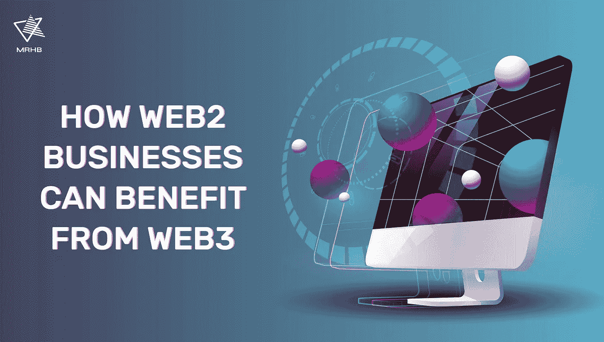

# Web3 如何让 Web2 公司受益

> 原文：<https://medium.com/coinmonks/how-web3-can-benefit-web2-companies-a377ba440f97?source=collection_archive---------10----------------------->

随着万维网的发展，企业也在发展。那些在网上存在的人很可能已经与互联网的 web2 版本进行了互动。从电子商务到社交媒体，web2 公司已经将业务发展到了更高的水平，赢得了利润、声誉和客户忠诚度。但是，随着新一轮互联网的出现，即 Web3，似乎有更多的机会进一步扩展 web2 公司的业务。

# 什么是 Web3？

Web3 是互联网的**读写拥有**版本，其中数据是分散的。它由互连的节点组成，没有中央服务器。等等，在 web3 上，数据归用户所有，而不是一个集中的实体。然而，请注意这个概念不同于 Web 3.0 语义网，语义网在这里[有更详细的解释。](/@mrhbdefi/intro-to-web3-decentralized-web3-vs-web-3-0-semantic-web-db3bc46458de)

# Web2 和 Web3 的区别

Web2 被称为**读写**网络。数据保存在中央服务器中，由中央机构控制。想想脸书、推特和 Etsy。虽然你可以在这些平台上互动和分享信息，但这些平台上的数据不属于你。

更重要的是，你发布的内容可以被这些公司跟踪和货币化，即使你是在这些 web2 平台上运营的企业。如果出于某种原因，这些平台中的一个关闭了，你就不太可能检索到任何数据。

相比之下，web3 允许你这个用户**完全拥有和访问你的数据**。简而言之，web3 让你控制数据所有权和货币化。本质上，你是老板。

# Web3 的支柱——区块链

没有区块链技术，Web3 实际上什么都不是。这使得数据所有权成为可能。

作为一种分布式账本技术，区块链支持这些关键方面:

*   **分布式:**网络上的每个人都将拥有整个链的副本。
*   **分类账:**追踪双方之间的价值交换，数据一旦写入分类账就不可改变。
*   **安全:**密码技术保护和验证交易。
*   **共享:**交易通过点对点网络进行，无需中介。

由于区块链技术的核心概念是它是分散的，因此可以加速数据传输和验证过程。

没有了中介，不仅交易速度加快了，而且用户还可以选择如何呈现正在传输的数据。

对于每一份数据，他们可以选择披露哪些信息并验证其真实性。这使用户能够安全快速地共享特定数据，而不会泄露机密信息。因此，[数据所有权](https://www.thedigitalspeaker.com/blockchain-give-consumers-ownership-data/)已经被放回到用户手中，而不受中央实体的干涉。

# Web2 公司已经在 Web3 上

Web2 主要由像 [FAMGA](/quantum-economics/famga-what-we-learned-in-2016-from-the-5-big-mega-cap-tech-companies-39ca2edfe8a1) 这样的主要科技公司控制，这些公司垄断了用户在网络上的互动方式。然而，分散化的技术潜在地创造了根除他们统治的机会。

有了 web3，可以创造一个更加**可信的环境**，隐私的概念**真正得到尊重**，控制权**在用户自己之间分配**。

web3 上的数字资产可以通过网络传输，因此在资产所属的平台之外也是有价值的。因此，花费在购买数字资产上的资源不会被浪费，并且资产本身通常不会贬值或失去价值。

对于艺术家来说，这给了他们一个不同的金融模式的机会，在这种模式下，他们的艺术被货币化，并获得很高的回报。NFT 最大的市场之一 OpenSea 在 2021 年创造了 100 亿美元的巨大销售额。

FAMGA 公司虽然垄断了 web2 领域，但正在利用新生的 web3 机会。虽然他们仍然以集中的方式运作，但他们在 web3 上的互动必须是分散的。这些公司似乎正在测试一种与互联网的两次迭代互动的混合方法。

**fam ga 公司是如何采用 web3 技术的？**

*   **脸书:**他们将赌注完全押在了元宇宙身上，并将公司的名字更名为“Meta”。该公司还推出了自己的 stablecoin，Diem，并发布了 Novi wallet，允许用户在平台上交易 Paxos stablecoins。然而，Meta [在 7 月](https://techcrunch.com/2022/07/04/meta-novi-pilot-ends/)停止了这个项目。
*   Twitter: 他们引入了允许用户用加密货币奖励他们最喜欢的创造者的概念，并计划发布其他加密和基于 NFT 的功能。
*   Instagram: 他们刚刚[推出了数字收藏品](https://about.instagram.com/blog/announcements/instagram-digital-collectibles)来支持创作者在平台上展示非物质文化遗产。

这些大型科技公司逐渐接受了 web3 领域的最新发展，以及它对公司未来的重要性。作为对竞争对手的领先，他们已经开始将 web3 的特性整合到他们的业务结构中，并致力于无缝过渡到新版互联网。

# Web3 的商业潜力

虽然 web2 公司一直在推动创作者使用 NFTs 来制作和销售数字艺术，但事实上 web3 上有更多的商业机会可以探索。

这里有一些例子。

## 区块链供应链管理

**数据透明性和不变性**是区块链技术最吸引供应链管理行业的两个方面。消费者普遍意识到道德和可持续生产的必要性。因此，他们要求公司在产品来源和制造商方面透明。

[Providence 利用区块链技术](https://www.provenance.org/solutions)提供关于产品来源及其对人类和地球影响的可访问、可信赖的信息。他们与那些希望通过使用区块链技术的供应链数据来证明其影响力的公司合作。

## 艺术之外的 NFTs

不可替代代币或 NFT 是在区块链上唯一可识别的资产。与其他加密令牌不同，NFTs 使用一段代码来使每个资产都是唯一和可区分的。简单来说，NFT 是可以用来证明基本上任何东西的所有权的资产。

**几种** [**NFT 用例**](https://gregskril.com/blog/nft-uses/) **包括:**

*   一项活动的门票
*   公司的股权
*   对品牌的忠诚度
*   视频游戏中的虚拟资产
*   俱乐部的独家会员资格
*   VIP 客户专属商品

对于 web2 公司来说，使用 NFTs 可能会解决复制和验证的问题。此外，依赖视频游戏和在线活动等虚拟服务的 web2 公司可以利用 NFTs。

# NFT 商业发展市场

在 MRHB，我们正在建立一个**完全去中心化的财务解决方案**，该解决方案维护基于伊斯兰原则的道德价值观。其中一个解决方案是 [Souq NFT](https://mrhb.network/ecosystem/souq-nft) 市场，用户可以在这里制造和销售 NFT。

在撰写本文时，我们正在构建一个新版本的 Souq NFT，它将提供**多样化的产品**，包括但不限于铸造灵魂绑定令牌(SBT)，用于游戏赚取的 NFT 资产，以及企业之间合作创建特定用例的 NFT 的平台。这些产品预计将于明年年初上市。

与此同时，您可以在[**Souq NFT**](https://souq.mrhb.network/)**上探索和购买现有的 NFT 艺术收藏，这些收藏没有负面内容，如裸体、成人内容、仇恨言论和种族主义。你也可以开始在市场上铸造你自己的 NFT 和 SBT。**

> **交易新手？尝试[加密交易机器人](/coinmonks/crypto-trading-bot-c2ffce8acb2a)或[复制交易](/coinmonks/top-10-crypto-copy-trading-platforms-for-beginners-d0c37c7d698c)**