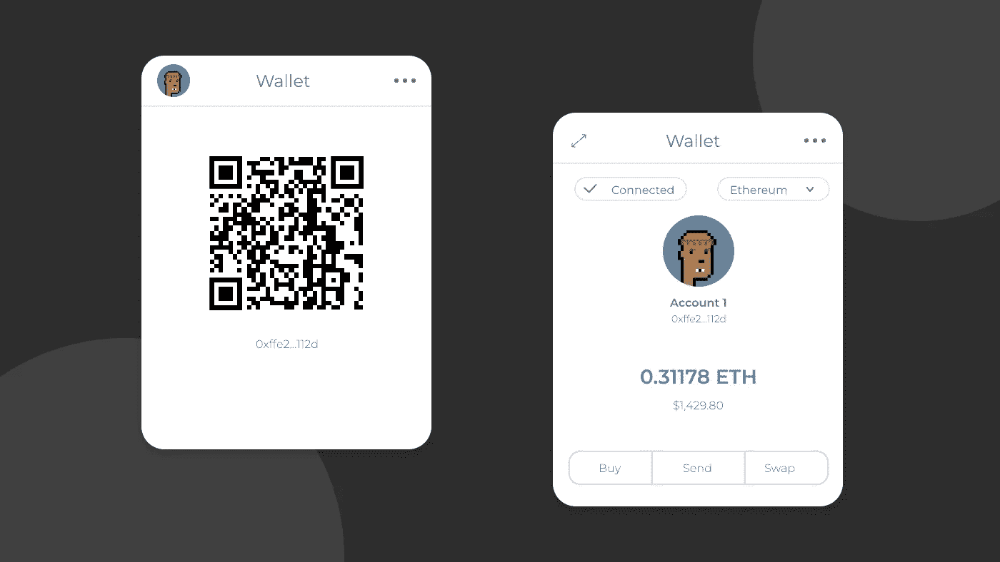

# web3 如何改变支付方式

> 原文：<https://medium.com/coinmonks/how-web3-is-changing-payments-494d6b87b0bb?source=collection_archive---------1----------------------->

[Web3](https://www.leewayhertz.com/web3-development-company/) 是下一代 Web 开发，它可以产生深远的影响，尤其是在金融解决方案方面。在 web3 支付中，去中心化技术让用户控制技术，而不是特定的公司或政府。虽然互操作性更强，但这一版本的互联网提供了更高的数据安全性，并消除了集中式中介。

web2 和 web3 支付基础设施的主要区别是去中心化，web2 的支付基础设施依赖于集中式银行系统，将没有正式银行账户的人排除在外。另一方面，每个人都可以使用区块链和加密货币进行 web3 支付，而不需要中介。

全球许多支付提供商一直在测试 web3 支付，Paypal 就是这些支付提供商之一。根据 2022 年初的报道，Paypal 不仅计划通过其支付轨道实施区块链技术，还计划允许加密货币通过其平台进行交易。

# 为什么 web3 是支付的未来？

Web3 支付使资金转移不需要通过中介公司。它完整地保留了平台的隐私和民主。匿名、快速、安全地汇款很容易。Web3 支付是点对点的交换，这意味着没有中介来处理支付。这消除了对大型技术公司基础设施的需求。

Web3 将减少货币和金融中的官僚主义，因为它允许人们在没有注册金融服务的情况下向他人汇款。Web3 数据经过加密，确保了用户在互联网上的数据和交易细节安全。

Web3 支付还可以增加人们可以兑换和持有的货币数量，在法定货币之外开辟新的金融机会。以加密货币和其他货币支付的能力将使投资和进入金融市场变得更加容易。

Web3 支付也快得多，因为没有官僚主义。Web2 支付可能需要几天时间，而区块链支付只需几分钟或几秒钟。web3 支付系统简化了国际转账，消除了兑换复杂货币和支付高额汇款费用的需要。正是分散金融使用安全的分类账来记录资金流动，并试图对抗对银行等大型金融机构的控制。

# 什么是 web3 支付基础设施？

Web3 支付是分散的，没有许可，这使得使用它的 dApps 免受金融审查。只要有互联网连接，全球任何人都可以获得这些产品和服务。新的网络还通过开源带回了早期互联网的精神，这意味着任何人都可以对代码库做出贡献。每个人都有编程、创新和连接的自由，因为没有一个集中的实体可以控制网络。

Web3 的支付基础设施也是不可信的，参与者可以公开和私下相互交流，不需要第三方。没有中间人，但智能合约是可自我执行的，只有在满足某些条件时才会运行。

互操作性是构建 web3 基础设施的另一个重要原则，它允许不同平台和应用程序之间的移动性和连接性。这也是加速采用 web3 的一个关键步骤。

# web3 支付的特点

*   如今的支付系统比以往任何时候都更加复杂，高处理费用与长结算时间相关联。Web3 提供了快速的翻译速度、高安全性、抗审查性和足够的报酬，作为破碎的菲亚特支付系统的替代方案。
*   Web3 支付工作提供了一个分散的、无许可的协议，允许 dApps 在其上构建。因此，它们不受金融审查的影响。所有这些产品和服务都可以由世界上任何一个有互联网连接的人使用。
*   信任是 web3 支付基础设施的另一个优势，参与者可以在没有第三方帮助的情况下私下和公开地相互交流。智能合约是自动执行的，只有在满足某些条件时才能运行。
*   互操作性是构建 web3 基础设施的另一个关键原则，它允许不同应用程序和平台之间的移动性和连接性。

# web3 支付服务是如何工作的？

您可以通过以下方式进行 web3 支付:

Web3 钱包可用于存储可替换和不可替换令牌(NFT)中的数字资产。它还允许用户与不同区块链的 dApps 进行交互。

Web3 钱包可用于不同的区块链，因为-

*   浏览器钱包
*   浏览器扩展
*   手机钱包(Android 和 iOS dApps)

为了存储数字资产，用户可以在 web3 钱包中创建账户。web3 钱包帐户配有一对私钥和公钥。帐户的公钥是其地址，可用于发送/转移令牌或其他资产。它不易被他人分享。私钥可以用作密码来执行相关钱包中的任何交易。为了避免安全漏洞，这是一个不能与他人共享的代码。此私钥可以将现有帐户导入 web3 钱包。任何 web3 钱包都允许用户创建和管理多个账户。浏览器扩展是与 web dApps 一起使用的最流行的 web3 钱包类型。

以太坊、Paypal 和 OpenSea 是一些用户可以利用的 web3 支付平台。

# 结论

Web3 支付使企业能够跟上技术进步，并为他们提供了一种满足客户需求的方式。实现 web3 支付需要耐心和丰富的经验。Web3 支付是增加收入的好方法

> 加入 Coinmonks [电报频道](https://t.me/coincodecap)和 [Youtube 频道](https://www.youtube.com/c/coinmonks/videos)了解加密交易和投资

# 另外，阅读

*   [加密复制交易平台](/coinmonks/top-10-crypto-copy-trading-platforms-for-beginners-d0c37c7d698c) | [五大 BlockFi 替代品](https://coincodecap.com/blockfi-alternatives)
*   [CoinLoan 点评](https://coincodecap.com/coinloan-review)|[Crypto.com 点评](/coinmonks/crypto-com-review-f143dca1f74c) | [火币保证金交易](/coinmonks/huobi-margin-trading-b3b06cdc1519)
*   [Bybit vs 币安](https://coincodecap.com/bybit-binance-moonxbt)|[stealth x 回顾](/coinmonks/stealthex-review-396c67309988) | [Probit 回顾](https://coincodecap.com/probit-review)
*   [顶级付费加密货币和区块链课程](https://coincodecap.com/blockchain-courses)
*   [加密交易机器人](/coinmonks/crypto-trading-bot-c2ffce8acb2a)|[P2E NFT 15 大游戏](https://coincodecap.com/p2e-nft-games)