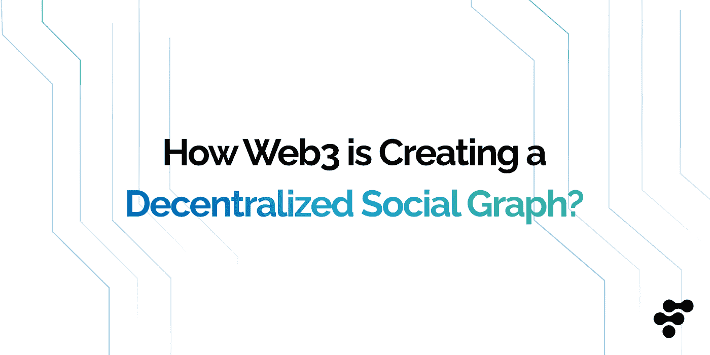

# Web3 是如何创建一个分散的社交图的？

> 原文：<https://medium.com/coinmonks/how-web3-is-creating-a-decentralized-social-graph-69325d0f400d?source=collection_archive---------6----------------------->

## Web3 社交图正在演变成一个庞然大物，以去中心化的方式赋予数据安全、隐私和所有权。

你见过蜗牛拖着它的粘液吗？

人类就是这样在这个世界上创建社交图谱的。这是一条光滑的小径，将我们和最亲近的人联系在一起，展示了我们是如何联系在一起的。但今天人类创建社交图的方式并不是去中心化的，也缺乏隐私保护。Web3 就是来改变这一点的。

在这篇文章中，我们将探索 Web3 如何创建一个分散的社交图，为我们的[数据](/kindeck-social-app/digital-data-ownership-in-the-current-world-is-decentralization-via-blockchain-technology-the-e1bf9ce57cef)提供隐私保护和增强安全性——这在当前的集中式模型中是不可能的。

# 什么是社交图？

自从脸书的联合创始人马克·扎克伯格、[在 2007 年脸书 f8 活动中使用了](https://about.fb.com/news/2007/05/facebook-unveils-platform-for-developers-of-social-applications/)这个词后,“社交图”一词开始流行。扎克伯格描述了他的使命，即让世界更加开放，让[连接](https://www.cnet.com/tech/computing/zuckerbergs-vision-realized-one-graph-to-rule-them-all/)和*“让人们有能力分享他们想要的任何东西，并与他们想要的任何人联系，无论他们在哪里。”*

这就是社交图的本质。这是人与人之间的关系以及他们是如何联系在一起的视觉表现。它提供了对个人的社会联系和与他人的互动的洞察。

在 Web3 中，社交图是一个分散的数据库，存储关于个人及其相互关系的信息。它使用户能够控制他们的数据，并确保他们的隐私得到保护。

# 社交图是如何工作的？

每当有人用社交媒体应用程序创建新账户时，该平台就会根据注册时提供的信息搜索他们可能认识的其他人。该应用通过建议感兴趣的话题并记录在平台上浏览的所有内容来了解他们的偏好；这包括互动、点赞、评论等等。基于所有这些数据，创建了一个以用户为中心的社交图，由兴趣、人际关系和生活习惯组成。

社交图是特定社交媒体平台上个人之间所有关系的地图。因此，如果你在 Instagram、Twitter 或脸书上，你的活动会以一种系统化的方式记录和存储，将你与其他用户和第三方企业联系起来。

# Web2 社交图的当前问题

过去十年，集中式 Web2 社交图模型统治了世界，没有属于用户的数据，也没有监管政策。乍一看，这似乎不是一个大问题；然而，更深入的分析揭示了几个缺陷。原因如下:

**用户隐私**

社交媒体平台通过监控用户的在线行为来收集他们的数据。然后他们将这些用户数据出售给第三方以获取利润。例如，仅在 2022 年第二季度，脸书或 Meta 就从[出售用户数据](https://www.shacknews.com/article/131577/facebook-meta-q2-2022-ad-revenue-came-in-at-2815-billion#:~:text=Facebook%20%28META%29%20has%20dropped%20its%20Q2%202022%20financial,price%20per%20ad%20decreased%20by%2014%20percent%20year-over-year.)中获得了 281.5 亿美元的广告收入。此外，[剑桥分析](https://www.nytimes.com/2018/04/04/us/politics/cambridge-analytica-scandal-fallout.html)丑闻揭露了关于自称“社交图谱”领导者的令人不安的事情。这使得用户隐私受到威胁，因为这些 Web2 平台的主要收入来源是他们的用户本身！

在 Web3 中，用户可以完全控制他们的数据，这意味着他们的信息的隐私和安全不受影响。最近的一个例子是 [Polygon ID](https://polygon.technology/blog/introducing-polygon-id-zero-knowledge-own-your-identity-for-web3) ，它将隐私作为一个基本功能，允许每个人匿名访问应用程序，对自己保密，不需要任何中介来执行用户交互。

**数据所有权**

当您在 Web2 社交媒体平台上注册时，您是否阅读过“用户服务协议”或“隐私政策”？如果你仍然需要，让我们告诉你，这些强制性的签名删除你拥有你的数据的权利。这些平台甚至有权规定使用和处理您的数据的条款，这给那些容易因为任何特定内容或语言不恰当的反复无常的观点而被禁止的个人带来了危险。在这个名为“安全、隐私和 Web 2.0”的 IBM 调查中，很明显，用户甚至不会访问他们的在线安全和隐私受到损害的网站。

这项调查是一个明显的例子，说明了 Web2 平台将如何改变，以屈从于去中心化的 Web3 平台，这些平台使用户能够将数据所有权掌握在自己手中。要了解更多细节，你可以阅读这篇[文章](/kindeck-social-app/digital-data-ownership-in-the-current-world-is-decentralization-via-blockchain-technology-the-e1bf9ce57cef)，其中我们讨论了日益严重的数据所有权问题以及 Web3 如何(试图)解决这个问题。

**数据集中存储和数据泄露**

Web2 社交图模型的核心问题是所有用户数据都存储在一个集中的数据库中，这使得它容易受到网络攻击和数据泄露。由于黑客攻击或泄露导致的数据丢失是公司在使用在线模式时面临的一个重大风险，Web2 社交媒体平台也不例外。一个很好的例子是我们上面提到的剑桥分析丑闻，数百万脸书用户的数据被滥用于个人利益。

分散数据存储的一个光辉例子是 [IPFS](https://ipfs.tech/) ，一个对等超媒体协议。IPFS 的宏伟目标是在促进开放环境的同时，让每个人都能更方便、更快捷、更安全地访问互联网。该系统允许用户通过向每个用户提供他们在区块链世界中的节点(服务器)来存储和共享内容。此外，这种结构允许任何人在 IPFS 上存储网站，以避免审查或单点故障。

# Web3 是如何创建一个去中心化的社交图的？

Web3 的主要目标是将数据所有权分散并归还给用户。使用区块链技术和链上身份，用户数据变得由用户而不是社交媒体平台控制。这剥夺了社交媒体巨头对用户信息的权力，并将控制权交还给人民，他们从第一天起就应该成为他们数据的所有者。这意味着用户有权决定是否与他人分享他们的数据。他们还可以通过向第三方出售数据来赚钱，就像 web 2.0 社交媒体平台一样。

去中心化和分布式是 Web3 的关键特征，因为社交图存储在多个区块链节点上。尽管这些图表是公开的，但用户可以完全控制他们的数据，并决定与谁分享数据。由于 Web3 社交图提供自我主权身份，最大限度地保证了每个用户的隐私。Web3 允许用户跨区块链平台无缝共享数据或社交图表，而无需每次都重建数据。这给了用户更多的自由来选择最适合他们需求的应用程序、社区文化和策略。

# Web3 社交图是如何发展的？

Web3 社交图仍处于发展的早期阶段。随着区块链技术的不断发展，开发人员正在开发更多支持 Web3 社交图的应用程序。去中心化世界中的一些很好的例子展示了社交图是如何去中心化的。

**1。镜头协议**

Aave 团队与*一起推出了 Lens Protocol，“Lens Protocol 的目的是让创作者拥有他们自己和他们社区之间的联系，形成一个完全可组合的、去中心化的社交图。”* [Lens Protocol](https://www.lens.xyz/) 是一个社交图，允许创作者在去中心化的互联网上拥有自己的内容。与 Web2 社交媒体平台不同，Lens 使创作者能够与他们的社区建立联系，并形成用户拥有的社交图。该协议旨在实现模块化，允许添加新功能和修复，同时确保用户拥有的内容和社交关系不变。

随着主要参与者开始加入分散平台，Lens 协议在加密世界中越来越受欢迎。

**2。网络连接协议**

CyberConnect 协议旨在赋予 Web3 社交网络去中心化、不受审查和自我管理的权力。为了做到这一点，他们正在建立一个新的去中心化社交图协议——一个任何区块链都可以使用的 Web3 基础设施。

他们的目标是让去中心化的社交图谱成为可公开访问的、自主的、区块链不可知论的、令牌激励的、具有隐私保护功能的。他们的生态系统已经包含了主要项目，包括 Mask，zk。林克和许多其他人。

**3。Steemit**

[Steemit](https://steemit.com/) 是一个社交媒体平台，使用区块链技术奖励用户创作和管理内容。它是一个建立在 STEEM 区块链上的分散式应用程序(dApp ),使用本地加密 Steem 作为其货币。

通过对 Steemit 上的帖子进行投票，用户帮助将硬币分发给那些为网络创造价值的人。尽管有人对投票的权重和价值提出了批评，但 Steemit 试图根据投票和发帖的感知价值来奖励它们。

用户在 Steemit 上创建的内容归他们所有，托管在区块链 Steem 上。这意味着用户可以完全控制自己的数据，并可以选择与他人分享。话虽如此，凯文先生说得有道理吗？

**4。亚社会**

[Subsocial](https://subsocial.network/) 是一个为未来设计的社交网络平台。这个平台上的应用程序将拥有集成的货币化方法，并能抵抗审查，同时用户保持对其内容和数据的所有权。Subsocial 建立在 Dotsama 生态系统的基础上，明确设计用于社交互动。这些互动不一定局限于社交网络；Subsocial 也可以支持 YouTube、Shopify 或 Airbnb 等应用。

波尔卡多特和草间弥生的创始人加文·伍德[说](https://docs.subsocial.network/):*“Subsocial，一套基于 IPFS 的社交网络工具看起来棒极了。有一些想法已经摆在桌面上，为草间弥生，也许还有波尔卡多特，治理平台提出这个目标。我认为这正是我们将在 2020 年通过波尔卡多特和草间弥生国债看到的越来越多的支持。”*

**5。分散社交**

DeSo 是新的第 1 层区块链；它的创建是为了分散社交媒体，以便数十亿用户能够拥有更多控制权。DeSo 的目标是赋予互联网一种力量，在这种力量中，创造者掌控一切，用户拥有自己的数据，而想要利用他人成果的开发者也没有任何障碍。Web3 应用程序开始在 DeSo 上建立自己的社交存在，允许用户控制他们的数据，并促进区块链的隐私。

**6。Mirror.xyz**

忘记媒介；这是一个分散的、抵制审查的博客平台，为你的内容支付加密费用。无论你是想发布以下大型白皮书，还是想给你的社区一个每周更新，Mirror 强大的发布平台都可以帮助你在没有障碍的情况下拓展在线写作的边界。

Mirror.xyz 利用以太坊区块链让作家从他们的创作中赚取加密货币，并通过不可替代的代币(NFT)为这些项目寻求资金。这个系统允许非交易证券的持续交易和代表作者的持续收益。

> 交易新手？尝试[加密交易机器人](/coinmonks/crypto-trading-bot-c2ffce8acb2a)或[复制交易](/coinmonks/top-10-crypto-copy-trading-platforms-for-beginners-d0c37c7d698c)
> 
> 多样化的密码持有，了解币安的选择
> 
> 加入 Coinmonks [电报频道](https://t.me/coincodecap)和 [Youtube 频道](https://www.youtube.com/c/coinmonks/videos)获取每日[加密新闻](http://coincodecap.com/)

# 另外，阅读

*   [复制交易](/coinmonks/top-10-crypto-copy-trading-platforms-for-beginners-d0c37c7d698c) | [加密税务软件](/coinmonks/crypto-tax-software-ed4b4810e338)
*   [网格交易](https://coincodecap.com/grid-trading) | [加密硬件钱包](/coinmonks/the-best-cryptocurrency-hardware-wallets-of-2020-e28b1c124069)
*   [密码电报信号](/coinmonks/top-3-telegram-channels-for-crypto-traders-in-2021-8385f4411ff4) | [密码交易机器人](/coinmonks/crypto-trading-bot-c2ffce8acb2a)
*   [最佳加密交易所](/coinmonks/crypto-exchange-dd2f9d6f3769) | [印度最佳加密交易所](/coinmonks/bitcoin-exchange-in-india-7f1fe79715c9)
*   开发人员的最佳加密 API
*   最佳[密码借贷平台](/coinmonks/top-5-crypto-lending-platforms-in-2020-that-you-need-to-know-a1b675cec3fa)
*   [免费加密信号](/coinmonks/free-crypto-signals-48b25e61a8da) | [加密交易机器人](/coinmonks/crypto-trading-bot-c2ffce8acb2a)
*   [杠杆代币](/coinmonks/leveraged-token-3f5257808b22)终极指南