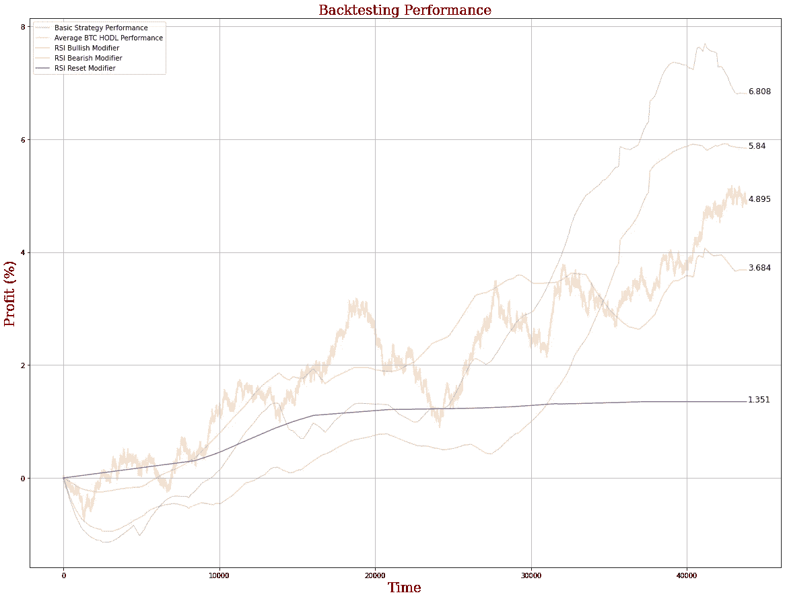
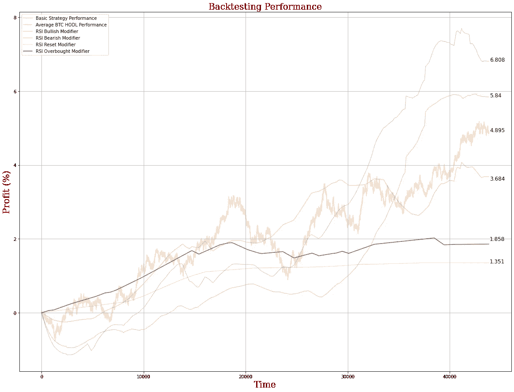

# RSI 对比特币的表现如何？

> 原文：<https://medium.com/coinmonks/how-well-does-the-rsi-perform-for-bitcoin-549cb81daa00?source=collection_archive---------13----------------------->

## 相对强弱指数是加密交易中最受欢迎的指标之一。我们的专业数据科学家对其进行了回溯测试，以确定其实际工作情况。

当谈到加密货币交易时，在大量的时间线上有无数的指标可以用来确定何时买入或卖出。有些简单，许多复杂得多，但全球交易者最常用的指标之一是相对强弱指数(RSI)。

你可以在这里[了解更多关于 RSI 是什么以及它是如何工作的](https://www.investopedia.com/terms/r/rsi.asp)，因为这篇文章的目的不是解释性的——相反，我们将根据 RSI 对我们的一些专有交易策略进行回溯测试，以确定众所周知的 RSI 信号是否真的是交易比特币的有用信号。

*注意:这篇博客文章不应该被解释为金融建议，交易加密货币本身就有风险。不要冒险超过你能承受的损失。*

# 对指标进行回溯测试

在不深入研究 RSI 如何工作的情况下(你可以自己做)，我们将讨论我们的回溯测试策略。我们将利用我们的一种专有交易算法，这种算法已经在各种市场环境中经过严格的回溯测试，我们知道这种算法从长远来看是有利可图的。

我们不会讨论 bot 是如何工作的，但它使用一种相对简单的方法来根据最近的历史表现确定资产的预期价值，并在当前价值偏离预期价值太远时执行交易。这个策略相对来说比较基础，还有很多需要改进的地方，所以我们不会关注我们的策略本身，而是关注 RSI 如何影响它的表现。

不过我要提到的一点是，这个机器人根据其最近的利润来确定其头寸大小，因此如果它最近盈利，它就会开始下注更多，直到它停止盈利，这给了它在牛市中的动力。

当回测一个加密交易机器人时，将你的策略与“买入 HODL”策略进行比较是很重要的，即只买入 BTC 并持有相同时间。随着时间的推移，BTC 的表现已经是天文数字——购买并长期持有几乎总是更好的选择。

因此，如果你想积极交易，你应该确保你的策略始终优于买入并持有。

> 交易新手？尝试[加密交易机器人](/coinmonks/crypto-trading-bot-c2ffce8acb2a)或[复制交易](/coinmonks/top-10-crypto-copy-trading-platforms-for-beginners-d0c37c7d698c)

## 适当的回溯测试条件

在各种条件下对你的策略进行回溯测试是至关重要的。在这篇博文中，我们选择了 2017 年 8 月至 2022 年 6 月之间的 100 个随机周期(或“窗口”)，时间为一个月(30 天)，基于从币安收集的 BTC 数据。

这些时段不一定与月初或月末一致，因此每周/每月蜡烛线收盘的影响被最小化。每个窗口开始于一个随机的时间点，这意味着它可以是牛市或熊市周期的开始、中间或结束。

首先，我们来看看 BTC 在这 100 个随机窗口中的平均表现，看看“买入 HODL”的平均回报率是多少:

正如你在上面看到的，购买并持有 BTC 通常是有利可图的。事实上，当我看到随机 100 个月的平均月回报率接近 5%时，我感到有点惊讶——这是相当高的！

请记住，**我们使用的窗口比我们的数据集**中的月份还要多，这导致了*重叠*。这不一定总是一件坏事，但重要的是要确保你的窗口间隔相对均匀，否则，如果多个窗口紧密对齐，你可能会放大特定的时间范围。

我们的目标是在各种条件下创造比这更有利可图的东西，这就是我们的专有机器人进入的地方…

## 交易机器人条件:

我们的盈利交易策略大约每周执行 14 次，或者每 12 小时左右执行一次，这意味着这不是日内交易或做市策略。因此，我们的时间范围是整整 1 个月，这是我们将要进行的回溯测试。

我们目前执行的机器人没有以任何方式、形状或形式考虑 RSI——因此引入 RSI 条件可以帮助说明 RSI 是否是交易的信息性和有用的指标。

此外，对于每个随机窗口，我们将比较机器人的性能与“购买和 hodl”策略，这意味着我们的机器人性能和 BTC 之间的差异将被考虑在内。这样我们可以证明我们的策略(平均而言)优于买入并持有 BTC。

在所有上述情况中，我们将 A/B 测试我们的 bot 自身的性能，并与考虑了以下 1 天 RSI 条件的 bot 进行比较。

## RSI 条件:

我们将对以下 RSI 条件进行回溯测试:

*   仅在“RSI 看涨”区域交易，但不在超买区域交易，即高于 50 水平，低于 70 水平。
*   仅在“RSI 看跌”区域交易，但不在超卖区域交易，即高于 30 水平，低于 50 水平。
*   仅在 1d RSI 最近“重置”在 50 水平时买入(在过去 14 天内)
*   仅在 1d RSI 处于超买区域(高于 70 水平)时卖出
*   仅在 1d RSI 处于超卖区域(低于 30 水平)时买入

这 5 个条件测试了 RSI 的大多数已知信号(除了背离之外),应该足以确定 RSI 在一段时间内的表现如何。

让我们深入了解一些结果…

首先，让我们看看我们的自营策略与在相同时间框架内买入并持有 BTC 的结果:

在这个图中，我们可以看到，在一个月的时间里，我们的机器人平均回报率为 6.80%，而持有比特币的平均回报率为 4.895%。请注意，这在很大程度上取决于你进行回溯测试的窗口——如果你随机选择的窗口与牛市一致，你将看到 HODL 提供更高的回报。你回溯测试的随机窗口数量越多，这种情况发生的可能性就越小，这样你就能更好地估计 HODL 回报。

请记住，6.808%的月回报率在一年内大约是 120%的投资回报率，这意味着这种策略在回溯测试中非常有利可图。我可以向你保证，在实际部署中，你可能会看到低得多的回报。记住:过去的表现并不代表未来的成功。

也就是说，为了这个实验的目的，我们将只关注回测性能。

现在，让我们开始将 RSI 引入组合中…

## 仅在 RSI 看涨时买入

有了这个警告，我们的策略是只在 1d RSI 处于看涨区时买入，这意味着它不会在长期熊市中交易。这个平均表现如何？

正如你在上面看到的，看涨修正因子优于 HODL 策略，但仍然低于我们的基线模型。事实上，直到最后，它的表现都不如这两种策略。这是为什么呢？

这是专业数据科学家深入研究数据的地方，查看每个随机选择的窗口，看看是否有任何可能影响机器人性能的异常值。我会问自己一些问题:

*   有多少窗口包含 50 水平以上的 RSI 信号？随机选择的窗口可能会过度加权熊市，给机器人更少的信号。
*   给定 RSI 修正值，信号分布有多均匀？在接近窗口结束时，可能会有一个倾斜的信号分布，导致它在本月下半月进行更多的交易。
*   随机窗口的分布有多均匀？完全有可能多个窗口彼此有很强的重叠，以某种方式影响机器人的性能。一个更高级的模拟可以最小化窗口之间的重叠，这是我们在这里没有做到的。

更详细的回溯测试将在以后的博客文章中完成，但是现在让我们继续我们当前的设置。

## 仅在 RSI 看跌时买入

与之前的策略相反，当你只在熊市买入时会发生什么？当价格波动为负时，增加库存是积极的策略吗？

到目前为止，这种策略表现不佳，表明传统的交易者智慧“逢低买入”只在牛市中有效。如果你一直在熊市中只买股票，你的表现可能不会像在牛市中一样好。

对这种策略的一个潜在改进是，在熊市中只买，在牛市中只卖。我们今天不会深入探讨这个问题，但这是值得思考的问题(可能还有另一篇博文)。

## 仅在 RSI 重置时买入

这种策略只在过去 14 个周期(最常用的 RSI 周期)中 RSI 重置(触及 50 水平)时买入。重置可能发生在任何一方，要么从熊市区域向上，要么从牛市区域向下。

我们的 RSI 重置修正限制了我们的模型，大大减少了交易的数量。因此，虽然它仍然盈利，但它似乎没有像其他车型那样充分利用上升趋势。

RSI 重置在交易者中很受欢迎，他们用 RSI 来表示动量的转移。对这一模型的未来修改可能包括重置的方向性，并建立在建立的(或缺乏的)新动力之上。

## 仅在 RSI 超买时卖出

这种策略只在 1 天 RSI 处于超卖区域时*卖出*，这意味着它倾向于在卖出前利用牛市的势头进入泡沫区域，以试图减少波动性并在牛市中持有更长时间。

我们在这里看到，虽然机器人往往做得很好，但它只能在市场出现泡沫时平仓的条件意味着它将错过许多短期机会，这阻碍了它的表现。

该模型的潜在升级可能会影响其在超买区域平仓的积极性，但仍允许其正常平仓。

## 仅在 RSI 超卖时买入

这种策略只在每日 RSI 处于超卖区域时买入，本质上是在更高的时间框架内“买入低点”。

这种策略喜欢在深度熊市期间买入，但可能受到熊市往往具有明显较低的交易量、较弱的价格波动和动力(这是 bot 有效交易所需要的)这一事实的阻碍，并围绕 1 天较高的时间框架指标进行导向。

这可以修改为专注于 RSI 的较短时间框架，为机器人添加“买入下跌”机制，**但是，需要注意的是，我们的机器人选择头寸规模时没有考虑 RSI。这种机制可能会在关于交易策略的更高级的博客文章中有所涉及，但现在我们只关注这些二元条件。**

# 讨论

可以看出，引入围绕日 RSI 的约束会对基线模型的性能产生很大的影响。我们的回溯测试表明，将 RSI 纳入我们的模型总是有负面影响——唯一的问题是我们的模型受到负面影响的程度。

RSI 是手动交易的一个受欢迎的指标，尽管当涉及到更自动化的策略(特别是围绕做市的策略)时，RSI 可能是更多的“噪音”而不是“信号”，甚至可以混淆已经盈利的交易策略。

然而，每个 RSI 策略在多大程度上影响了机器人？为了确定它的影响，我们可以利用一些专业交易者和数据科学家一直使用的统计工具。

# BTC 和战略的交叉相关性

在处理多个时间序列和回溯测试交易策略时，数据科学家可以做的最重要的事情之一是调查信号之间的交叉相关性。

交叉相关到底是什么？

> (来自维基百科)
> 
> **互相关是两个序列相似性的度量，作为一个序列相对于另一个序列的位移的函数。**

*当我们建立交易策略时，我们想知道 BTC 的价格波动对我们的交易策略有多大影响。通过确定我们的交易策略相对于 BTC 表现良好的时期，我们可以专注于策略中表现更好的特定参数或功能。这让我们有机会关注一项战略的相对优势，并隔离其弱点。*

*在未来的帖子中，我们将深入调查上述每个策略与 BTC 和我们的基线模型之间的相关性，以更严格的统计方式更好地确定每个个体 RSI 指标对我们的 bot 性能的影响程度。*

*一定要关注下一个帖子！*

*与此同时，一定要看看 arc Taurus——一个用于构建加密货币交易机器人的自动化无代码解决方案。我们允许您构建和部署定制策略，无需编写任何代码，我们将于 2022 年 7 月推出！查看我们的[网站](http://www.arctaurus.com/)和[链接树](http://www.linktr.ee/arctaurus)了解更多信息。*