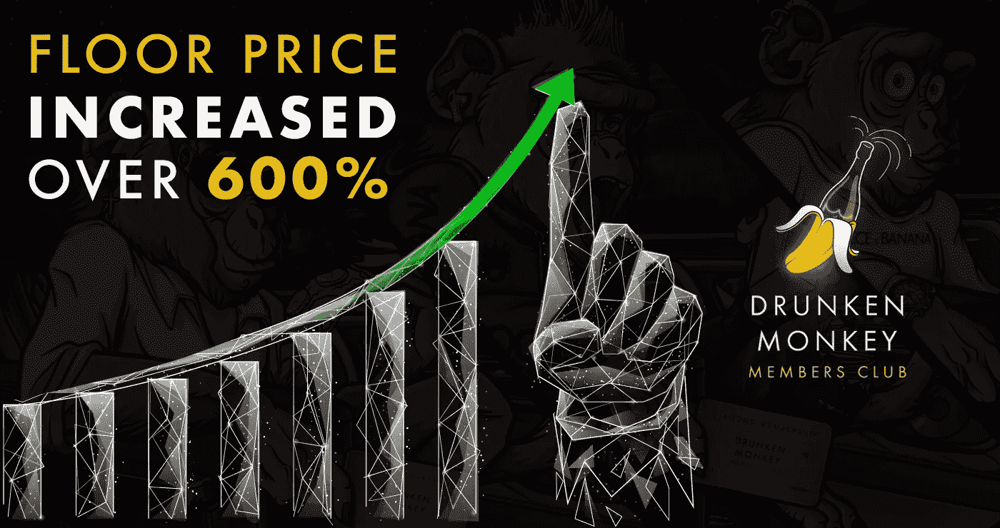
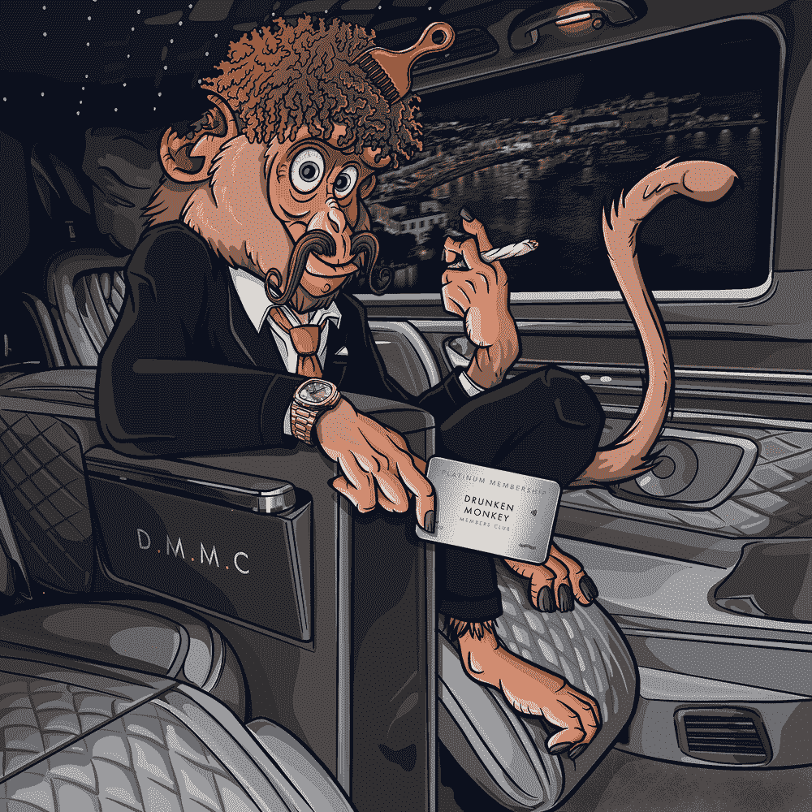
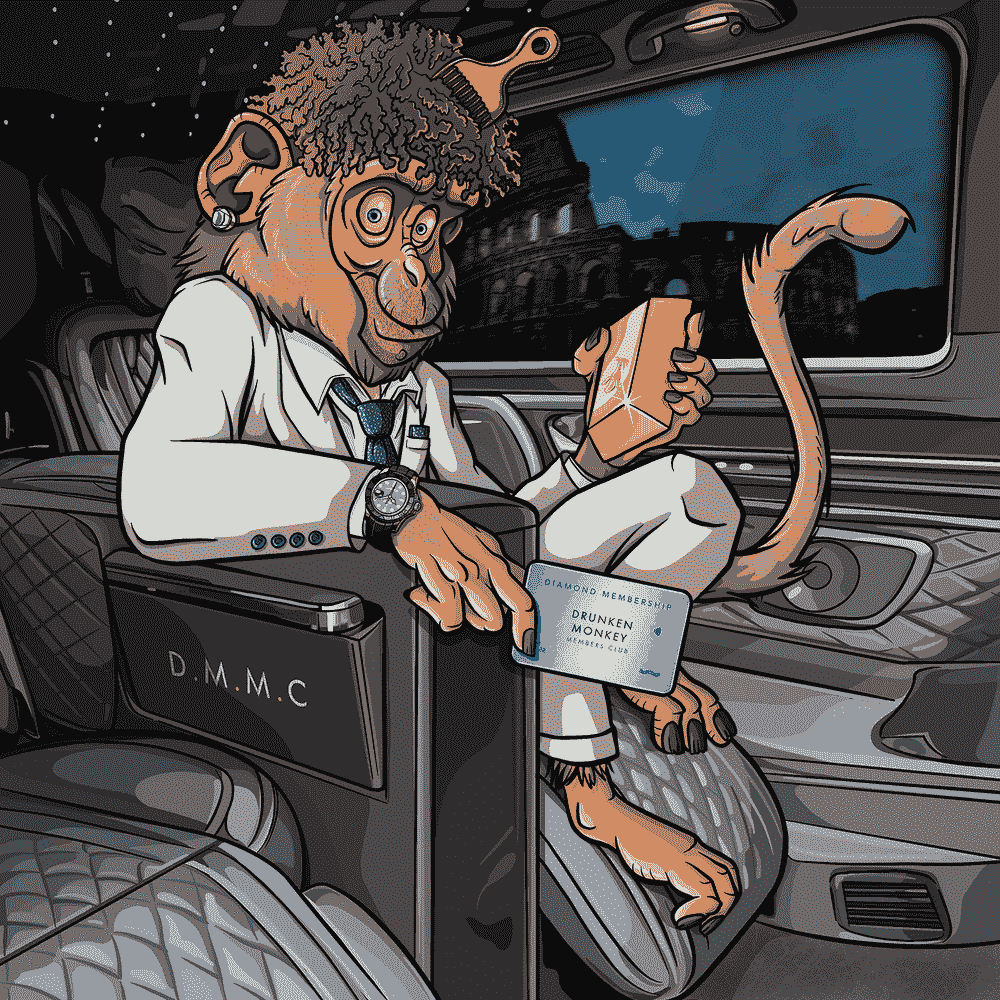
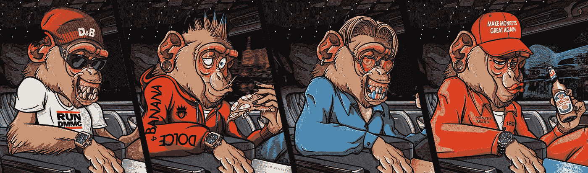

# 今年我们如何将底价提高了 600%

> 原文：<https://medium.com/coinmonks/how-weve-increased-our-floor-price-by-600-this-year-f166a67627bc?source=collection_archive---------11----------------------->

## 这不是秘密…看看我们的效用就知道了

[Source](https://drunkenmonkeyclub.com/): DMMC

我不需要告诉你这些，但我们正处于一个糟糕的熊市的最深处。尽管熊市是任何市场周期中健康和正常的一部分，但就市场情绪而言，熊市肯定不是最令人愉快的。以太坊联合创始人维塔利克·布特林(Vitalik Buterin)对熊市的欢迎是出了名的，他认为熊市是淘汰弱势资产和项目的“达尔文式”方法，我们对此深表赞同。

## 我们很高兴地宣布，本月我们迎来了 120 名新成员加入醉猴会员俱乐部，保持了我们自推出以来的底价+600%。

Platinum and Diamond monkeys listed on OpenSea at 28 ETH and 12 ETH respectively. [View the full collection here](https://opensea.io/collection/drunken-monkey-members-club?search[sortAscending]=false&search[sortBy]=UNIT_PRICE).

自 9 个月前推出以来，我们已经取得了超出许多人在熊市中可能想到的成就。我们的白金猴子交易量超过 4 ETH(比私人销售增加了 4，000%)；我们已经在一些最负盛名的 NFT 活动中展出过。我们的内部团队比以往任何时候都更强大。

为了保持这一上升趋势，继我们的独家黑色星期五造币前优惠活动之后，本月我们迎来了 120 名新会员，帮助我们的底价自推出以来舒适地上涨了 600%。这种增长不是偶然或巧合:我们小心翼翼地应对这个市场周期，以确保在熊市森林中，**我们是公牛**。

透明是 Web3 的核心原则，这就是为什么我们想分享这个项目在熊市中取得成功的各种因素。

# 1.效用

这个项目增长的最大因素是我们的潜在效用，即终身访问全球真实的礼宾网络。

> **不考虑加密市场，我们的效用本身就很有价值**。

传统的豪华礼宾会员资格每年的费用高达 25，000 英镑，而其他终身会员资格的费用约为 400，000 英镑。另一方面，DMMC 的会员资格不仅终身有效，而且可以在二级市场上完全交易。这就是为什么我们预测我们的资产价值将会增加，直到未来几年达到 50，000 英镑的合理中值。[你可以在这里](https://cryptodaily.co.uk/2022/11/why-this-nft-could-be-worth-over-50000) 阅读更多关于那个**的内容。**

此外，我们的工具完全独立于密码市场。这意味着，如果以太坊关闭，每个持有者仍然可以不受限制地访问我们跨越 20 个目的地的礼宾网络。在过去的几个月里，我们与迪拜的许多新的高端场馆和酒店合作，包括 Address、Rixos JBR、Anantara The Palm、Caesar's Palace Hotel 等等。

# 2.市场周期意识

当我们的创始猴子[加文·贝里](/@DrunkenMonkeyMembersClub/meet-the-monkeys-gavin-berry-the-founding-monkey-52a0696a3526)不在监管 DMMC 时，他经营着一家名为[零重力加密](https://zero-gravity.io/)的老牌加密货币咨询公司。Zero Gravity 是 SycoLabs 的另一个品牌，提供全面的加密咨询服务，以及访问[私人电报频道](https://zerogravitycrypto.io/what-we-do-and-why-we-believe-in-web3-and-cryptocurrency-536d31025c58)，为社区成员提供专家提示、警告和对加密趋势和市场的见解。

有鉴于此，我们在 DMMC 做出的每一个决定都是基于对市场的了解。在发布之前，我们勾画了一个可行的长期路线图，考虑了从熊市的最糟糕时期到下一轮牛市的顶峰时期。正因为如此，我们能够充分利用熊市作为建仓的时机，而不是恐慌和过早套现。

# 3.社区

在 NFT 空间，看到 5000 多名成员挤在一起的 Discord 服务器和 Telegram 频道并不罕见，但我们的社区不同。作为一个专属的礼宾网络，我们希望让我们的社区保持亲密和联系。我们认识我们社区中的大多数人，他们每个人都全力以赴地参与到这个项目中来——因为这对我们所有人都有好处。

当我们在未来几个月进入下一轮铸造时，情况将会更是如此，这将只通过申请。

在黑色星期五周末，我们收到了各种渠道的广泛新闻报道，概述了我们的独家薄荷前优惠。从周五到周日，我们暂时取消了 20 NFT 最低购买要求的限制，让人们有机会以 0.5 ETH 购买一个会员资格，而不是通常的 10 ETH 总共 20 个会员资格。

许多新来者通过铸造一只 0.5 ETH 的铂金或钻石猴子获得了 DMMC 头奖——考虑到这些猴子已经在二级市场上出售了超过 4 ETH，并且目前正在上市多达 28 ETH，这真是一个幸运的壮举。

如果你错过了黑色星期五造币前优惠，现在参与还不算太晚——在我们进入申请环节之前，还有一些 NFT 留在造币前。你可以通过我们的网站注册你的兴趣。

看看下面的文章，看看我们在过去的一个月里都做了些什么:

*   [**为什么这辆 NFT 能值 5 万多**](https://cryptodaily.co.uk/2022/11/why-this-nft-could-be-worth-over-50000)
*   [**公用事业 NFT 是大规模采用的关键**](https://cryptomode.com/utility-nfts-are-the-key-to-mass-adoption-starting-with-the-drunken-monkey-members-club/)
*   [**NFT 如何扰乱礼宾行业**](https://coinpedia.org/non-fungible-token-nft/how-nfts-are-revolutionising-the-concierge-industry/)
*   [**醉猴会员俱乐部在黑色星期五**](https://nftevening.com/drunken-monkey-members-club-expands-membership-ahead-of-black-friday/) 前扩大会员

> ***加入*** [***此处***](https://discord.com/invite/drunkenmonkeynft) ***。***

# [网站](https://drunkenmonkeyclub.com/) | [推特](https://twitter.com/DrunkenMonkey) | [电报](https://t.me/drunkenmonkeynft) | [不和](https://discord.com/invite/drunkenmonkeynft)

> 交易新手？尝试[加密交易机器人](/coinmonks/crypto-trading-bot-c2ffce8acb2a)或[复制交易](/coinmonks/top-10-crypto-copy-trading-platforms-for-beginners-d0c37c7d698c)