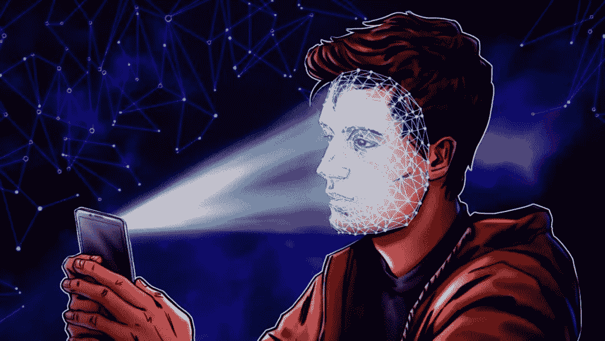

# 数字身份将如何统治元宇宙？

> 原文：<https://medium.com/coinmonks/how-will-digital-identity-rule-the-metaverse-74acc3d5f066?source=collection_archive---------36----------------------->

# 数字身份

 [## 数字身份将如何统治元宇宙-库普 360

### 数字身份是元宇宙的新时尚。一份报告表明年轻一代尤其感兴趣…

koop360.com](https://koop360.com/blog/digital-identity-rule-the-metaverse/) 

> 随着越来越多的企业、品牌甚至国家开始考虑利用虚拟世界进行商业活动，元宇宙已经成为今年最流行的流行语之一。尽管元宇宙的开发仍在进行中，但预计在未来几年将获得相当大的市场份额。

预计未来几年社交媒体平台上的电子商务增长可能表明，元宇宙可能会成为下一代社交网络。许多千禧一代和新生代目前都对元宇宙感兴趣。这也表明[元宇宙](https://koop360.com/blog/dubai-metaverse-conclave/)将在未来几年稳步增长。

# 数字身份是元宇宙的新时尚

一份报告表明，年轻一代对在虚拟世界中重塑自我的可能性特别感兴趣，虚拟世界允许形成数字身份和所有权。与 Web2 社交媒体网站如[抖音](https://www.tiktok.com/en/)和 [Instagram](https://www.instagram.com/) 相比，用户将能够在元宇宙更自由地表达自己。

用户将能够改变他们的头像，以更好地使用他们已经拥有的数字资产来代表他们自己。正如物质财产有助于人们实现他们的意图和抱负一样，元宇宙用户的数字财产对于自我的成长和表达也至关重要。

# 数字身份对隐私和信任的挑战

虽然元宇宙的吸引力主要是由于数字识别，但围绕这一想法仍然存在一些安全问题。重新评估你的信仰、追求和潜在的行为改变都是重塑自我的一部分。

多亏了元宇宙，每个人都可以重新想象自己是谁，想成为什么样的人。然而，这可能会导致许多问题，例如确保一个化身是他们所说的那个人。幸运的是，有办法克服这些困难。

SSI，或自我主权认同，可能会有所帮助。 ***【分散识别】*** 的概念使人们能够拥有和控制自己的数据，经常被互换使用。

这些动态数据点可以为元宇宙的头像创造分散的声誉。元宇宙头像之间的互动将被用于收集在线社交证据，允许用户选择哪些头像代表正派人士(或不代表正派人士)，同时保持匿名。

换句话说，这在允许匿名的同时增强了信心:即使开发者保持匿名并且只存在于元宇宙，他们也可以通过互动来开发社会证据，从而在 SSI 中建立声誉。

一些 Metaverses 使用**“照片级”**头像，而另一些则让用户基于虚构的 3D 人物来构建他们的头像。例如，在巴塞罗纳建立的虚拟身份元宇宙平台 Union Avatars 使用真实的照片来代表用户的头像。

基于用户真实图像的用户真实世界自我的 3D 虚拟描绘被称为照片逼真的化身。工程师们开发了一个系统，可以利用计算机视觉技术，从你的网络摄像头拍摄的单个自拍或上传到网络应用程序的单个自拍中生成全身头像。

在必须展现真实生活中的自己的行业中，使用照片般逼真的代表性化身。元宇宙在引领潮流的同时，也引发了人们对用户数据保护的担忧。

未来数字身份将如何发展？

尽管障碍重重，元宇宙的数字身份仍将取得重大进展。元宇宙对数字识别的使用将发展到支持与不同虚拟生态系统的兼容性。用户希望在虚拟世界之间传递的不仅仅是他们虚拟角色的外表。

此外，他们会想带着他们的网上声誉、成长和成就。随着个人在元宇宙度过更多的时间，无论是在游戏环境中，在虚拟活动中，还是在虚拟工作中，他们的数字身份将继续发展。

用户应该能够使用他们所有的数据作为在线身份证明文件。这将有助于建立一个人的真实的数字身份。虽然现在下结论还为时过早，但赋予用户数字身份的价值可能有助于减少元宇宙预计会发生的非法行为。

**结论**

虽然元宇宙正在创建一个虚拟世界，许多领先的企业在其中展示自己，但它们都需要一种叫做 NFTs 的东西。担心去哪里找一个创建 NFT 的平台？[**koop 360**](https://koop360.com/)**来帮你了。去中心化、开源的 KOOP360 平台非常适合定制元宇宙和 NFT 的生态系统。借助人工智能/人工智能工具，人们可以很容易地实现他们的想法。**

> **交易新手？尝试[加密交易机器人](/coinmonks/crypto-trading-bot-c2ffce8acb2a)或[复制交易](/coinmonks/top-10-crypto-copy-trading-platforms-for-beginners-d0c37c7d698c)**