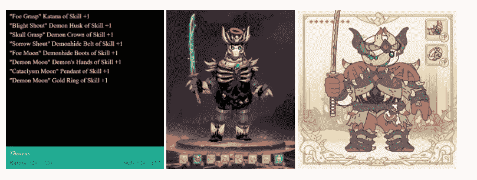

# CC0 标准将如何增加 NFT 投资的价值？

> 原文：<https://medium.com/coinmonks/how-will-the-cc0-standard-add-value-to-nft-investments-76e7cd318d76?source=collection_archive---------43----------------------->

在一个非常迅速的普及过程之后，NFT 市场被分为四个主要类别，即游戏、收藏品、艺术品和实用品。尽管在每一类中都有无数成功和失败的研究，但仍然没有为 NFT 增值的神奇公式。CC0 协议是该领域各种尝试的最新成果之一，它涉及作品的公开展示，完全放弃作者的版权。该协议不仅仅是一种新的营销方法，还具有创建通用标准和建立永久分类的潜力，因为它适用于 NFT 市场上的每一类产品。

**什么是 CC0？**

CC0 协议是在加密货币之前提出的版权标准。CC0 就像加密市场的开源代码一样，是通用的，不适应任何国家法律管辖区的法律。因此，即使使用该协议的提交人声明他/她已经放弃了他/她的所有权利，如果提交人本国的法律禁止放弃某些权利，也有可能出现与该法律有关的法律索赔。由于这个原因，接受这个协议作为标准和声明是更健康的。

**特权？无障碍？**

毫无疑问，NFT 所有者对版权的选择与他/她的营销策略和长期期望密切相关。例如，最受欢迎的 NFTs 之一，无聊猿游艇俱乐部(BAYC)创建了一个特权社区，因此人们有加入它的愿望。通过这种方式，他们通过持续的需求在市场上获得了强大的地位。考虑到 BAYC 的策略，使用 CC0 协议可能会导致整个图像被破坏。因此，该协议为不同的增值策略打开了大门，因为它极大地提高了可访问性，尽管它并不适合所有的非功能性测试。

现在让我们看看使用 CC0 的 NFTs 可以提供什么好处…

*   **由于每个人对事件的看法和判断方式不同，在创造性方面可以取得一个重要的收获，不管 NFT 属于哪一类。**

由于作品的创作者介绍了一个新产品，他/她实际上为作品的主题提供了一个基础。该产品没有版权，这为作品被引用或受到启发打开了方便之门。因此，由原始作品创建的基础设施和在此基础上建立的新研究可以使作品深入广大群众。这种情况最好的例子是战利品收集，公共 NFT 概念的先驱之一。只有写在黑色背景上的几行定义导致了阅读相同行但产生非常不同设计的游戏的衍生。

最左边的图像显示了原来的战利品 NFT。另外两张图片展示了写在这张卡片上的特征是如何被不同地设计的。这个例子可以用一部恐怖电影《小熊维尼》的翻拍版来说明，这部电影在 70 年后进入了公共领域。正如我们大多数人所知，这部作品之前曾以漫画的形式走进我们的生活。

随着作品传播到社区而获得的多样性可以在用户数量很重要的每个领域提供优势，因为它同时创造了一种归属感。例如，如果我们认为一个 NFT 是品牌的，一个属于这个品牌的在线购物网站被打开，社区采用 NFT 将自动确保该网站获得用户。因此，在任何用户数量很重要的领域，版权豁免 NFTs 都可以使用基于 CC0 的营销策略。

*   如果可以免费使用，为什么要买 NFT？

由于希望在 NFT 上工作的人不需要使用 CC0 购买 NFT，这种方法可以导致需求的减少。在上面给出的战利品例子中，由于从卡上线条衍生的游戏是完全独立的项目，它们不必直接与战利品等分享收益。除了为战利品创造的文化做贡献。因此，如果这样的非功能性交易不是一件艺术品，它们必须以一种额外的特征来产生需求。否则，NFTs 可能不会超越一个收藏家的项目。

非金融信托最常见的特征是 NFT 持有者可以投票的“道”形式、由这些“道”出售 NFT 所得收入创建的基金的管理、与私人不和团体的接触以及 NFT 担保贷款。使用 CC0 的 NFT 可以继续托管这些功能并持续吸引需求，并且由于这种 NFT 可以免费用于商业用途，因此建立更复杂的基础设施也成为可能。由于该协议在欧洲等发达地区得到了认可，因此它确保了在监管方面的全球标准适用于 NFTs，从而避免了法律问题。在法规日益增多的加密货币市场中，提供这样的标准可以鼓励集中式和分散式 NFT 应用在其广告、商业模式或奖励机制中使用具有 CC0 的 NFT。因此，即使使用 CC0，NFT 需求也可以通过附加功能继续。

*   **创意**

让我们假设一个人或公司喜欢一个 NFT，并想使用它。但这个人/公司可能想让他/她自己的设计师画一个类似的 NFT，以便不因版权而分一杯羹。在这种情况下，一个受欢迎的 NFT 的劣质复制品可能会导致品牌价值下降。从这个意义上说，CC0 也保留了产品的原创性。因为没有必要复制已经可以免费使用的作品。

— — — — — — — — — — — — — — — — — — — — — — — —

正如我们在上面的各个主题中所讨论的，CC0 协议是一个充满希望的趋势，最重要的是，它可以为市场带来一个全球标准。公开发行 NFTs 完全符合比特币的原则。因此，比特币通过在金融界开辟更自由的空间而创造的革命也可以通过使用 CC0 在 NFT 实现。总之，应该指出，对于如何增加非森林论坛的价值，仍然没有明确的行动方针。因此，在使用 CC0 的项目中会有许多不成功的计划应该被认为是很正常的。由于建立了可靠的标准，从长远来看，推动市场向前发展的要点是既为企业家开辟道路，又保护用户。

**编制人:** [**贝凯**](https://twitter.com/AybeyBerkay)

*此处表达的观点和评论属于*[*BV Crypto*](https://bvdigital.io/en/)*。*[*【BV Crypto】*](https://bvdigital.io/en/)*不能对基于本帖所做的任何金融交易负责。每一次投资和交易都有风险。当你做决定时，你应该自己做调查。*

> 交易新手？试试[加密交易机器人](/coinmonks/crypto-trading-bot-c2ffce8acb2a)或者[复制交易](/coinmonks/top-10-crypto-copy-trading-platforms-for-beginners-d0c37c7d698c)