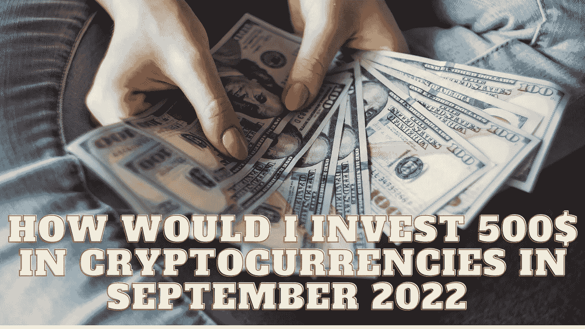

# 2022 年 9 月，我将如何投资 500 美元到加密货币

> 原文：<https://medium.com/coinmonks/how-would-i-invest-500-in-cryptocurrencies-in-september-2022-2a69cba30bd8?source=collection_archive---------19----------------------->

Source photo Unsplash.com

# 比特币(200 美元)

第一种加密货币比特币也是最成功的数字资产之一，因为它的价格在过去十年中上涨了 100，000%以上。

在我们选择作为 2022 年重要投资的五种密码中，它最有前途。两个国家已经正式承认 BTC 为货币，并且…