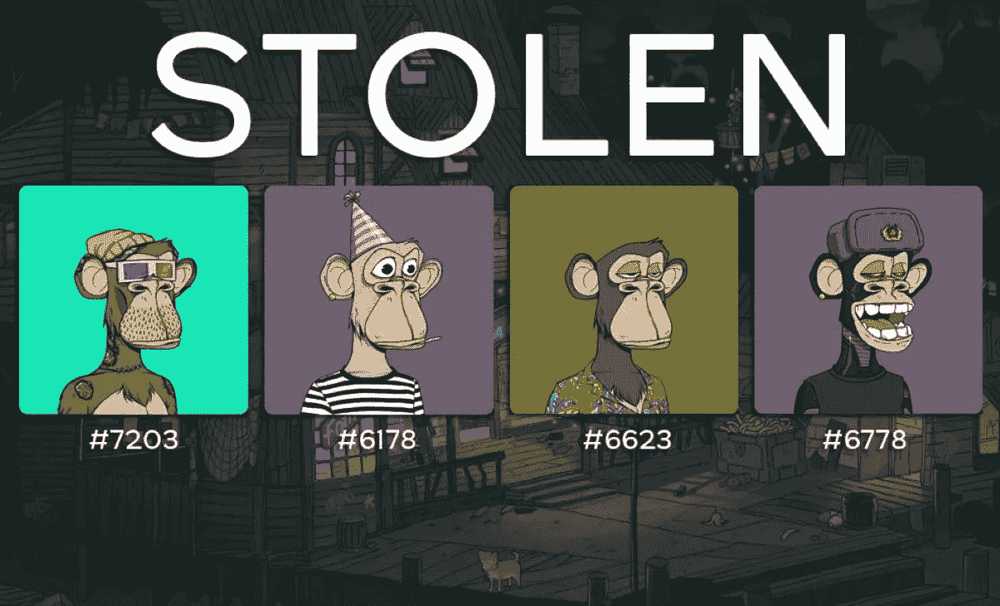

# 如果你价值 32 万美元的 jpeg 文件被盗，你会有什么感受？

> 原文：<https://medium.com/coinmonks/how-would-you-feel-if-your-320k-jpeg-got-stolen-ddf11b3f1772?source=collection_archive---------13----------------------->

Cameo CEO loses a Bored Ape NFT he paid $320K for, in a malicious hack.

Cameo 的首席执行官的猩猩被偷了。

这是一个无聊的看起来像凯撒与时髦的 3D 方形阴影猿。

史蒂夫·加兰尼斯(Steve Galanis)是 Cameo 的联合创始人兼首席执行官，这家公司允许你付钱给名人和知名人士说几句话。

这是一个有趣的概念，让非常容易辨认的人为你的婚礼或毕业朗读贺词，甚至用一个笑话逗你发笑。

你可以想象，当疫情罢工时，它真的起飞了。

Cameo raises $50M to deliver personalized messages from celebrities & influencers.

Cameo 已经筹集了大约 1.65 亿美元，价值在 1B 到 100 亿美元之间。

不足为奇的是，史蒂夫的收藏中有一些极其昂贵的 jpegs 图片。

这是它的长与短。

2022 年 1 月:史蒂夫在 2022 年 1 月花 32 万美元买下了 Ape #9012。

2022 年 8 月:小偷偷走了猿猴，并以 13 万美元的价格出售。

史蒂夫损失了 32 万美元。

小偷赢了 13 万美元。

“从加兰尼斯的推文中还不清楚确切的黑客机制。一些 Twitter 用户表示，他在一个使用 iCloud 备份的服务中保留了一份种子短语(本质上是一个可以用来访问加密钱包的安全密钥)，让黑客在他的账户被泄露后可以访问。加兰尼斯没有立即回复 Twitter 上寻求《The Verge》证实的直接消息。"

经历这样一场痛苦的考验。

Seth Green Pleads for Return of Stolen Bored Ape NFT So It Can Star in His New TV Show.

让数字资产遭到网络钓鱼、被盗、钱包被攻击，毁掉你的整个一周(或一个月)。

是的，史蒂夫可能负担得起，32 万美元可能是他在拉斯维加斯度过的一个周末。

但这是我们今天生活的黑暗现实。

随着我们的数字生活和在线身份变得比现实生活中更重要、更有价值，坏人攻击我们数字资产的动机也越来越多。

黑客一天比一天可怕。

桥梁正在倒塌，网络钓鱼诈骗变得如此隐蔽，对钱包的直接攻击变得更加大胆。

The amount of valuable NFTs stolen over the last year alone is scary and astounding.

今天，一个天才黑客坐在星巴克喝着撒有肉桂的冰柴拿铁，用一台笔记本电脑可以造成的金钱和损失是无法想象的。

如何自救？

如果你的 NFTs 和密码被偷了怎么办？

你再也找不回来了。

即使是像 OpenSea 和 Magic Eden 这样的市场，它们所能做的也是有限的。

我们能做些什么呢？

你可以追踪他们。

在区块链看到他们。

但是你永远也找不回来了。

至少法律上没有。

也许是时候让一群白帽黑客联合起来，专门黑坏黑客，找回被盗的东西了。

你看，报复黑客的唯一方法可能就是成为一名黑客。

未来属于那些能理解和写代码的人。

-

有可能找回被盗的 NFT 吗？

-

# startups # business # startupx # growth # success # social media # culture # web 3 # strategy # hacks # stevegalanis # cameo # hacked #失窃# bayc # bored apes # eth # BTC # crypto #黑客#钱包

> 交易新手？试试[加密交易机器人](/coinmonks/crypto-trading-bot-c2ffce8acb2a)或者[复制交易](/coinmonks/top-10-crypto-copy-trading-platforms-for-beginners-d0c37c7d698c)