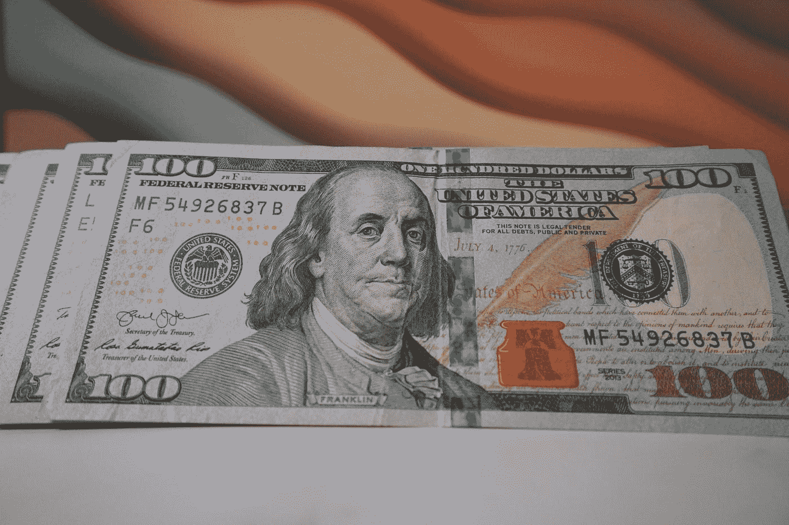

# 你如何通过分红每月赚 1000 英镑

> 原文：<https://medium.com/coinmonks/how-you-can-make-1000-per-month-with-dividends-fc678942e80a?source=collection_archive---------9----------------------->

近年来，股息投资变得非常流行。事实上，股息股现在占了美国所有公开交易股票的近一半。投资者喜欢股息的原因是因为股息提供了稳定的现金流，而不必担心股价波动。

[这篇文章最初来自我的网站组合中心](http://www.portfolio-hub.co.uk/)

Photo by [Blogging Guide](https://unsplash.com/@bloggingguide?utm_source=medium&utm_medium=referral) on [Unsplash](https://unsplash.com?utm_source=medium&utm_medium=referral)