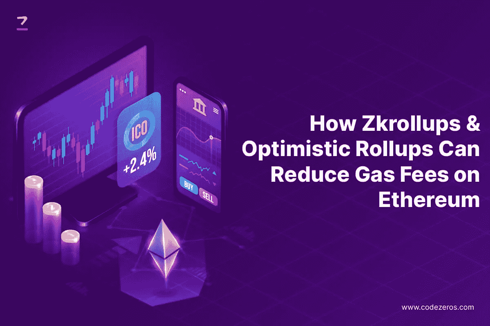

# Zkrollups &乐观 rollups 如何减少以太坊的汽油费

> 原文：<https://medium.com/coinmonks/how-zkrollups-optimistic-rollups-can-reduce-gas-fees-on-ethereum-4c0f773db8ad?source=collection_archive---------14----------------------->

随着技术的发展，新的支付和金融交易方式的使用越来越多。以加密货币为例。今天，有数百种加密货币，如比特币、Dogecoin、以太坊等。由于这些区块链网络的广泛流行，许多科技公司已经将它们作为一种支付方式。星巴克、亚马逊、特斯拉和微软是一些受欢迎的名字。

现在，当谈到以太坊时，有许多方面与区块链的用法有关。其中两个流行的术语是汽油费和累计。在区块链网络上处理一笔交易所需的常规天然气费用相当高。

尽管区块链提供了顶级的安全保障，但高昂的汽油费多少让用户望而却步。但是，没必要担心；这种情况下，汇总会有所帮助！如果你想知道如何？让我们一起来看看吧！

**汽油费和累计费用的简要概述！**

你看，每当一个人在以太坊网络上进行操作或交易，都要征收使用费。这笔费用被称为汽油费。根据区块链的使用情况，在以太网上进行交易的费用可能相当高。

例如，你可能要支付 100 美元来发送 500 美元，这是金额的⅕th。这对用户来说确实令人沮丧。

但是，就像每个问题都有解决方案一样，这个问题也有解决方案，那就是汇总。

虽然 Mainnet 上有许多事务要验证，但整体速度可能会很慢。因此，有一个第二层系统，或者你可以说是在主系统之上的另一个更快的区块链系统。

汇总的核心概念位于以太坊区块链的第 2 层。Rollups 基本上是一种扩展系统，可显著帮助降低整体汽油费用，并提高区块链网络的交易处理速度。继续阅读了解如何！

**什么是汇总及其类型？**

到目前为止，我们只知道总结是一个很好的工具，以确保低汽油费是为你招致的。然而，这里是它的一般定义。

顾名思义，汇总是扩展解决方案，将大量区块链事务汇总或合并为一个事务，并将其提供给主以太坊区块链或 Mainnet 进行验证和分析。由于费用由多个用户分摊，每个用户的燃气费显著下降。

例如，如果有十个用户试图进行总额高达 500 美元的交易。所有这些用户都集中在第二层，一笔 500 美元的交易被送到以太坊区块链(Mainnet)。如果这 500 美元中的汽油费是 100 美元，它会被 10 个用户分摊，每个用户 10 美元。因此，为用户节省了很多钱。

由于以太坊区块链需要时间来处理每笔交易，在这里，它会更少，因为只有一笔交易，而不是 10。因此，提高了速度并节省了时间。

这就是汇总可以为您节省时间和金钱的方式。

现在，如果我们讨论汇总的类型，有两种类型的汇总用于第 2 层。以下是两者的简要概述！

**乐观汇总**

这是第一种类型的第二层协议，它假定没有任何交易是欺诈性的，并且是有效的。这个汇总工作背后的关键思想是，通过假设没有人试图使用不正确的信息来欺骗区块链，速度会增加。

现在，很明显，如果任何交易都是假的。好吧，这就是乐观向上的一面。当交易在主区块链上滚动和提交时，需要欺诈证据。这个是有固定时间的，这个时候只清除有合法造假证明的人。因为乙醚是赌注，如果有人说谎或提交错误的防欺诈，他们可能会损失金钱。

乐观汇总的好处是，它们通过避免虚假的欺诈证据来防止网络垃圾邮件。这些汇总是扩展的理想选择。此外，他们可以更好地提高工作效率。

**ZK-rolups**

术语 ZK 在这里的意思是零知识。这些类型的汇总并不假定所有的事务都是有效的，但是它们通过使用一种复杂的加密技术来自己确认这些事务。这里使用的信息很少。

ZK 累计最大的好处是减少了收到资金的延迟。怎么会？嗯，不存在需要欺诈证据来证明交易合法性的挑战性时期。因此，用户可以快速获得他们的资金。汇总使用的加密证明确保了交易的安全性。

使用 ZK 汇总的缺点是设计加密证明的复杂性。最重要的是，他们受限于特定的应用程序，因为他们需要可靠的设置来工作，并且成本较高。

因此，这两种方式都可以为您节省大量的油费，同时一个提供速度，另一个提供可扩展性。与 ZK 汇总不同，乐观汇总不需要任何激活费。与乐观汇总相比，ZK 汇总更加私密。在撰写本文时，在区块链主干网上，平均节省油费是[的 80 倍。](https://dune.com/optimismfnd/Optimism)

**结论**

所以，最后，我们可以说，对于那些想在以太坊区块链网络上节省高额油费的人来说，ZK 易拉宝和乐观易拉宝是他们的退路。这两者都有其独特的好处，同时为您节省汽油费作为一个共同的。注意汽油费的节省，因为它随着乙醚值的变化而变化。

使用我们一流的[以太坊开发服务](https://www.codezeros.com/technology/ethereum)，为您的业务带来未来式的转变。

*最初发表于*[T5【https://www.codezeros.com】](https://www.codezeros.com/blog/how-zkrollups-&-optimistic-rollups-can-reduce-gas-fees-on-ethereum)*。*

> 交易新手？尝试[加密交易机器人](/coinmonks/crypto-trading-bot-c2ffce8acb2a)或[复制交易](/coinmonks/top-10-crypto-copy-trading-platforms-for-beginners-d0c37c7d698c)