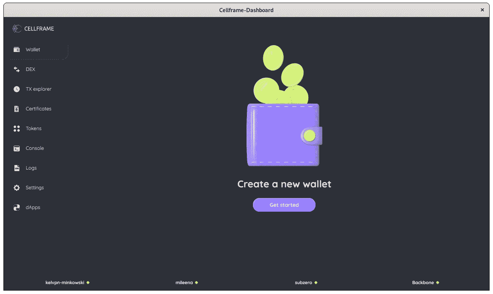

# HOWTO:从源代码构建 Cellframe 仪表板(Debian/Ubuntu)

> 原文：<https://medium.com/coinmonks/howto-building-cellframe-dashboard-from-source-debian-ubuntu-84a595df42e8?source=collection_archive---------13----------------------->


我在访问 [Cellframe Gitlab](https://gitlab.demlabs.net/cellframe) 时注意到 Cellframe Dashboard 的构建说明(顺便说一下，它是管理 Cellframe 节点和其他节点的所有内容的超级应用程序)有点过时，可能有人正在努力从源代码构建 Cellframe Dashboard。

本教程只能在 Debian Linux 及其衍生版本(如 Ubuntu)上运行。

哦，也许有人也想在 arm64 架构上尝试这些指令？

没有任何进一步的废话…

我们走吧！

## 关于单元格框架

Cellframe 是一个雄心勃勃的第三代区块链项目，很少有人(包括我在内)已经开始谈论它是下一个波尔卡多或草间弥生。

然而，这个项目更加面向服务，并且与 Polkadot/Kusama 相比具有一些优势(例如，后量子加密、2 级分片、P2P 跨链操作)。

Cellframe 是用 C 写的(这会让它更快)，目前它有一个 C 和 Python 的 SDK。将来会有更多受支持的语言出现。

我真的推荐访问他们的网站([https://cellframe.net](https://cellframe.net/))并阅读他们的白皮书！

## 准备构建环境

因此，首先我们显然需要通过安装构建 Cellframe 仪表板所需的所有包来准备我们的构建环境。为了在 Debian/Ubuntu 上做到这一点，我们安装了:

```
sudo apt -y install build-essential cmake dpkg-dev libpython3-dev libjson-c-dev libsqlite3-dev libmemcached-dev libev-dev libmagic-dev libcurl4-gnutls-dev libldb-dev libtalloc-dev libtevent-dev traceroute debconf-utils pv build-essential cmake dpkg-dev libpython3-dev libjson-c-dev libsqlite3-dev libmemcached-dev libev-dev libmagic-dev libcurl4-gnutls-dev libldb-dev libtalloc-dev libtevent-dev traceroute debconf-utils pv git libicu-dev qt5-qmake qtdeclarative5-dev libqt5svg5-dev libz-dev debhelper cdbs qml-module-qt-labs-settings qml-module-qt-labs-platform
```

下载和安装所有必要的软件包可能需要一段时间，所以如果你的互联网连接速度很慢，你可能需要在继续本教程的下一步之前喝杯咖啡休息一下。

## 获取源代码并构建 Debian 安装包

在您成功地安装了在您的系统上构建 Cellframe 仪表板所需的所有软件包之后，是时候获取源代码并开始构建了！为此，我们将使用`git`从 master branch 下载最新的可用源代码，并切换到下载的源代码所在的目录:

```
git clone [https://gitlab.demlabs.net/cellframe/cellframe-dashboard.git](https://gitlab.demlabs.net/cellframe/cellframe-dashboard.git) --recurse-submodules && cd cellframe-dashboard
```

我不得不在`dpkg-buildpackage` 命令前使用`qmake`和`make`，否则节点安装会因为某种原因无法正常工作。因此，使用这个 oneliner 来创建安装包。

```
qmake && make && dpkg-buildpackage -J -uc -us --changes-option=--build=any
```

构建完成后(在低性能系统上可能需要很长时间)，安装包在父文件夹中等待您。使用`cd ..`命令移动到那里，并使用以下命令安装软件包:

```
sudo apt install ./cellframe-dashboard_2.0-16_<your_architecture>.deb
```

您可能会注意到安装文件上的版本号相差甚远。不过这没关系，这个构建仍然是团队 Cellframe 中最新最棒的。

## 安装软件包

在我的系统上，安装是通过`sudo apt install ./cellframe-dashboard_2.0-16_amd64.deb`进行的。

安装软件包时，您会被问一些与安装 Cellframe 节点时相同的问题。当安装程序问你是否想设置节点自动上线(第一个问题)，我的建议是回答“真”。


Set auto online to true.

允许 Cellframe 节点接受连接也可能是明智的。所以在你看到一个问题“接受连接”后，你可能想回答真。


Set accept connection to true.

对于其他问题，可以保留默认值，只需按 enter 键。

完成后，只需从您的应用程序中启动 Cellframe Dashboard 即可！



Boom!

## 结论

如果运行 Debian 系统会有什么好处吗？没有。据我所知，团队已经为最新的 Debian 提供了包，你可以直接从他们的 repo 安装。

在较新的 Ubuntu 系统上有好处，尽管由于缺少依赖关系，当前版本不能在上面工作。

本教程在 Debian 11 和 Ubuntu 22.04 LTS 版上进行了测试。

你想在区块链的未来上有所建树吗？加入他们的 [Cellframe 开发电报频道](https://t.me/cellframe_dev_en)。

感谢您的阅读！

> 交易新手？试试[加密交易机器人](/coinmonks/crypto-trading-bot-c2ffce8acb2a)或者[复制交易](/coinmonks/top-10-crypto-copy-trading-platforms-for-beginners-d0c37c7d698c)