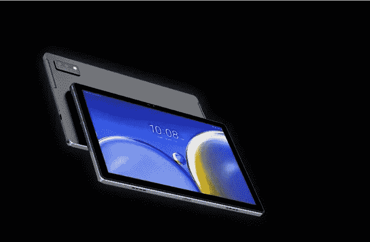

# HTC 悄悄地宣布了一款新的 Android 平板电脑——没人注意到

> 原文：<https://medium.com/coinmonks/htc-quietly-announced-a-new-android-tablet-and-nobody-noticed-71a7f6bae693?source=collection_archive---------5----------------------->

曾经令人印象深刻的 Android 智能手机制造商 HTC 推出了一款令人惊讶的平板电脑，以配合其怪异的元宇宙专注产品 Desire 22 Pro。新款 A101 是一款 Android 平板电脑，配有 10.1 英寸显示屏，入门级规格，设计与过去十年的设计完全不同。我们通过 AndroidPolice 发现的这个设备似乎在上个月已经被悄悄公布了——