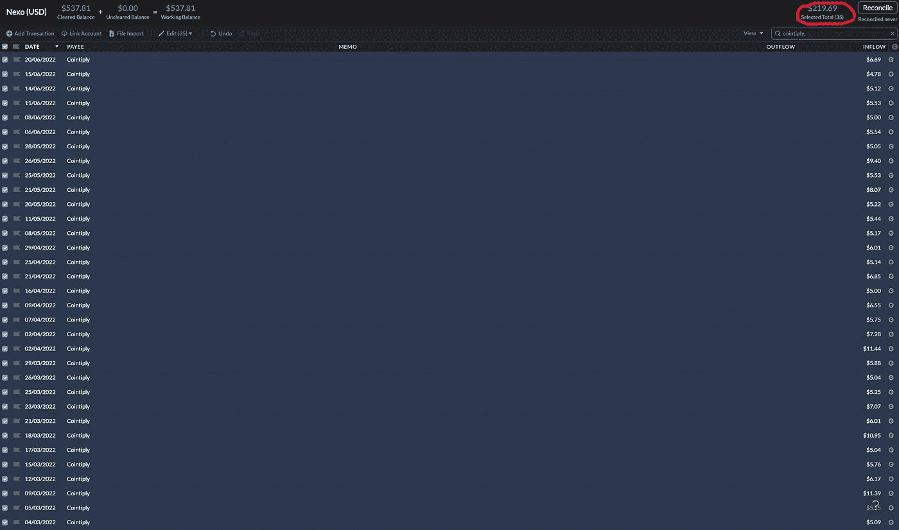

# 如何在没有前期成本的情况下构建您的加密货币组合

> 原文：<https://medium.com/coinmonks/https-medium-com-aalpinenepal-how-to-build-up-your-cryptocurrency-portfolio-without-upfront-cost-513c558eeb9c?source=collection_archive---------33----------------------->

如果你相信加密货币的未来，那么这可能适合你。

The value of BTC I’ve accumulated over the past 5 months — $219.69 through Cointiply

网上赚钱的方法有很多，但不管我们采用什么方法或策略，古老的好等式依然成立，那就是…

> 时间=金钱

我在这里分享的东西不需要任何前期成本，你就可以开始积累…