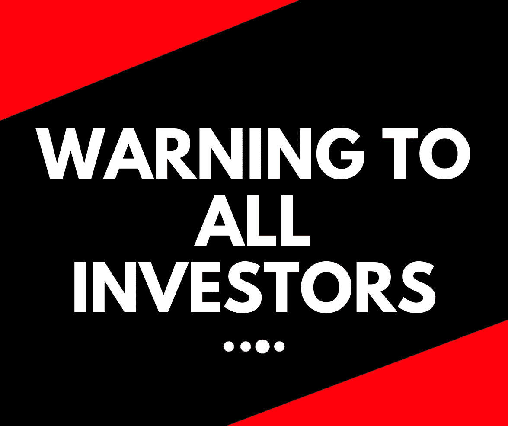

# 对所有投资者的巨大警告

> 原文：<https://medium.com/coinmonks/huge-warning-to-all-investors-a490a114d813?source=collection_archive---------8----------------------->

## 管理超过 10 万亿美元的资产使贝莱德成为世界上最大的资产管理公司。

相比之下，像 Vanguard 和 Fidelity 这样的公司就显得微不足道了。

贝莱德董事长兼首席执行官拉里·芬克最近接受了一次采访，内容是关于投资领域的现状。