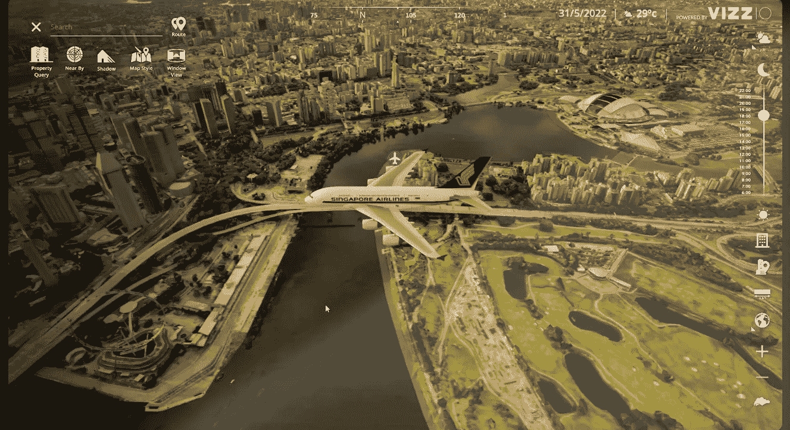
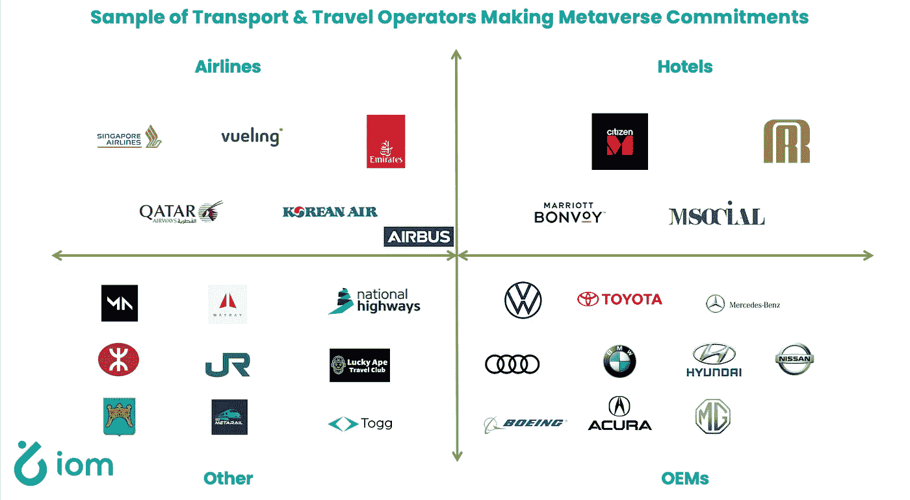

# 超现实的元宇宙，旅行和超越

> 原文：<https://medium.com/coinmonks/hyper-realistic-metaverse-travel-beyond-d64d97bfd98b?source=collection_archive---------9----------------------->

如果元宇宙只是关于虚拟世界的游戏，那么就没有必要认真考虑实体企业和 web 2 企业如何将元宇宙视为一个新的分销渠道。当然，数百个全球品牌已经开始尝试领先的基于游戏的元游戏，如沙盒和分散的土地。

但早期采用元宇宙的传统品牌主要是利用这些实验来学习和参与元宇宙用户的品牌激活。更简单地说，如果做得好，早期出现在元宇宙对传统和 web 2 品牌来说是很酷的。

然而，我们还处在元宇宙能够和将要成为什么样的早期阶段。我同意元宇宙将代表一个更加身临其境(通常是 3D)的互联网版本的观点。因此，传统品牌将有更多的事情可以做，不仅仅是为了酷，而是通过利用更加身临其境、超现实的互联网来增加收入。

Example screenshot from a digital twin of Singapore by Vizzio

Iomob 自 2018 年以来一直在建立一个分散的移动互联网(IoM)网络。几个月前，我们的第一位投资者、现任顾问兼个人导师[李尚义](https://www.suss.edu.sg/about-suss/faculty-and-staff/detail/professor-david-lee)鼓励我们认真探索与元宇宙合作的途径。虽然我们最初有点不情愿，因为我们致力于成为 IRL 影响力的一股力量，但我们越来越相信，元宇宙确实将改变每个行业，包括旅游和移动 IRL，我们有时间成为支持旅游和运输品牌的先行者，以在元宇宙获得曝光率和收入。

> 交易新手？试试[密码交易机器人](/coinmonks/crypto-trading-bot-c2ffce8acb2a)或者[复制交易](/coinmonks/top-10-crypto-copy-trading-platforms-for-beginners-d0c37c7d698c)

IoM 已经支持需求合作伙伴向网络、信息亭和移动设备提供无缝移动性。在我们看来，支持元宇宙的无缝移动是为旅游和交通用户创造一个新的分销渠道和界面，这些用户将寻求更沉浸式的方式来发现要去的地方、到达目的地的旅程选择、要住的地方，当然还有到达目的地后要参加的活动。今年 5 月， [TechNavio 发布了一份市场报告](https://www.technavio.com/report/metaverse-market-in-travel-and-tourism-industry-market-industry-analysis)，预计到 2026 年，元宇宙的预订收入将达到 1800 亿美元，并得出结论:

*“在预订过程中，元宇宙产品在旅游业中的真正价值在于它们增加整体预订量的能力。这是由于元宇宙的使用增强了客户体验，其中客户可以从虚拟和增强现实旅行技术中获得灵感，预订酒店、旅行、餐厅和其他服务的实际体验变得更加愉快、信息量更大，并且成为影响买家购买决策的工具。”*

下一个地球是第一个区块链和基于地球的元宇宙。就在几个月前，Iomob 宣布了我们的第一项计划，通过合作将旅游和元宇宙连接起来，将 IoM 数字传输层交付给 Next Earth。Vueling Airlines 拥有 120 多个目的地，主要在欧洲，每年有 3000 多万乘客，是我们在元宇宙加入我们的第一个客户，他们将与 Iomob 合作，不仅允许预订航空旅行，还允许无缝门到门旅行，可以通过元宇宙和/或 IoM 已经建立的元宇宙旅行伴侣应用程序预订。配套应用程序允许用户无缝整合在元宇宙(或其他界面)预订的旅程，并动态解决他们的第一英里和最后一英里，以及解决目的地移动性，而无需在每个城市下载本地应用程序。

我们与 Next Earth 的合作只是我们支持交通和旅游行业早期采用者的旅程的开始，他们不仅希望激活自己的品牌，还希望增加元宇宙的预订收入。我们一直在收集已经开始在元宇宙投资的越来越多的运输和旅游企业的名单。下面的人只是那些发表过一些公开声明或正式产品发布会的人，并不代表我们线下交谈过的几十个人。

我们认为，超现实的元对比，最好是 3D 或那些支持附加混合现实功能的元对比(例如 AR/VR)。敬请关注，国际移民组织将继续努力支持这些企业通过网络、手机和元宇宙提供无缝移动，如果你碰巧在新加坡，或者能够在线观看，我将应李尚义的邀请，在新加坡举行的 [GWEI 峰会上分享更多这些见解。](https://www.gweisummit.com)

**关于作者**

Boyd Cohen 是 Iomob 的首席执行官和联合创始人，Iomob 是一个分散的移动互联网(IoM)网络。自 2001 年在科罗拉多大学获得战略和创业博士学位以来，他在过去的二十年里致力于加速实现低碳可持续经济。这包括出版了 3 本书，多篇同行评审的文章，经常为 Fast Company 投稿，并在智能城市和可持续发展领域创办了一些企业。

> *加入 Coinmonks* [*电报频道*](https://t.me/coincodecap) *和* [*Youtube 频道*](https://www.youtube.com/c/coinmonks/videos) *了解加密交易和投资*

# 另外，阅读

*   [Bookmap 评论](https://coincodecap.com/bookmap-review-2021-best-trading-software) | [美国 5 大最佳加密交易所](https://coincodecap.com/crypto-exchange-usa)
*   [加密交易机器人](/coinmonks/crypto-trading-bot-c2ffce8acb2a) | [造币评论](https://coincodecap.com/coingate-review)
*   最佳加密[硬件钱包](/coinmonks/hardware-wallets-dfa1211730c6) | [Bitbns 评论](/coinmonks/bitbns-review-38256a07e161)
*   [新加坡十大最佳加密交易所](https://coincodecap.com/crypto-exchange-in-singapore) | [购买 AXS](https://coincodecap.com/buy-axs-token)
*   [红狗赌场评论](https://coincodecap.com/red-dog-casino-review) | [Swyftx 评论](https://coincodecap.com/swyftx-review)