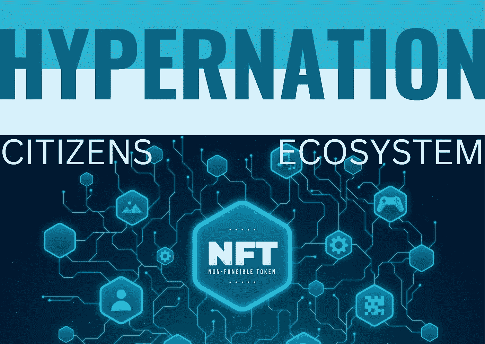

# 超级国家:公民有权决定他们的经济如何运行的秘密机会

> 原文：<https://medium.com/coinmonks/hypernation-the-crypto-opportunity-where-the-citizens-get-to-dictate-how-their-economy-is-run-7c8715450a1c?source=collection_archive---------0----------------------->

## 多亏了区块链的技术。

**Image Edited by the Author**; Image from [Freepik](https://www.freepik.com/free-vector/gradient-nft-concept_14064704.htm#query=blockchain&position=21&from_view=search)

**免责声明:*本文中的信息仅用于信息和教育目的。请寻求专业意见，进行自己的尽职调查。***