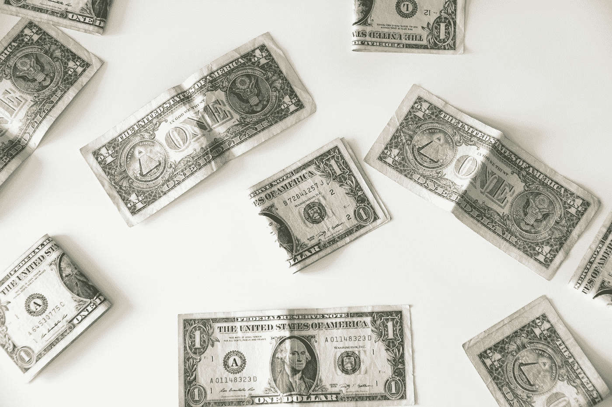

# 我是一个丢了$4K 的白痴

> 原文：<https://medium.com/coinmonks/i-am-an-idiot-who-loses-4k-d175f919e403?source=collection_archive---------31----------------------->

## 我是怎么做到的？嗯，问沙子！

Photo by [Emilio Takas](https://unsplash.com/@emiliotakas?utm_source=medium&utm_medium=referral) on [Unsplash](https://unsplash.com?utm_source=medium&utm_medium=referral)

你知道吗，当你不知道海洋的深度就冒险进入大海，最终吞下海水？我就是这么做的，当我买了沙盒游戏的官方货币沙时，我认为我看到了一个金融机会。

几个月前，这枚硬币是一个现象，击败了它的 4 美元，打破了几项记录，每天都有新的玩家加入，等等。——只有一部电影是走下坡路的。今天，同样的硬币价值不到 1 美元，我在它的历史最高点买入，损失了 1 美元 4K。

沙子真的变成了灰尘——我曾经引以为豪放在钱包里的游戏变成了 13 号星期五的噩梦。我的运气，我的意思是…没有机会。我的快乐在于，我通常会分散我的加密货币投资组合，因为它们波动性很大(我不会用股票来分散投资)，这种分散投资是我没有损失所有资本的原因。

> 交易新手？试试[加密交易机器人](/coinmonks/crypto-trading-bot-c2ffce8acb2a)或者[复制交易](/coinmonks/top-10-crypto-copy-trading-platforms-for-beginners-d0c37c7d698c)

今天，我的加密货币钱包里不再有沙子，我失去了，但我恢复了。当我被一个只会让我越陷越深的“流沙”吸引时，我被轻松赚钱的细微差别冲昏了头脑。

我希望我的错误可以作为一个教训，这里有一些来自那些损失了 4k 美元的人的提示，以防止有人犯下和我一样的愚蠢。

*如果你已经做到这一步，请点击“跟随”来帮助我::*

# 如何避免和元宇宙一起赔钱

听着，我仍然坚信元宇宙硬币的潜力。然而，我也认为我们还没有准备好接受这项技术。也许这在未来五年内会更有趣，但那些今天投资只考虑短期的人应该意识到他们会亏钱——就像我一样。

如果你想最小化你的加密货币损失，现在就避开元宇宙。除非你想持有这个密码至少五年，否则现在购买它们可能是值得的——否则，不要购买它们，否则你会用火烧掉你的钱。

购买这些币时需要考虑的另一点是，如果 crypto 有发行限制(这些是最好的)，分析其市值和流动资产。最后，研究这些硬币的用途也是必不可少的——这将告诉你她可以从哪里得到它们。

保持投资组合的多样化也很重要。不值得将你所有的资源分配给一种可能贬值 100%的资本——为此，对于投资这类业务的你，我建议你的投资组合中至少有五六种其他加密货币。(例如:露娜、瑞士联邦理工学院、BTC)

还值得记住的是，避免交易这些货币对你有好处——如果这成为时尚，你的密码遭受异常下跌的可能性是显而易见的。面对现实吧，你不想赔钱。你想赢。

# 最后的想法

我从这个错误中学到了什么？嗯，我明白了，我们不应该把整个身体沉入水中来测量海洋的深度——毕竟，我们可能会淹死。

在考虑购买假设之前，需要对加密货币进行研究和分析。我承认，急功近利背后的贪婪支配着我，让我陷入诱惑，进入流沙——但我也承认，我从那个错误中吸取了教训。它给我上了一课，我希望它也能给读过这部剧的人上一课。毕竟，如果我告诉你我是如何犯错的，为什么你会重复我犯过的同样的错误？

感谢阅读。祝您愉快！