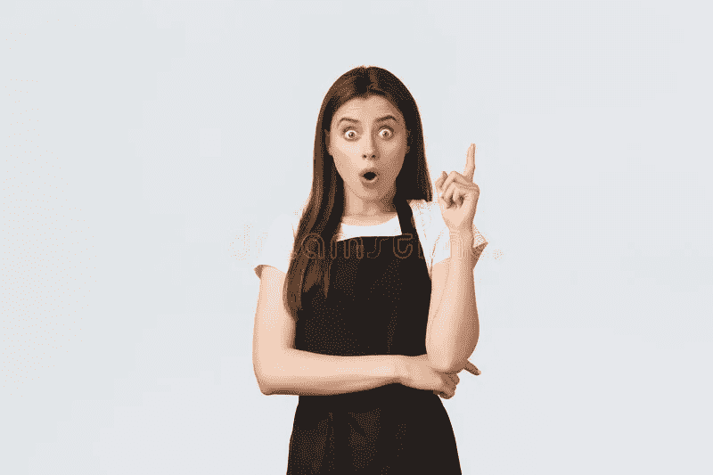

# 我在大声思考。想听吗？

> 原文：<https://medium.com/coinmonks/i-am-thinking-out-loud-care-to-listen-a56d10fa5903?source=collection_archive---------40----------------------->

dreamstime

大约两年前，我在加密的道路上迈出了第一步；我买了一点比特币。然后我又买了一些。在那之后，我找到了一个社区，并开始研究加密货币，将我的投资组合分散到大约 12 种不同的货币中。

从那以后，我买了又卖，增加了 60%之多的初始投资。

大约一年前，我开始写我的旅程，称之为“一切都是秘密”。我写过关于比特币、以太坊、Doge 等的文章。我走过了 DeFi(去中心化财务)、CeFi(中心化财务)、DAO(去中心化自治组织)、DCA(美元成本平均化)、NFT(不可替代代币)和元宇宙(仅举几个例子)。

由于加密空间的爆炸式多样性，所有加密的事物开始进化成加密体。这是一次奇妙的旅程。

今天，我在大声思考。cryptoverse 是一个普通人(而不是精英公司世界的富人和著名的肥猫)可以(在适当的指导下)走向财务和家庭自由的地方。

每个人都有自己的角度。

我看到一个由普通人组成的社区，他们聚在一起学习和赚钱。我的经验是，cryptoverse 中的许多人说我想帮助日常生活中的人们，结果却是令人恐惧的(对不起，伙计们)呼吁购买这个程序或课程。

可悲的是，似乎每个人都有自己的角度——我并不嫉妒他们；你做生意是为了赚钱。我明白，一旦你建立了一个东西，你就必须向它注入资金来维持它的运转。

我的观点是，通过提供简单、易于遵循的指南，而不收取现行费用，看看人们每天能走多远。

也许这是一个白日梦，但这是一个我不得不追随的白日梦。也许你同意，也许你不同意。如果你没有，没关系，但是如果你有，我邀请你加入我的旅程。

隐文是给你的。跟着我学；你会学到的，我们可以探索隐密体。

*免责声明:我是一名狂热的加密学生。当新冠肺炎占领世界并锁定全球经济时，隐密体引起了我的注意。从那以后，我花了一部分时间来学习这种货币——未来的货币——和国际商业。作为一名作家，我决定记录我的发现。我选择把它们写成短小精悍的文章，以帮助任何有兴趣了解这个领域的人。这些文章不是用密码或投资写的，而是简单易懂的文章。我不是在提供建议，仅仅是我在意外进入隐密体的旅程中发现的信息。经验丰富的投资者可能会从阅读中获得一些东西，但我的重点是对密码的好奇。*

> 交易新手？试试[加密交易机器人](/coinmonks/crypto-trading-bot-c2ffce8acb2a)或者[复制交易](/coinmonks/top-10-crypto-copy-trading-platforms-for-beginners-d0c37c7d698c)