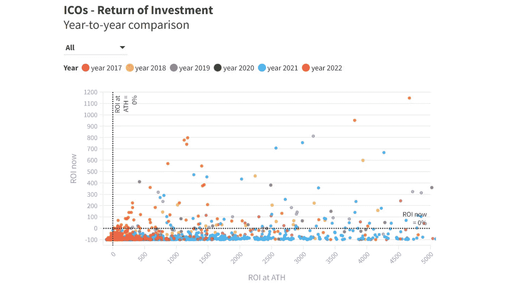

# 我分析了 1.600 个加密 ico 的 ROIs 以下是我了解到的情况

> 原文：<https://medium.com/coinmonks/i-analyzed-the-rois-of-1-600-crypto-icos-here-is-what-i-learned-cc4ad2dfa63e?source=collection_archive---------0----------------------->

在这项研究中，我想找出哪些密码具有最高的投资回报率(ROI)。为此，我分析了总共 1.648 种初始硬币发行(ico)的价格表现。

## 💾数据集

我使用的数据集来自 [Cryptorank](https://cryptorank.io/ico) 。它包括 ICO 销售价格、历史最高投资回报率(ATH)、当前投资回报率等数据