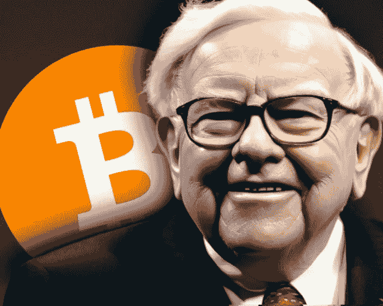

# 我买了世界上所有的比特币。现在一文不值了。

> 原文：<https://medium.com/coinmonks/i-bought-all-the-bitcoin-in-the-world-now-its-worth-nothing-5bde1bb5fff3?source=collection_archive---------70----------------------->

## 根据“供求关系”的概念，你买得越多，价格就越高。但是如果你全部买下会发生什么呢？

> “如果你……拥有世界上所有的比特币，你以 25 美元的价格卖给我，我不会接受的，”—沃伦·巴菲特

比特币是一种资产，**本身并没有真正的价值，而是被*认为它有价值的人推高的。该币的最大供应量为 2100 万枚，已经开采了****19241537 枚。*** 因为每块铸造的比特币数量每 21 万块减少 50%，所以[估计](https://www.investopedia.com/tech/what-happens-bitcoin-after-21-million-mined/)还需要 118 年才能全部开采完；只有在 2140 年，理论上一个人才能拥有每一枚比特币。****

> *从顶级交易者那里复制交易机器人。免费试用。*

*那么 2140 年会发生什么呢？价格预计会上涨。一旦最后一个比特币被开采，将不会有新的比特币发行，使得比特币的稀缺性吸引投资者，**从而抬高比特币的价格。***

**所以购买硬币的投资者越多，*的价格就会涨得越高。但是全部买下会让它变得一文不值。*

*为什么？因为它对其他人没有价值。*

> *如果你拥有世界上所有的硬币和纸币，这些现金将毫无价值，因为没有人可以用这些货币进行商品交易。*

*比特币也是如此。就像其他加密货币一样，它一开始没有价值。在货币发行之前，只有一个人与它互动过，那就是创造者。一旦有人用现金“购买”比特币，比特币就会增值，从而提高比特币的价值。因此，如果你拥有所有的比特币，你必须释放它们以获得真正的价值。*

*因此，如果你是世界上最富有的人，出于某种愚蠢的原因想要拥有每一枚比特币，你就会破产。*

# *结论*

*围绕沃伦·巴菲特不喜欢比特币有很多争议，但我相信这是真的。加密货币没有实际价值，因此**投资者依赖于愿意在未来*为其支付更多*、**的人，这指的是[、【更大的傻瓜】理论](https://www.investopedia.com/terms/g/greaterfooltheory.asp#:~:text=The%20greater%20fool%20theory%20states,%2C%20prices%20will%20sell%2Doff.)*

*抢劫。这并不意味着这枚硬币不值得投资。尽管它没有实物价值，但它仍然是一种可交易的资产和全球货币。它也履行了**金钱的六大特征；**持久性、便携性、可分性、可替代性、稀缺性和可接受性。*

*虽然硬币的价值可能会波动，但硬币的价值不太可能很快达到 0 美元…除非加密货币在全球范围内被禁止。*

**感谢阅读！(每次鼓掌都有帮助)**

> *加入 Coinmonks [电报频道](https://t.me/coincodecap)和 [Youtube 频道](https://www.youtube.com/c/coinmonks/videos)了解加密交易和投资*

# *另外，阅读*

*   *[Bookmap 评论](https://coincodecap.com/bookmap-review-2021-best-trading-software) | [美国 5 大最佳加密交易所](https://coincodecap.com/crypto-exchange-usa)*
*   *[密码交易机器人](/coinmonks/crypto-trading-bot-c2ffce8acb2a) | [硬币门评论](https://coincodecap.com/coingate-review)*
*   *最佳加密[硬件钱包](/coinmonks/hardware-wallets-dfa1211730c6) | [Bitbns 评论](/coinmonks/bitbns-review-38256a07e161)*
*   *[新加坡十大最佳加密交易所](https://coincodecap.com/crypto-exchange-in-singapore) | [购买 AXS](https://coincodecap.com/buy-axs-token)*
*   *[红狗赌场评论](https://coincodecap.com/red-dog-casino-review) | [Swyftx 评论](https://coincodecap.com/swyftx-review)*