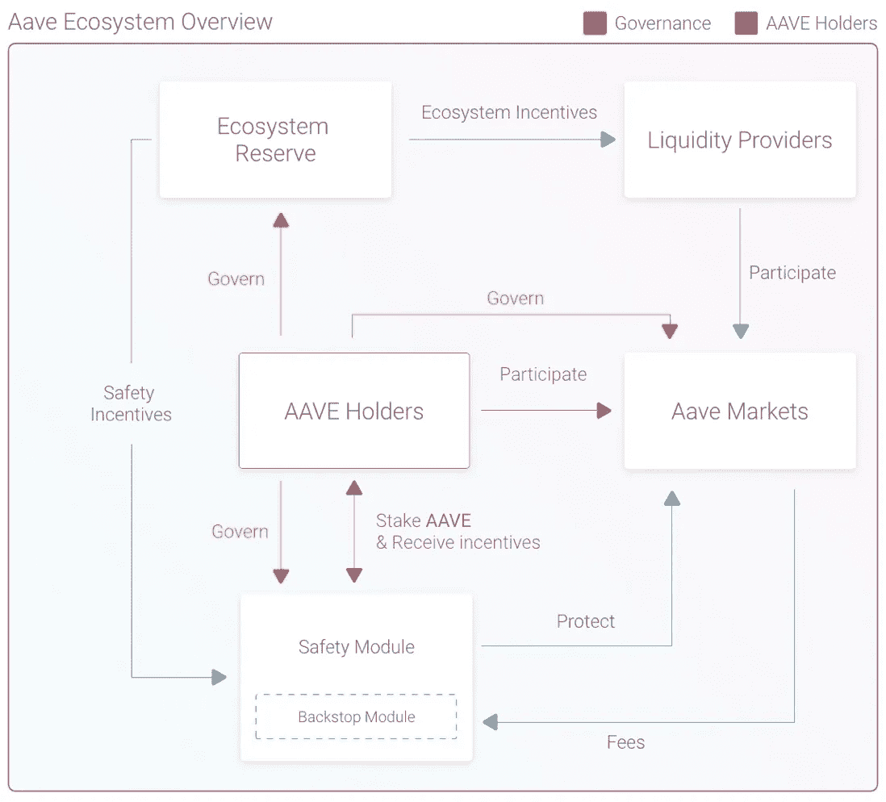
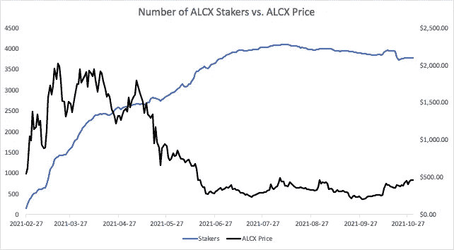
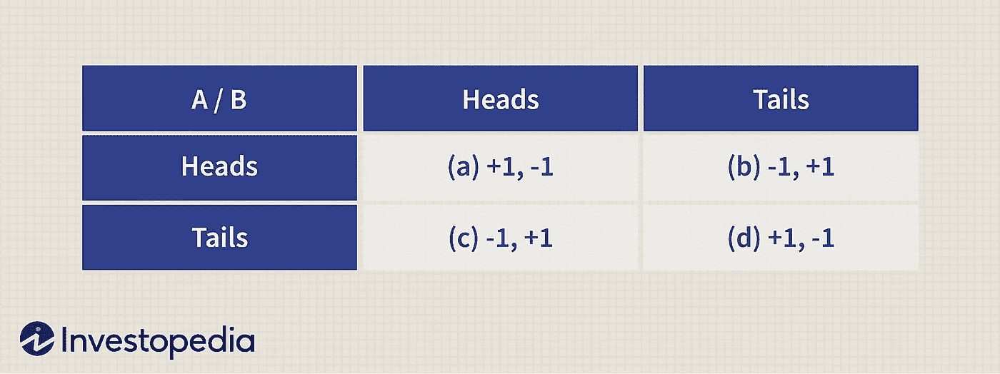
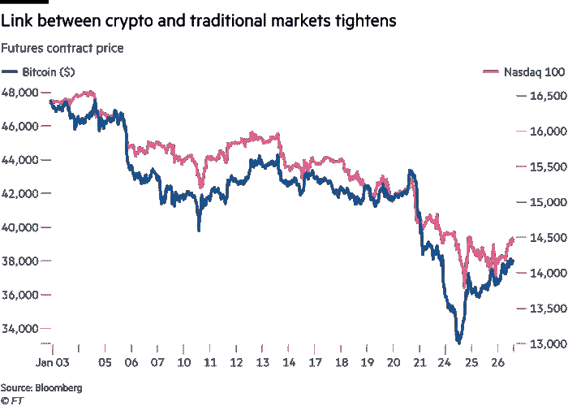
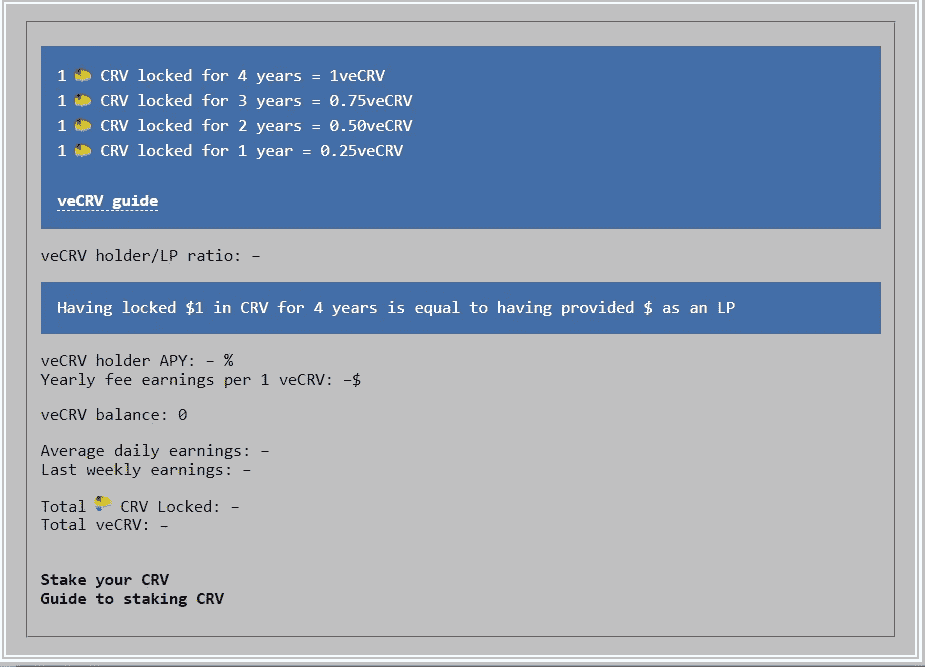

# 我设计记号组学。以下是我所学到的。(第一部分)

> 原文：<https://medium.com/coinmonks/i-design-tokenomics-here-is-what-i-have-learned-part-i-63bb9ee48573?source=collection_archive---------7----------------------->

好吧，我不“只”设计令牌组学。我在 L1 做研究，所以这也是我工作的一部分。你明白了。虽然我不能讨论正在进行的产品相关开发的任何细节，但我肯定可以分享我学到的经验，尝试建立一个令人信服和有意义的经济模型。我和 Zilliqa 的几个超级聪明的呆子一起开始的一个不错的小项目，把我变成了一个兔子洞访问怪人，在我的午休时间阅读利基经济理论。多动症是一种严重的药物。

本系列文章将涵盖一些一般的令牌组学原理，当令牌在野外生存时协议面临的主要问题和潜在的解决方案，或者至少是我看到的令牌组学设计的一般方向。我还将讨论保持在高水平，因为记号组学是一门新科学(？)这是对我们都认为是一成不变的基本原则的挑战。像稀缺性价值、分布、内在价值等等。事不宜迟，让我们开始吧！

# 但是首先，什么是令牌组学？

加密使用令牌。事实上，每个人都可以在没有(大部分)中央银行或特定监管的情况下自由拥有和交易它们，这是一个全新的事物。人们总是在彼此之间交换东西。这就是所谓的“经济”。代币+经济学=代币经济学。在那里，谁需要花哨的投资媒体风格的定义？您有时会看到术语“令牌组学”仅指在产品发布期间、之后和之前的令牌分配策略和百分比。虽然这肯定是其中的一部分，但随着 DeFi 和游戏等密码领域开始成熟，令牌组学在过去几年中已经发展了很多。

令牌组学设计主要是指一个或几个令牌的整个经济生态系统。 [AAVE 的](https://docs.aave.com/hub/)令牌分布，利率模型，LTV 比率和风险参数？令牌组学。 [Axie Infinity 的](https://whitepaper.axieinfinity.com/) AXS 碎片，治理与经济循环？令牌组学。沙盒的沙子分配，土地销售和资产铸造策略？这是象征经济学。基本上，在任何加密项目中，经济部分+所有其他用例文档和营销提案构成了白皮书。

可以说，在启动之前获得项目的令牌组学是确保您的 GameFi 项目或 DeFi 协议至少在某种程度上是可持续的，并且不会被遗忘的最重要的部分。稍后，我将更详细地介绍这种情况的原因。

可以说，协议赖以生存和消亡的东西与好的、坏的或不可预见的令牌设计有关。为智能合同制作一个 web 界面并没有那么难。安全是，但那是另一个时间的另一个话题。然而，困难的是与其他具有越来越有趣的奖励机制的协议竞争，以便您的生态系统中的鲸鱼不会通过地板出售您的令牌的市值。

另一个需要记住的方面是，我们谈论的是基于区块链的资产。如果你拥有钥匙，你就拥有资产。任何法官、央行或财政部都不能在所有者不交出私人钥匙的情况下没收资产。这也适用于 AMMs。除非通过欺诈性的设计，用户不能在未经他们同意的情况下锁定他们的令牌，他们可以随心所欲地使用它们。如果你设计了一个数字和自由的经济模式，你的工作就是激励人们留在你的生态系统中并保持活跃。

# 第一课:每个人都是德根

是的，包括你，你的祖母，她小学时的前任，还包括(也许特别是)你那自鸣得意的投资银行家朋友。人类本质上是基于激励的动物。我们希望好事多，坏事少。毒贩拿他们的自由冒险，因为他们可以赚很多钱来买好东西。假设没有多少人会接受一周七天每天工作 16 个小时，工资只有最低工资的一半。时间回报比非常糟糕，因此令人沮丧。[行为经济学](https://news.uchicago.edu/explainer/what-is-behavioral-economics)并不是一个新事物，同样的原理也适用于加密。

假设鲍勃喜欢 DeFi，并建立了一个 AMM 指数。他希望像拥有 1000 美元的丽莎这样的人和百万富翁詹妮弗一样加入。他提供赌注奖励，做像 APY 这样的事情来提高农场产量，并为积极的治理参与提供好处，目的是做两件事:1 .让丽莎和詹妮弗加入；2.让丽莎和詹妮弗留下来。然而，约翰也建立了一个 AMM 指数。它提供了更好的奖励，因为他设法带来了更多的人比鲍勃，支持更多的硬币，还提供借/借功能。Lisa 和 Jennifer 都从 Bob 的协议中拿出了钱，并转移到 John 的协议中，以获得更好的早期 APYs，并从增加的效用中受益。

这被称为唯利是图的流动性，是每个令牌组学设计者都必须理解和解释的事情。Lisa 和 Jennifer 最终会带着全部或大部分资金，移民。这是一个自由的国家…呃，我是说网络。整个要点是让他们尽可能长时间呆在这里，尽可能活跃。Bob 通过他的协议获得的费用获利，例如 Lisa 和 Jennifer 通过提供流动性、赌注等等。但是如果这一切都是徒劳的，用户最终都会离开，那为什么还要建立任何东西呢？这将我们带到:

# 第二课:这是一个零和游戏

所有的一切。不仅仅是密码。股票市场基本上是一个零和游戏。早期进入项目的投资者获得了巨额利润，因为其他人比他们更晚看到效用/宣传。这使得公司/协议/资产更受欢迎，因此更有价值。早期投资者以公平的市场价格将他们的资产出售给其他愿意购买的人。有意愿的买家希望/认为基础资产在未来会升值更多，从而证明其购买价格高于一年前的价值是合理的。为了让卖方获利，买方需要购买资产，并愿意承担资产贬值的风险，以应对未来资产升值的可能性。

简单来说，为了让一个人赢得一些东西，另一个人需要失去一些东西。这就是零和游戏的定义。卖方失去了更高的未来潜在收益，卖方失去了资金并承担了风险。放大到一定程度，大多数投资活动看起来与字面上的庞氏骗局没有太大区别。低买高卖，诸如此类。

也就是说，这本身并不是一件坏事。社会永远在变化，经济也在变化。一些在过去有价值的东西和服务在今天不再有价值，反之亦然。唯一不变的是变化，投资和物理都是如此。虽然加密和私募股权市场在过去的几年里非常相关，但这两个市场之间有一个显著的区别:生命周期。

密码有更快的市场周期。也就是说，我们从稳定的低价到牛市的历史高点，再到市场崩盘，再到稳定的低价，这比我们在股市中的速度要快得多。Crypto 可以说有三个市场周期:2013 年 10 月-2014 年 5 月；2017 年 3 月—2018 年 10 月和 2020 年 10 月—2022 年 4 月。自 2010 年以来，最近一轮私人股本牛市(历史上持续时间最长的一轮)一直在持续，可以说我们仍处于牛市之中。这使得许多加密项目和协议具有更快的生命周期，这反过来迫使项目更快地制造更引人注目的经济生态系统。接受好的和坏的。

从这个角度来看，唯利是图的流动性似乎不再是一件邪恶的事情了。这只是一个在设计表征组学时必须考虑的现象。没有什么是永恒的，所以你应该尽力激励人们尽可能长时间地留下来。我觉得我们真的只是触及了表面。想到的用户保持特征例如是类似于 CRV 和 veCRV 的锁定机制。通过将代币锁定一段时间，用户可以获得更多奖励。这个系统有一个缺陷，事实上大多数用户在解锁后会出售他们的代币。它在已经建立的有很多 TVL 的平台上比在更小的协议上运行得更好。

另一个有趣的方法来自 GameFi 和最受欢迎的 P2E 交易卡牌游戏[夹板岛](https://splinterlands.com/)。这款游戏鼓励玩家用他们的 SPS 代币来换取每日奖励的机会，而不是不断空投，因为空投会受到泵和转储的影响。这有点类似于彩票储蓄的概念。这个系统比传统的空投要好得多，因为它缓解了两个问题:

首先，奖励倾销销售压力。举例来说，不要一下子把你所有代币的 1%给用户，然后让大多数人一下子把它们卖掉，卖出压力就不是问题了。第二，进一步阻止雇佣军的流动性。玩家有动机将他们的至少一部分资产留在游戏中，以获得罕见掉牌的持续机会。你让玩家保持资产的长期经济可行性，同时不把你的硬币变成农场代币。DeFi 中应用的思考。

> 交易新手？试试[密码交易机器人](/coinmonks/crypto-trading-bot-c2ffce8acb2a)或[复制交易](/coinmonks/top-10-crypto-copy-trading-platforms-for-beginners-d0c37c7d698c)