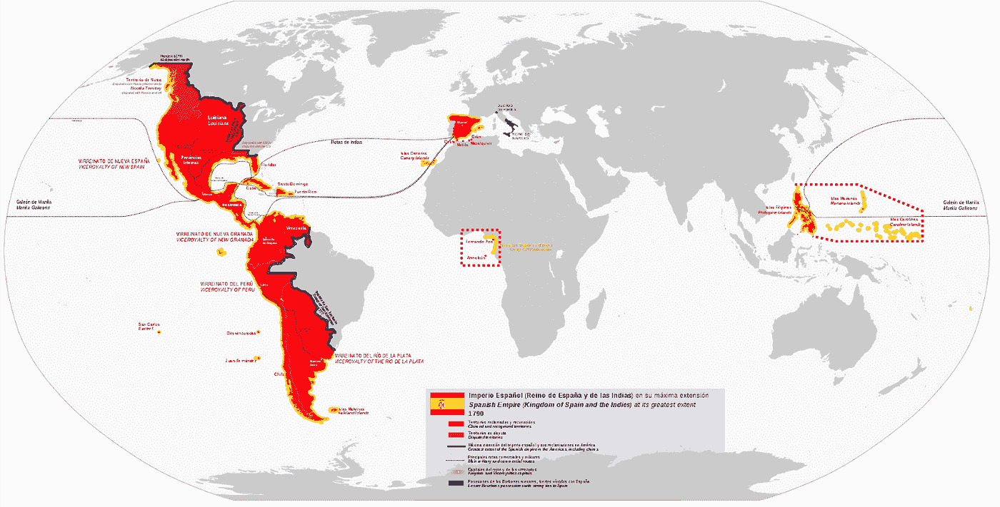

# 我设计记号组学。以下是我所学到的。(第二部分)

> 原文：<https://medium.com/coinmonks/i-design-tokenomics-here-is-what-i-have-learned-part-ii-2dc9b2c7dbfa?source=collection_archive---------6----------------------->

链接到第一部分[这里](https://totiavlad.substack.com/p/i-design-tokenomics-here-is-what)

第三课:没有内在价值这种东西

我想这个人不会交到很多朋友。自 2015 年以来，我一直是 crypto 的积极支持者。我从人们那里听到的关于比特币最常见的批评之一是它缺乏内在价值。也就是说，事实上，比特币本身没有任何有形的好处，如果没有人想买它，它的价值将为零。这与大多数普通人的感觉相反，他们认为他们购买的东西、他们拥有的钱和他们使用的服务的价值在某种程度上来自一个客观的、普遍适用的和无所不包的公式或方法，该公式或方法准确地对虚无中的事物进行定价。本质上，[供求理论](https://www.britannica.com/topic/supply-and-demand)是 100%精确的，并且考虑了所有的变量。男孩，我有消息告诉你…

投资信息市场价值数十亿美元，充斥着使用越来越复杂的数学公式来推导资产内在价值的定量分析师和分析师。理论上，假设[有效市场假说](https://www.investopedia.com/terms/e/efficientmarkethypothesis.asp)，如果这可以被准确地确定，市场将最终正确地为资产定价。这进而允许银行和对冲基金相应地做多和做空资产。

问题？每个人都在这么做，这有点像是一个自我实现的预言。人们想要某种资产，这反过来使它更有价值，从而吸引更多的人。我们可以看到这种现象发生的一个绝对重要的领域是加密。[以太坊](https://ethereum.org/en/)是一项令人敬畏的科技壮举吗？绝对是。它目前大约 1400 美元的价格是每个人都知道的原因吗？不知道。特斯拉[造好车吗？许多人会说是的。它目前超过 1 万亿美元的估值是否仅限于汽车、电池和收入？绝对不行。它考虑了市场营销、埃隆·马斯克近乎崇拜的地位、他在 Twitter 上的恶作剧，以及许多人对该公司要么爱要么恨的事实。所有这些因素在多大程度上和以什么比例构成了资产的“内在”价值？如果你能回答这个问题，当你去领取诺贝尔经济学奖时，我有一些不错的斯德哥尔摩 AirBnB 推荐。](https://www.tesla.com/)

这并不是说所有的努力都是徒劳的，因为我们不能准确地评价任何东西，那么一切本质上都是编造的谎言…某种程度上。经济是一种社会契约，只要某样东西有一个愿意买的人和一个愿意卖的人，同一件东西的交易最终会发生。那么这在 tokenommic 设计中起什么作用呢？在一个新兴行业的新经济中，你如何真正为一个代币或一项资产定价？我有好消息告诉你。你真的不需要。做一些简单的事情，比如为你的武器皮肤或 DEX 奖励令牌设定一个平均市场价格，就足够了。市场力量把它带走，用 1000 个太阳的力量把它放在它认为合适的地方。是的，甚至算上鲸鱼和内幕交易(一定程度上)。

最终，经过一段时间后，考虑到外部因素，如整体市场情绪和你的营销活动的效率，资产最终将只是人们愿意购买的价格。因此，令牌组学的重点最好是让用户在你的生态系统中做尽可能多的事情。稍后会有更多关于这个问题的潜在解决方案，比如[否决](/coinmonks/curve-finance-and-vecrv-8490d51537c5)。

第四课:稀缺=价值，直到它不存在

除了供应和需求之外，许多协议选择的解决方案是人为地减少供应，以使某种资产的价格下限在理论上稳定下来。根据经验，不同人群对不太容易得到的东西和丰富的东西的评价是不同的。阅读 1000 年前的任何贸易路线。[维京人](https://www.historyonthenet.com/vikings-as-traders)以高价从中东王国购买骆驼皮，并以低价将鲑鱼肉卖回给他们。

人们想要他们没有的东西，这 100%适用于加密。限制某种资产的数量肯定会引起关注并鼓励需求。然而，做这件事有好的方法和坏的方法。先查一个不好的吧。

带着所有的责任，我完全袖手旁观我的观点，知道他们的社区是多么热情，[滴滴](https://drip.community/)是我在一段时间内见过的最糟糕的稀缺需求版本。我敢肯定还有其他更差的型号，不过这个型号已经变得特别成功。以下是滴滴用非常简短的总结解释:

该项目表示，一旦用户存入初始金额，他们就可以获得 1%的低风险投资回报。钱从哪里来？你不需要担心那个。该平台有一个非常发达的社区和人群，专注于让其他人进入庞氏骗局…我的意思是机会，通过推荐代码等。不，但是说真的，APY 的钱从哪里来？

好吧，好吧。来自其他用户。每日支出由新用户出资。在任何平台上，如果你搞不清楚流动性从哪里来，你就是流动性。新进入者支付之前进入者的回报，他们必须专注于引入新人来支付他们的回报，冲洗并重复金字塔下的…我的意思是线。用户不能在 1 年内提取资金的事实是一个如此巨大的危险信号，以至于弗拉基米尔·列宁会从坟墓里爬出来，只是为了和创始人握手。相反，它变成了一个明显的特征。营销可以创造奇迹。

但是仅仅因为有一些彻头彻尾的骗局利用某种经济原理来欺骗人们，并不意味着这个原理本身就是有缺陷的。否则，没人会再用新兴技术建造任何东西。在 crypto 中有一些记号模型，它们利用稀缺性作为一个特征，而不是金字塔计划。在写这篇文章的时候，我想不出任何比 [Curve 的投票托管 CRV token](https://resources.curve.fi/crv-token/understanding-crv) 机制更成功、更成熟的模式。

整体而言，曲线金融是有史以来最成功的 DeFi 协议之一。最初，该平台被认为是一种分散的代币交换方式，但很快成为流动性挖掘的灯塔。为了激励用户使用这项服务，而不陷入“农场代币陷阱”( farm token trap ),即用户只需立即用本国货币兑换联邦理工学院(ETH)、BTC 或稳定币(stable coin ), Curve 想出了一个非常聪明的模式，鼓励长期参与，同时保持经济上的可行性。

CRV 是曲线上的本地标志，也是流动性提供者的回报。当然，用户可以出售他们的 CRV 来换取其他东西。或者，他们可以锁定他们的 CRV 奖励并接收 veCRV。锁定期可以在 7 天到 4 年之间。通过累积 veCRV，流动性提供者有权获得该平台赚取的额外交易费，CRV 奖励计划的排放量增加了 2.5 倍

这种自愿放弃直接奖励以换取未来更大回报的模式，在鼓励曲线用户合作创建资金池以及良性竞争方面取得了成功。我说的竞争指的是曲线战争，这个话题太大了，无法在一小段话中涵盖。更重要的是，它为像 [Convex](https://www.convexfinance.com/) 这样的平台创造了一个二级市场，这些平台围绕优化和提升曲线池和回报建立了他们的整个商业模式。

第五课:不要像西班牙人一样！(帝国)

尽管将一项资产缓慢供应给一个迫切需要它的市场的观点肯定是正确的，但答案并不像我们希望的那样简单。嘿，你设计或阅读令牌组学，这是一个新的领域，我和你一样知道，我们正在一起发现东西。现在我们看到了基于稀缺的经济的局限性，让我们看看为什么让人们想要的资产充斥市场是一个坏主意。还有什么比西班牙殖民帝国[的绝对经济灾难更好的例子呢！](https://en.wikipedia.org/wiki/Spanish_Empire)

15 世纪初，当葡萄牙和卡斯蒂利亚帝国发现新大陆时，欧洲各国首都对探险家从美洲带回的财富感到惊讶。香料、奇怪的动物、土豆和说着奇怪语言的奴隶崇拜着木神。每个人都想在新大陆分一杯羹。即将成立的西班牙帝国对此非常清楚。因此，它的殖民政策可以用一个词来概括:贪婪。

西班牙征服者领导了一场极具侵略性的殖民地扩张政策，基本上导致了对土著人口的大规模清洗。但与我们的话题更相关的是，他们囤积了很多很多东西。金，银，金属，香料，染料，几乎任何东西。所有这些货物被集体运往西班牙，最初用于为探险者在家乡积累财富。

对西班牙人来说听起来很棒，对吧？不是的。这项政策已经彻底让西班牙王室破产了。士兵的军饷是用黄金支付的，他们可以从战利品中获得更多的黄金和宝石，用曾经稀有的材料充斥市场。官方是如何考虑解决这个问题的？更糟糕的是:他们不断从意大利共和国如热那亚或神圣罗马帝国选帝侯如汉堡借钱来进一步扩张他们的殖民地。这只会带来更多的资源，从而让每一项值得出售的资产都变得像马德里正在印刷的钞票一样毫无用处。

在接下来的几个世纪里，直到 19 世纪末，西班牙殖民帝国慢慢瓦解，新的国家诞生了，而马德里的各个君主却饱受长期通货膨胀和可怕债务的困扰。英国人、法国人和荷兰人比他们的伊比利亚人和卢西塔尼亚人更好地吸取了这一教训(葡萄牙人和他们的邻居有类似的问题，但程度较小)。例如，英国对来自今天美国纽芬兰的鱼量设定了一个直接的最高日限额。

当然，殖民者和渔民当时很不高兴，抱怨这不公平，但是这项政策奏效了，把英国变成了一个经济强国。[荷兰](https://www.reachtheworld.org/teresas-journey-netherlands/journal/dutch-trading-empire?page=2)对来自西印度群岛的香料和[法国](https://ageconsearch.umn.edu/record/273134/?ln=en)对来自北美路易斯安那州的毛皮采取了类似的政策。是的，我在 [Europa Universalis 4](https://www.paradoxinteractive.com/games/europa-universalis-iv/about) 中玩了 1000 多个小时，你怎么知道？

在 crypto 中，与此非常类似的情况是项目的初始公众持股量非常低。总供应量的大约 5%在交易所公布，大约 15%给其他合伙人，创始人和初始团队拥有其余部分，他们认为他们可以通过随意产生供应和需求来更好地控制市场。发生了完全相反的情况，因为创始人对大部分供应唯一能做的就是把它放到“自然”中，因此在市场上出售它。这做了两件事:

首先，它产生了很大的卖出压力。例如，如果某样东西的 2%被购买，而同一资产的 8%被出售，这意味着想要摆脱它的人比想要拥有它的人多。这是为什么大多数粉丝令牌看起来像上图中的一个的部分原因。

其次，作为一个创始人，拥有绝大多数代币并不能真正帮助你。你不是央行，你有一个快乐的扳机指，想要出售代币来致富。你不是 JPow 你是华尔街赌标上的婴儿。不断向市场投放硬币会进一步稀释本已有限的市值。你并没有以某一价格创造更多的资产，你只是在最高价格不变的情况下将总数“分解”成更小的部分。经济学很难，象征经济学更难。

> 交易新手？试试[加密交易机器人](/coinmonks/crypto-trading-bot-c2ffce8acb2a)或者[复制交易](/coinmonks/top-10-crypto-copy-trading-platforms-for-beginners-d0c37c7d698c)