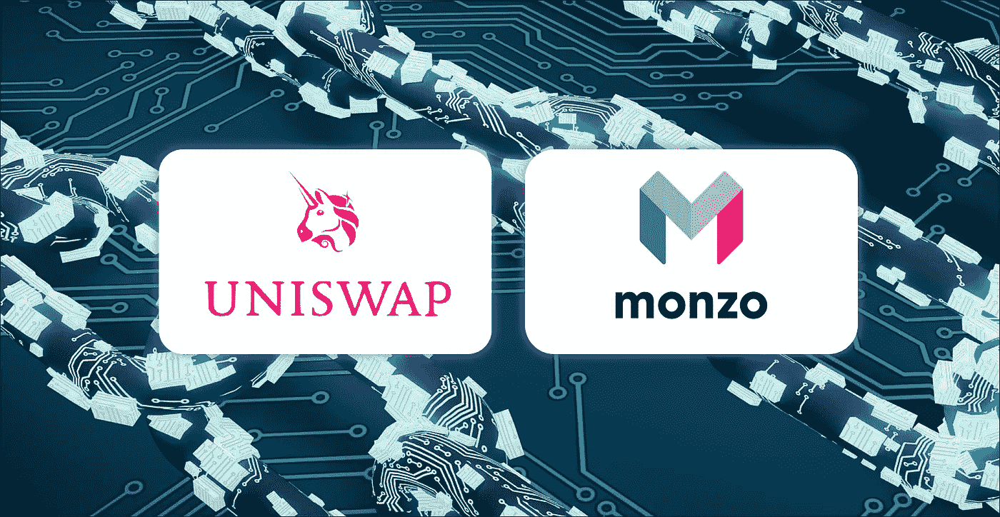

# 我甚至不相信 Monzo，所以我为什么要相信 DeFi 贷款协议？

> 原文：<https://medium.com/coinmonks/i-dont-even-trust-monzo-so-why-would-i-trust-a-defi-lending-protocol-45090e6e99b7?source=collection_archive---------41----------------------->

Uniswap & Monzo

*此文章为数码收藏品，可在* [*tokenblogs*](https://tokenblogs.app/listing/buynow/947605461) 拥有

# 加密货币缺乏 CEX 行动

FTX 在过去一周的崩溃引人注目，损失了数十亿美元，储蓄化为乌有，但一个安静的新希望诞生了。

集中式交易所的致命弱点暴露无遗。

人类的贪婪，对完全权力和政治影响力的渴望接管了一切。

“绝对的权力导致绝对的腐败”，这句话对山姆·班克曼-弗里德来说并不陌生。

FTX 灭亡的后果是，分散交易所的加密资产数量达到创纪录水平，Uniswap 现在是 ETH 掉期交易的第二大市场。

这使得人们乐观地认为，分散化的交易所将成为每个人交易其加密资产的地方。*也应该如此！*

Defi 减轻了与人类心理和会计漏洞相关的各种风险。它还提供完全的透明度，准确显示资金池的流动性、借贷利率，并将其传达给所有市场参与者。

目前，人们普遍认为 DeFi 将吸引大量零售采用，但并不是每个人都对 DeFi 本身感兴趣。

这篇文章纯粹是在探索 DefFi 的借贷产品，而不是互换，在互换中，用户可以借出他们的资产和稳定的硬币，以换取其他用户借入的 APY——类似于银行使用客户存款的方式。

# 信任问题

我是一个超级密码迷，自 2016 年以来一直在这个领域工作，觉得这太不可思议了。

> *但是我当然不会相信那些有任何钱的网站。*

它们可能今天在这里，明天就不见了，被流氓开发者或黑帽黑客攻击、利用。

我对借贷平台的信心非常有限。

> *但这并不仅限于 DeFi lending。我不相信任何数字银行！*

没有 Monzo，没有 Tide，没有 Revolut——如果我的钱有任何问题，我希望能够进入银行并对某人大喊大叫，而不是一些自动化实时聊天的客户服务，甚至更糟的是，在 Twitter 空间上被告知！

# Defi 贷款敞口应被视为一项投资，而不是构成你的整个投资组合

话虽如此，我确实参与了流动性池和贷款产品，但只有一小部分资金**我准备在网站倒闭时损失。**

> *2021 年* ***Defi 用户因价格泵、*** *等各种伎俩和其他漏洞利用损失了 84 亿美元。我在哪里报名？*

我恳请用户将 Defi 池和贷款平台视为一种投资，它们应该只占你投资组合的一定比例，而不是全部。看到人们在一个新的 DeFi 平台上将他们的现金储蓄作为一种新的算法稳定的硬币，我不寒而栗。你在自找麻烦。

> *相信代码而不是人类……*suuureee

# 什么会让我更信任 DeFi Lending 产品:

1.  一个**更低的 APY** ，特别是在稳定的硬币上。
2.  对**的透明度，APY 来自于**并精确分解它是如何获得的，#互换，#清算等… #来自 xyz 的流动性激励，奖金/奖励。
3.  算法稳定的硬币让我逃之夭夭。这些是数学上稳定的硬币，没有抵押，没有任何支持的价值，但能够通过控制供应量来维持盯住汇率。不要误会我的意思，它很聪明，很酷，但他们提供 20%的 APY，这只是一个危险信号🚩。然而，它们对政府和银行机构构成的威胁令人难以置信，但我却不太相信。
4.  **由不在元宇宙的公司**承保的资金池的保险**。🤦**
5.  **教育**和改进的 **UI/UX** 也很关键。大量的 web3 用户就是来看 NFTs 的！如果贷款让他们害怕，我们需要通过提供更好的教育、透明度和安全性来帮助他们度过难关。
6.  解决**非永久性损失**，目前由[科梅塔](https://cometa.farm/)在 Algorand 上解决

DeFi lending 的力量和未来肯定会存在，并且肯定会被主流采用，但不会很快。

开发者应该围绕透明的审计和现实的财务回报，专注于构建一个稳定的、坚不可摧的产品。

*这篇文章是一个数字收藏品，可以在*[*token blogs*](https://tokenblogs.app/listing/buynow/947605461)拥有

> 交易新手？在[最佳加密交易](/coinmonks/crypto-exchange-dd2f9d6f3769)上尝试[加密交易机器人](/coinmonks/crypto-trading-bot-c2ffce8acb2a)或[复制交易](/coinmonks/top-10-crypto-copy-trading-platforms-for-beginners-d0c37c7d698c)