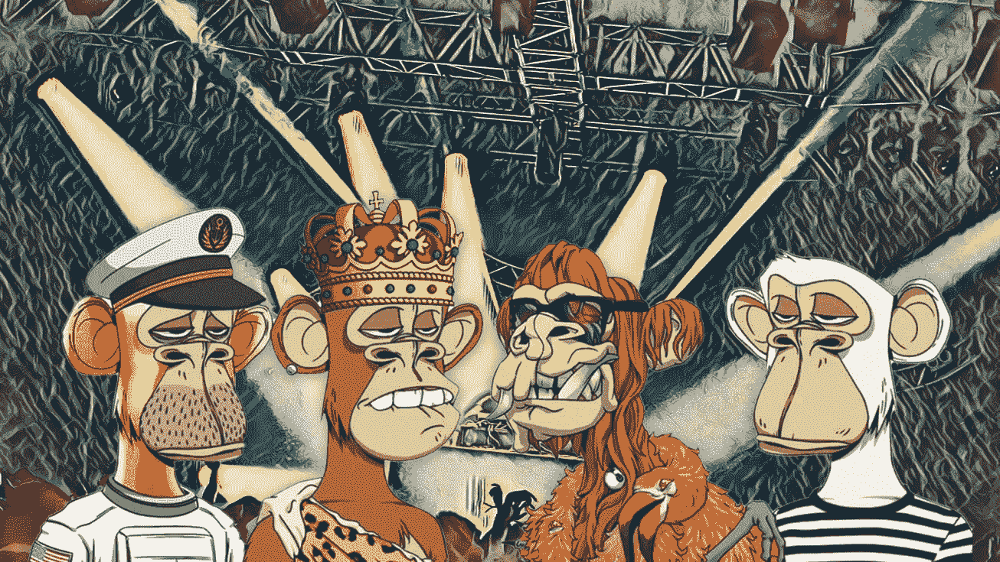
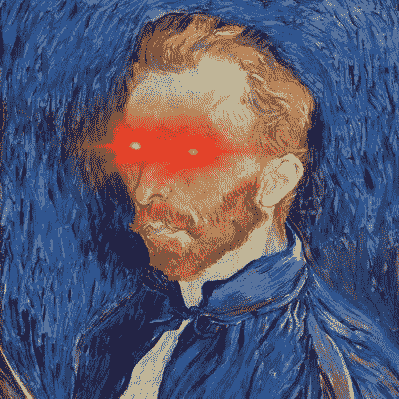

# 我终于发现了 NFTs 的真正目的。

> 原文：<https://medium.com/coinmonks/i-finally-discovered-the-true-purpose-of-nfts-235c0275ca2e?source=collection_archive---------42----------------------->

NFTs are the gateway drugs to Web3.

NFTs 的真正力量在于它是通向 Web3 的门户药物

当有一天尘埃落定，crypto 的冬天结束时，也许我们会问自己这个问题:你们中有多少人真正开始进入 crypto 和 web3 的旅程是因为 NFTs？

不管你是爱、恨还是不关心 NFT，你不得不承认，在过去的两年里，他们席卷了全世界。

从数字猴子到熊猫、浣熊、卷饼、狮子狗、气球、狗、猫、苍蝇、名人甚至涂鸦，非功能性食物有各种形状和大小。

字面上。

如果你非常努力地尝试，你现在想不出一个 NFT 原创的想法。

NFT 像 20 世纪 90 年代的 Furbies 一样突然出现。

如果你不知道什么是 Furby，谷歌一下，今天就学习一些新的东西。

你以后会感谢我的。

NFT 创造了价值数十亿的公司。

创业公司、艺术家、程序员、社区建设者、玩家等等的整个生态系统几乎神奇地围绕着 NFTs 显现出来。

只要看看宇迦实验室对他们的 NFT 集合 BAYC 做了什么，它变成了一个完整的元宇宙游戏，筹集了 4.5 亿美元，震撼了整个加密世界。

Hate it or love it, in the grand scheme of things, what Yuga did with Bored Apes and their NFTs, really brought web3 forward by leaps.

请注意，整整一代的年轻投资者和交易者不会告诉你如何使用洗衣机，但可以教你如何在 Magic Eden 和 OpenSea 上翻转 NFT，花费数千美元。

他们在课堂上没有学到记号经济学。

他们没有通过一学期又一学期的讲座来理解区块链、利害关系的证明和切分。

他们不需要。

他们从 NFT 开始，让他们的想象力漫游到他们感兴趣的任何地方。

也许这就是现代社会中非功能性外语教学的真正力量。

它是通向 Web3 的门户药物。

当然，你可能讨厌到处都是诈骗和网络钓鱼。

是的，总督，BTC 和许多其他硬币的价格都转移到埃隆的推文。

当然，有大量的炒作、愤怒、失望和推诿。

你可能是为了 NFTs 而来，希望复制一个好的 jpeg 来翻转。

或者听一个播客或有影响力的人告诉你买机械化柚子 NFT 收集。

但是你会为社区、技术和它对未来的承诺留下来。

直言不讳。

对我们大多数人来说，NFTs 只是一种入门药物。

一个简单的机制，进入奇怪的，野生世界的密码。

一扇神奇的珍珠白门，顶上有明亮的霓虹灯招牌，吸引我们进去，轻推我们迈出进入 web3 的第一步。

What are some of the most ridiculous NFTs you have seen?

我们的旅程永远不会在 NFTs 结束。

我们中的一些人会被烧伤，被炒鱿鱼，被诈骗，被扇耳光。

但是我们会学习，重组脑细胞，继续前进。

web3 不仅仅是 NFTs。

有元宇宙、gamefi、defi、基础设施等等。

你可以是玩家、收藏家、交易员、建筑商、程序员、社区经理、艺术家、不和冠军、潜伏者甚至是仇恨者。

Web3 是自由，你可以自由地做任何你喜欢的事情。

不要害人害己就好。

-

2023 年 NFTs 还会火吗？

-

# startups # business # startupx # growth # success # social media # culture # entrepreneurs # strategy # eth #比特币#加密货币# bayc # nft # getrich # trending #品牌#web3

> 交易新手？试试[加密交易机器人](/coinmonks/crypto-trading-bot-c2ffce8acb2a)或者[复制交易](/coinmonks/top-10-crypto-copy-trading-platforms-for-beginners-d0c37c7d698c)