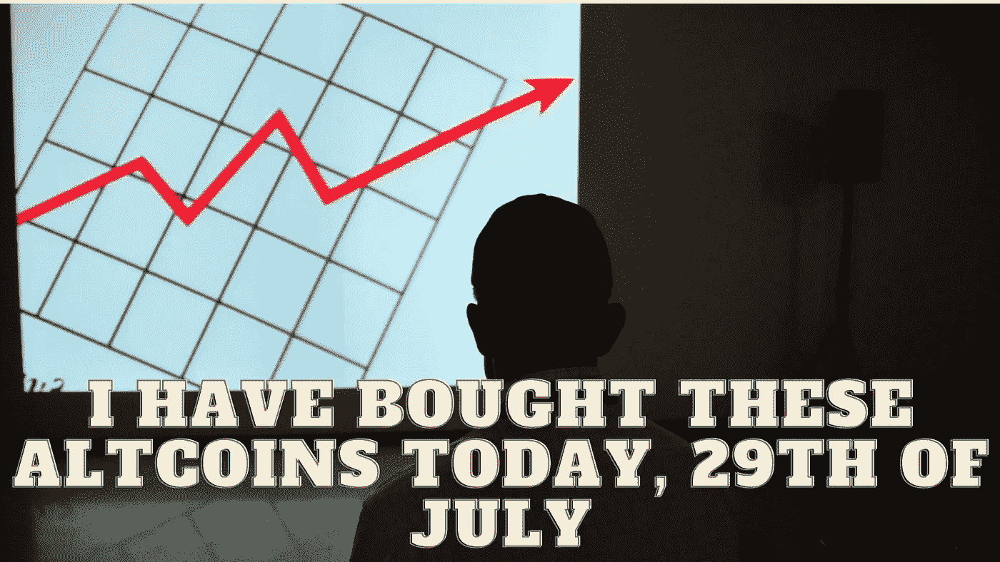

# 今天，7 月 29 日，我买了这些硬币。你怎么想呢?

> 原文：<https://medium.com/coinmonks/i-have-bought-these-altcoins-today-29th-of-july-what-do-you-think-6d0844e46a39?source=collection_archive---------31----------------------->

Source photo Unsplash.com

# Dogecoin (DOGE)

最初，这只是一个恶作剧，对某些投资者来说是有回报的。Dogecoin 是对加密货币行业的讽刺性模仿，获得了“meme coin”的绰号。正因为如此，Dogecoin 飙升到了新的高度。