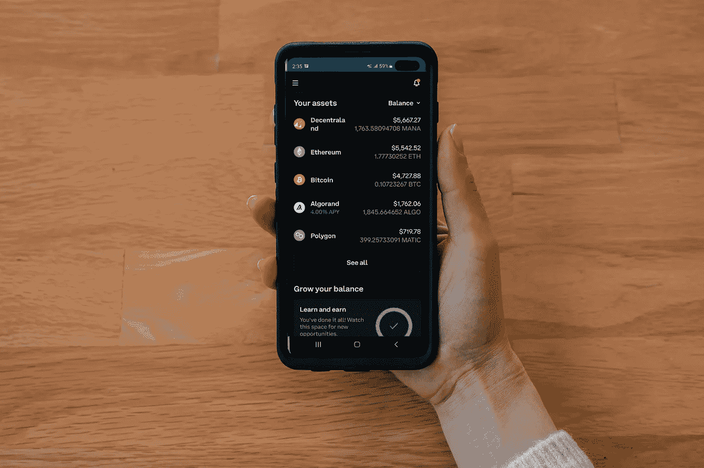

# 我在 7 月份投资了这些密码。你的文件夹里有吗？

> 原文：<https://medium.com/coinmonks/i-have-invested-in-these-crypto-in-july-do-you-have-them-in-your-portfolio-8b0b5c8a6365?source=collection_archive---------31----------------------->

Source photo Unsplash.com

# 茄属植物

sola(SOL)是现有的最快和最具扩展性的加密货币之一。由于其可扩展性，该项目于 2021 年年中启动。然而，索拉纳区块链的稳定性问题现在已经导致其价值下降了 86%。