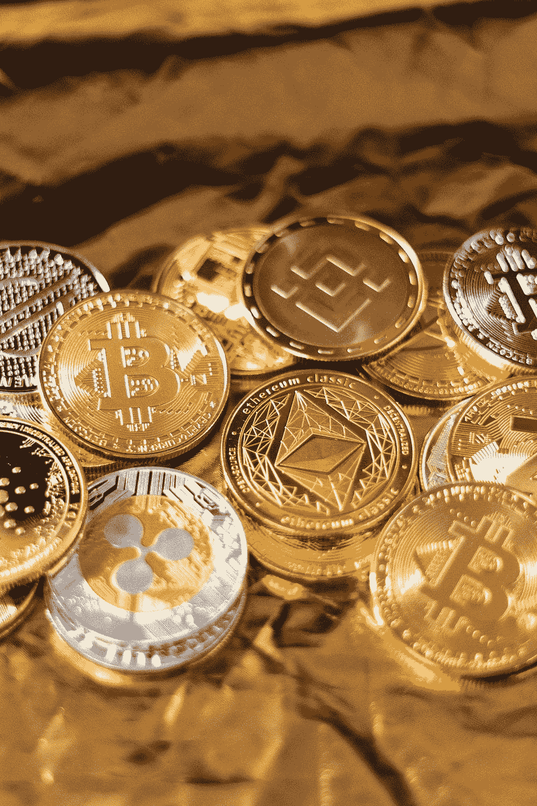

# 我在一种高风险的加密货币上投资了 100 美元，想看看结果如何。

> 原文：<https://medium.com/coinmonks/i-invested-100-in-a-high-risk-cryptocurrency-to-see-how-it-turns-out-6469ba29e1d8?source=collection_archive---------28----------------------->

Photo by [Art Rachen](https://unsplash.com/@artrachen?utm_source=unsplash&utm_medium=referral&utm_content=creditCopyText) on [Unsplash](https://unsplash.com/s/photos/crypto?utm_source=unsplash&utm_medium=referral&utm_content=creditCopyText)

你知道吗，如果你在 Shib 硬币流行之前买了 100 美元，你就已经在 ATH 赚了 100 万美元了。

当然，我们很容易看出这一点。毕竟，后见之明总是 20–20，对吗？

然而，这凸显了一般加密的残酷现实。

当然，你仍然有可能通过投资已经流行的硬币赚很多钱。然而，除非你在很多人还不知道这枚硬币的时候发现了它，否则你永远也不会经历 x1000 事件。

因此，根据这一推理，我决定离开排名前 500 的加密货币，开始寻找一颗隐藏的宝石。

请注意，我不会建议任何人做我正在做的事情，因为投资低市值硬币风险极大，充满了骗局。事实上，我已经被[骗了](/coinmonks/only-stupid-people-fall-for-crypto-scams-until-i-fell-for-one-19042dd092e8)很多次了。

## 硬币选择标准

有经验的交易者给新手的建议是永远不要感情用事。

我用来防止我的情绪影响我的判断的一个方法是建立一套标准，一枚硬币在投资之前必须满足这些标准。

无论一枚硬币被炒得多高，价格涨了多少，我都不会投资它，除非它能满足我的所有要求。

出于记录目的，以下是选择低市值硬币的一套标准:

*   **有实际用例**

密码领域的资深人士告诉新手的最常见的一条建议是，只投资有真实用例的硬币，尤其是在熊市的时候。

这是因为具有实际用例的加密货币可以在没有炒作的情况下生存，因为它们本身就有价值。

*   **在社交媒体上表现活跃**

第二个标准是，硬币应该有一个活跃的社交媒体存在，定期更新其投资者，无论硬币的价格波动。

我加入这个标准是因为让我们面对它，营销和炒作是一枚硬币价格上涨的基本因素。

*   **积极发展，忠实于他们的路线图**

除了有一个实际的用例，我还有另一个不可协商的标准，那就是项目背后的团队积极地开发项目并满足他们为自己设定的最后期限。

它确保团队信守承诺，项目不仅仅建立在空洞的承诺上。

*   **必须拥有 100 万美元或更少的市值**

正如我之前提到的，这个实验的目标是投资一个有潜力做 1000 倍或更多的硬币，所以我的高风险投资的标准之一是它应该有低市值。

对于那些不熟悉市值的人来说，市值就是硬币的价值乘以其发行量。它用来衡量硬币的市场有多大。

*   **度过了我 1 个月的冷却期**

最后，我知道我是那种容易冲动的人。所以，我最后的标准是，在我投资之前，硬币应该能够在我发现它之后存活一个月。

无论价格在 1 个月的冷却期内如何变化，我都不会购买，我只会观察团队如何处理加密货币中典型的波动性。如果它能存活一个月而不损失 90%的价值，我就投资它。

## 我是怎么找到硬币的？

我通过运气和个人偏见找到了这枚硬币。

首先，我去了 coinmarketcap，按市值排名浏览了列出的加密货币，并在排名前 3000-2000 的范围内寻找一种引起我兴趣的硬币。

## 结果呢

经过数周的努力(JK，实际涉及的工作只是一个小时左右)，我终于找到了一枚符合我所有标准的硬币，而且很可能不是骗局。

这种硬币是由 KaJLabs 开发的岩石圈(LITHO)，是第一种利用深度神经网络学习实现加密互操作性的加密货币。

它的市值约为 8 万美元，可能是我 100 美元投资的 1000 倍。

看起来该团队是合法的，几个月前甚至提供了 2.5 亿美元来拯救旅行者号。

目前，我持有大约 90，000 枚 LITHO，我是以每枚 0.0011 美元的价格购买的，如果它的价格达到 10 美元，我将拥有近 100 万枚。

链接到[关于这次投资的第一次更新](/coinmonks/i-invested-100-in-a-high-risk-cryptocurrency-to-see-how-it-turns-out-6469ba29e1d8)。

如果你想知道这项投资的结果，请关注我并订阅我的时事通讯。我将张贴每月更新我的$LITHO 投资。

> 交易新手？试试[密码交易机器人](/coinmonks/crypto-trading-bot-c2ffce8acb2a)或[复制交易](/coinmonks/top-10-crypto-copy-trading-platforms-for-beginners-d0c37c7d698c)