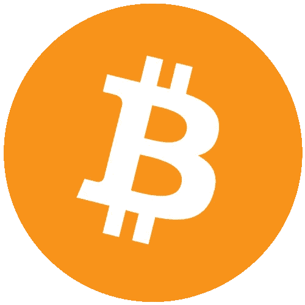

# 我喜欢比特币

> 原文：<https://medium.com/coinmonks/i-like-bitcoin-11c90e0740a0?source=collection_archive---------36----------------------->

嗨，我是 Cryptogawd

**我喜欢比特币**

*我的意思是连商标看起来都很棒*

*看看她，她是个美人，不是吗？*

***BTC 一直在那里陪着我同甘共苦，又回来了***

自从我看到比特币，我就知道她会成功。当我第一次听说人民币汇率时，我就知道我应该多买一些。因为我已经知道这枚硬币会改变世界。当我开始看到越来越多的 BTC 自动取款机出现在我经常光顾的商店里时，我知道我正在亲眼目睹一些改变生活的事情。

我只想和她在一起。我看到她这些年变得很红。我确实后悔没有早点买更多。但是，嘿，没有人是完美的，即使是 Gawd。你得活到老学到老，对吧？

*对吧？！哈哈*

不管怎样？我觉得比特币前景光明。这就是为什么我不断增加我的 SAT 堆栈。最近的熊市肯定了我的位置，也加强了我对头号加密专家 BTC 的信心。

不可否认，我以前更喜欢叠硬币。

但是，然后…

***事情变了***

Terra Luna 崩溃，导致 Luna 令牌一夜之间持平。此后不久，主要的 DeFi 平台 Celcius、3AC(三箭资本)和 Voyager *、*变得资不抵债，摇摇欲坠。这种多米诺骨牌效应在整个密码领域都可以感觉到。

所以，现在，我们在这里，在熊市。我以前比较坚定的相信 altcoins。但是，目睹 Terra Luna 的情况让我后退一步，把这个空间作为一个整体来分析。小数点后有 6 个零的硬币和 20k 的 BTC 哪个更安全？以前的我会说是 altcoin。但是，现在，新的我说要把高考成绩扔掉。

诚然，一旦牛市真的回来，即使是很快，替代硬币也会给我带来更好的回报。但是，伴随着更高利润的附加潜力，伴随着小市值替代硬币而来的是更高风险的波动性。

就像我们今年看到的那样，即使是大钞币也不安全。没有密码是安全的，甚至比特币也不安全。但是，在所有的密码中，比特币是最安全的。

甚至，BTC 最大的敌人，SEC 主席 Gary Gensler 也承认，在所有的密码中，BTC 是最安全的。他承认，他认为唯一的“商品”是 BTC 硬币。这使得 BTC 不同于包括 ETH 在内的所有其他硬币，他认为“安全性”更高。Gensler 的这一承认可能会产生重大影响，一旦即将到来的加密法规最终确定并签署成为法律。

**DCA 时间**

因此，为了应对这次熊市，我们必须牢记一些来自我们更明智的经济前辈的明智建议。

***命运偏爱勇敢的人*** ~ *奥登蒂斯·福尔图娜·尤瓦特*

我把这句话解释为逆潮流而动，做大多数人不愿意做的事情，比如在经济衰退时买入下跌股，哈哈。这让我想起了另一个经常听到的术语，尤其是在 crypto 中。

***熊市造就百万富翁***

我不知道这句话的出处，但它听起来确实符合我们当前面临的加密市场形势。这两句话让我把目光聚焦在我的 BTC 包上。这就是为什么我把我的整个策略变成了平均每天投入比特币的美元成本。当然，如果市场完全崩溃，甚至 BTC 跌至 0，这可能是一个坏主意。但是，我相信这是一个焦土情景，我不认为会发生。

*那不是说它*不能*发生。我只是确信它不会*

总之，就像我说的。我已经改变了我的加密策略，不再专注于堆叠大部分代用币，现在的重点是堆叠大部分 BTC。

我仍会将我投资组合的一部分投入到替代硬币堆叠中。因为，让我们承认，一些替代硬币硬币*会*成功，尽管很多不会。我的意思是 1000 倍就是 1000 倍。在牛市中，替代硬币总是这样做。

这意味着，一些不起眼的替代硬币*可以*改变生活，如果玩的方法正确，通过长期持有。这就是为什么我仍在投资代用币，尽管不再像以前那样大量投资。

这可能会在牛市中发生变化，但目前，我对投资策略的永久调整是始终确保 BTC 是我现在最大的袋子。

即使当公牛回归，BTC 仍将是我设计的最大的袋子。

一旦熊市稳定下来，牛市开始，我敢肯定 altcoin 赛季将会回来。我的蜘蛛感官告诉我。

然而，投资 BTC 将会加强我的投资策略。因为，如果所有其他的都失败了，所有其他的硬币都变成了 0，我仍然有原来的硬币在我的端口里。因为，我很确定，至少我的 BTC 会活下来。

**NFTs 和游戏**

除了 BTC，我仍在大力投资的另一个领域是游戏 NFTs。首先，我热爱游戏和 NFT 科技。我们都知道游戏是世界上最受欢迎的在线游戏，除了可能 p0rn 哈哈。

无论如何，关键是我非常相信现在接管游戏的 P2E 方面。

自 Axie Infinity 以来，区块链游戏已经走过了漫长的道路。每个月都有许多新游戏、机会甚至奖学金*(将你的游戏 NFT 资产借给其他玩家，收取一定比例的利润)*问世，就像现在一样。这种新的数字经济可能会塑造我们网上交易的未来。

*NFT 博彩业是博彩业的未来，我坚信袖手旁观的这一信念*

这个领域对投资者来说是一个巨大的机会，我不会用这篇文章的一小部分来公平地对待它。我在文章中添加这一部分只是为了让您了解除了 BTC 之外，我所相信的其他一些 crypto 机会。

我不会对 NFT 游戏进行过多的描述，因为坦率地说，这已经超出了本文的范围。但是，我会给你一个更好的，并致力于整个即将到来的写这个白热化，蓬勃发展的加密部门。

所以，让我们回到这篇文章的主要焦点…

**BTC 为王**

我将以我喜欢，*也许爱*，比特币来结束这篇文章。

尽管我花了很长时间才真正意识到 BTC 是安全的避风港，但重要的是我学到了。我了解到 BTC 是真正的国王，尽管我尽了最大努力来利用疯狂运行的替代硬币。从中吸取的教训是，在多年来保持其价值方面，没有其他加密技术像 BTC 那样可靠。

这只熊教会了我一条艰难的道路，那就是坚持我唯一真正的资产，它会像黄金一样随着时间的推移不断升值。

*我猜你可以称之为数字黄金，也就是比特币*

好了，我对投资的自我反思到此结束，哈哈

希望你喜欢。

谢谢你听我倾诉，朋友们。

直到下一次， ***CRYPTOGAWD，OUT***

***免责声明:*** *请记住，这仅仅是我的观点，这些都不是财务建议。在进行任何投资之前，你都应该咨询你的财务顾问和 DYOR，尤其是在高风险和不稳定的加密市场。*

> 交易新手？尝试[加密交易机器人](/coinmonks/crypto-trading-bot-c2ffce8acb2a)或[复制交易](/coinmonks/top-10-crypto-copy-trading-platforms-for-beginners-d0c37c7d698c)