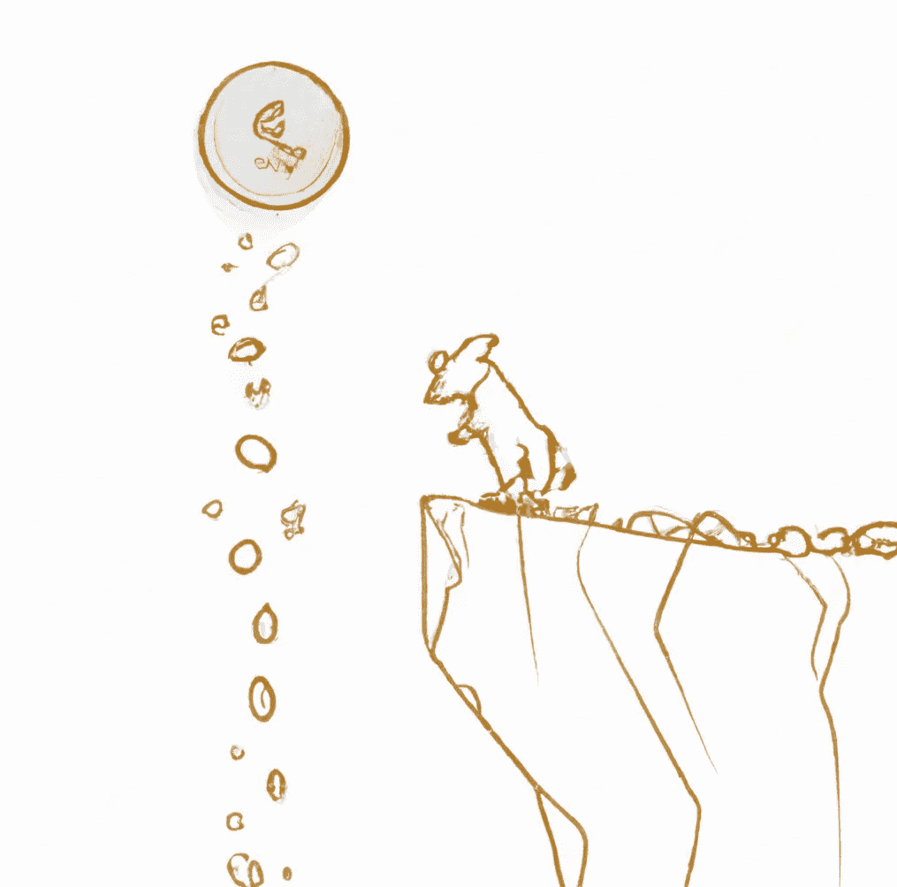

# 我可能会失去我所有的钱在双子座(赚取赎回待定)

> 原文：<https://medium.com/coinmonks/i-might-lose-all-my-money-in-gemini-earn-redemption-pending-b95c8fd18a32?source=collection_archive---------4----------------------->

自从我在 Gemini Earn 提交赎回我的加密股份的请求以来，已经过去了八天。我还没看到我的钱。最糟糕的是。双子座不知道我什么时候能拿回我的钱，也不知道我到底能不能拿回。

> 如果我们的理解是正确的，即这是一个流动性问题(即现金流破产)，那么 Earn 用户完全收回资金是可能的。如果这是一个资产负债表问题(即资产负债表破产)，其资产少于负债，**那么可能会损失一些金额**。我们目前没有迹象表明这是一个资产负债表问题，而是一个流动性/现金流问题。我们的首要任务是帮助赚取用户收回他们的资金。

我不能说他们的回应让我充满了信心，但是我认为他们尝试[频繁透明地交流更新确实值得肯定。也许，仅仅是也许，他们对形势的理解是正确的。](https://www.gemini.com/earn)

说到这里，什么是资产负债表破产？它是指一家公司的总负债(债务和其他金融义务)超过其总资产(财产、投资和其他价值来源)的情况。换句话说，当一家公司无法用其流动资产偿还债务时，就会发生资产负债表破产。如果 Genesis 确实面临资产负债表破产问题，那么他们可能无法履行其财务义务，你可能再也看不到你的钱了。

如果像双子座认为的那样是流动性问题，那么对于想要赎回自己股份的双子座客户来说，前景肯定更加乐观。现金流破产是指一家公司手头没有足够的现金来履行其当前的财务义务。它不同于资产负债表破产，因为公司有足够的资产来支付他们的负债，但没有足够的流动现金来支付他们的短期财务义务。如果 Genesis 面临现金流破产问题，他们可能会被迫贷款或其他形式的融资来履行义务。好消息是什么？你可能会再次看到你的钱，虽然这可能需要一些时间。

## 我的外卖？

1.  你并不孤单。据报道，Genesis 及其母公司 Digital Current Group (DCG)欠 Gemini Earn 客户 9 亿美元。
2.  撇开细则不谈，如果双子座一开始真的想对他们的客户透明，他们应该把它叫做 *Genesis Earn，*而不是 *Gemini Earn* 。
3.  抱最好的希望，做最坏的打算。

[1][https://www.gemini.com/earn](https://www.gemini.com/earn)

[2][https://decrypt . co/116387/genesis-Gemini-earn-9 亿-owned-users-ftx](https://decrypt.co/116387/genesis-gemini-earn-900-million-owed-users-ftx)