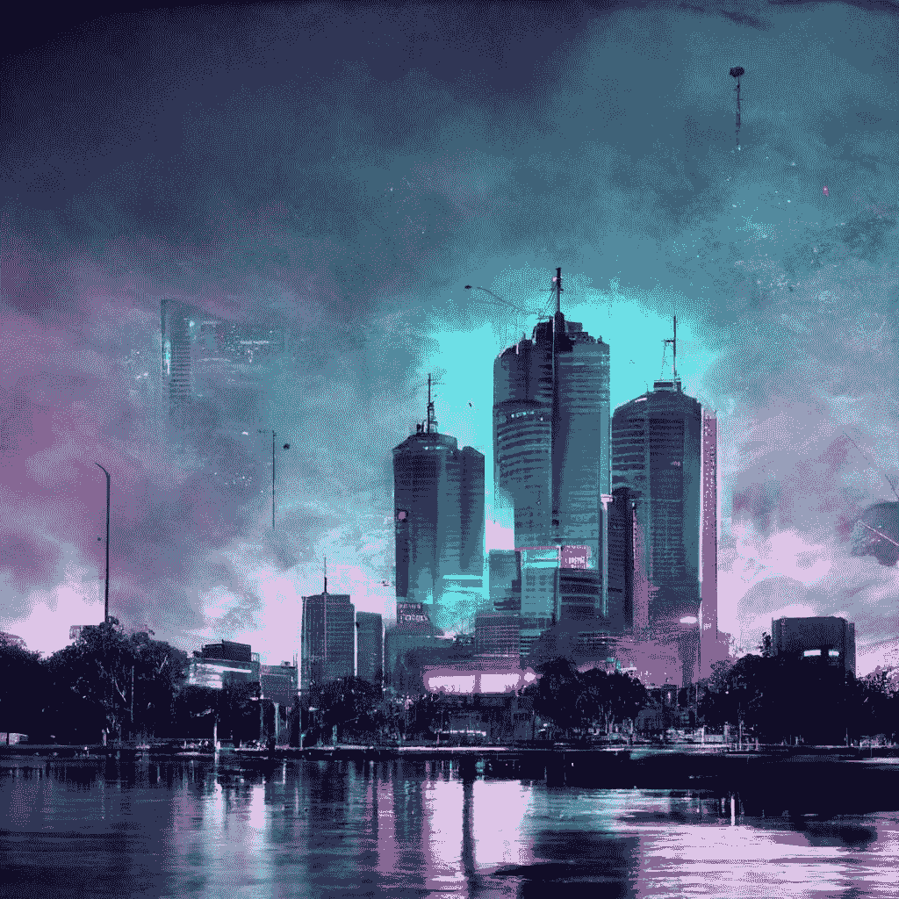
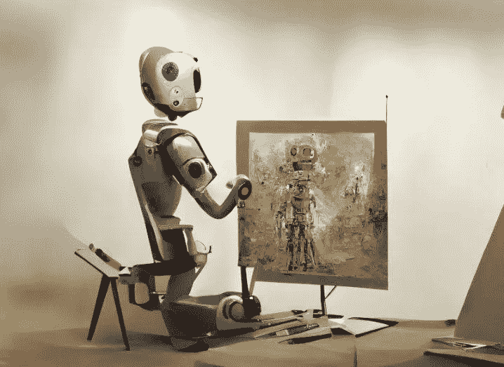
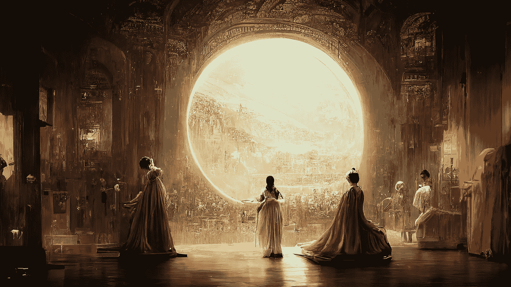
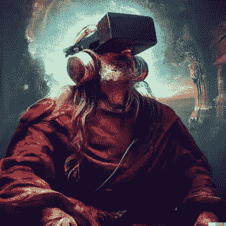

# 我认为人类刚刚破解了创造力的密码

> 原文：<https://medium.com/coinmonks/i-think-humanity-just-cracked-the-code-for-creativity-5e5d28d200ae?source=collection_archive---------37----------------------->

Humanity just outsourced imagination and creativity to AI.

人生最难解决的问题之一就是:创造力。

创造力，想象力，原创思想。

这些都是非常复杂和无形的东西，只是凭空发展，对不对？

我的意思是，从写一个故事到为一首歌创作歌词，从插图到表达你的想法到数字艺术作品，这一切都始于创造力。

你是如何解决创造力的？

你不能。

这是完全不可能的。

那么 OpenAi 做了什么呢？

他们做了退而求其次的事情。

他们创造了一个强大的人工智能，即机器学习模型，允许任何人仅从一行文本中创建图形。

因此，虽然它不能取代创造力或帮助你产生原创想法，但它有很大的帮助。

Generative AI Art has the ability to create some truly amazing graphics that will rival even the best artists.

你必须看到它的行动才会感到困惑。

这简直令人震惊。

简单地输入一行字，比如“愤怒的史莱克吃漂浮在太空中的热狗”或“特朗普在巴黎度假时抚摸鬣蜥”。

几秒钟后，它会神奇地创造出让你震惊的数字艺术品。

Linkedin 的创始人雷德·霍夫曼详细讲述了 Dall.e 将如何成为世界上的一项杰作。

毫不费力地向世界传播艺术和创造力。

基本上，任何人，任何地方，只需要文字就可以创作出丰富、有创造力和美丽的艺术作品。

想象力是主观的，甚至不是 Dall.e 工作的强制要求。

它有帮助，但不是必须的成分。

This artwork won first prize at a competition and it was done with the help of generative AI tech.

迷人吧？

这就是今天人工智能技术的状态。

像 Dall.e 这样的技术本质上意味着任何人都可以成为插画师、平面设计师、画家、NFT 创作者、视觉艺术家等等。

需要一些有趣的艺术作品来为你的文章增添趣味吗？

需要一张引人注目的照片来在你的社交媒体帖子中引发欢乐吗？

您的登录页面需要一张新的封面图片吗？

需要为你的观众创作一个数字卡通系列吗？

需要向您的设计团队展示模型吗？

Generative AI tech will change the world in ways we can’t even imagine.

Dall.e 只是一个开始。

OpenAI 为人类做的事情太棒了。

其他人将跟随它的脚步，带领我们更快更好地前进。

Meta 刚刚发布了他们的 Dall.e 版本，我迫不及待地想试试。

让我们希望所有这些科技进步也能发生在其他重要领域，比如医学和健康。

未来已经变得更加光明。

-

你试过 Dall.e 吗？

-

# startups # business # startupx # growth # success # social media # culture # entrepreneurs # strategy # eth #比特币#加密货币# web3 # dalle # ai #计算机# openai # meta #技术#机器学习#创造力

> 交易新手？试试[加密交易机器人](/coinmonks/crypto-trading-bot-c2ffce8acb2a)或者[复制交易](/coinmonks/top-10-crypto-copy-trading-platforms-for-beginners-d0c37c7d698c)