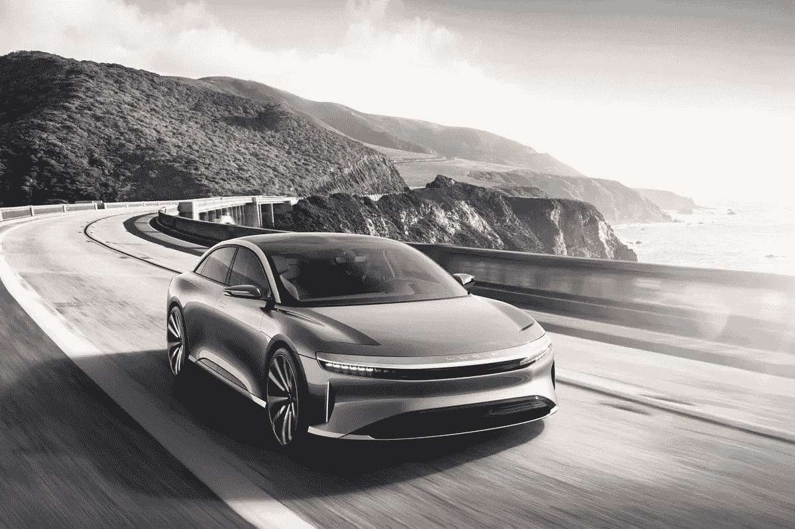
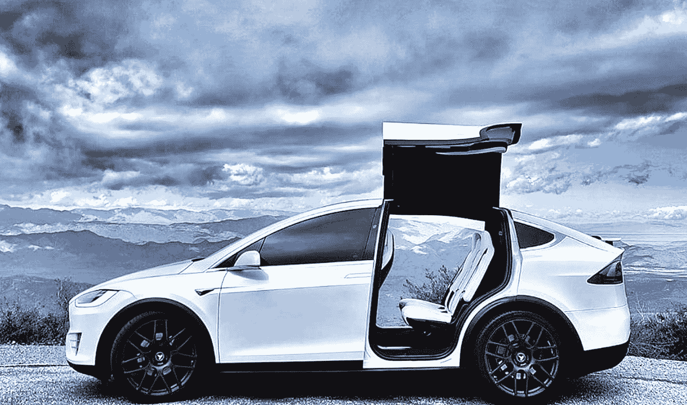
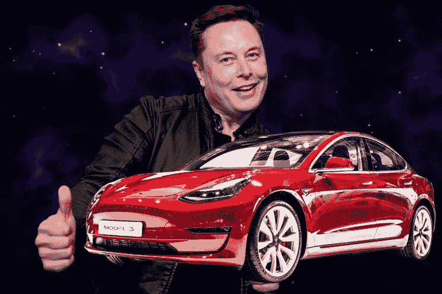
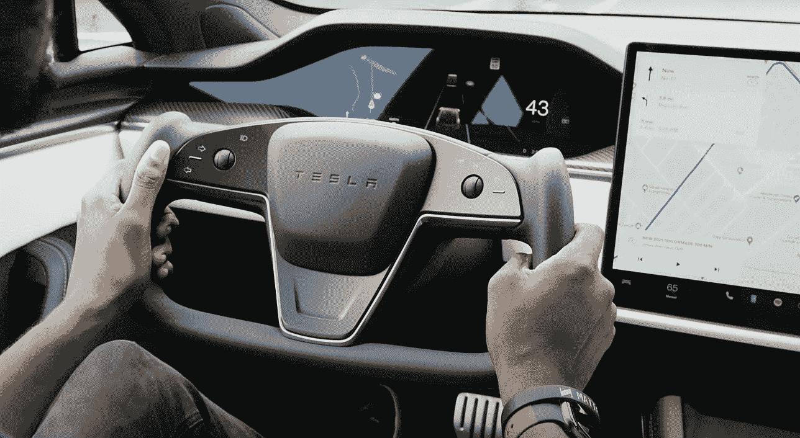
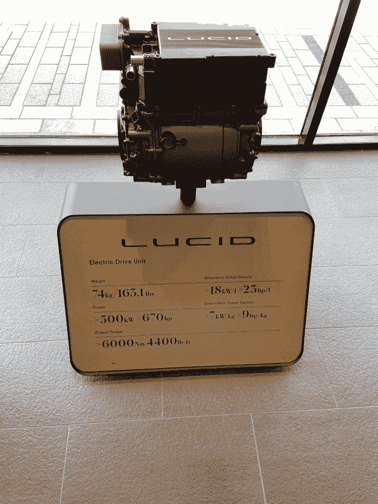

# 我认为泰斯拉很酷，直到我遇到了鲁西德

> 原文：<https://medium.com/coinmonks/i-thought-tesla-was-cool-till-i-met-lucid-466905502539?source=collection_archive---------5----------------------->

Lucid Air is unstoppable. With a choice of single, dual, or three-motors and max horsepower of up to 1,200+³, it can go from 0–60 in sub 2 seconds, reach a quarter-mile in under 9 seconds, achieve a top speed of 200+ mph, and has a proven track record for power, literally.

你知道我喜欢特斯拉。

我爱它胜过只在新加坡才有的麦当劳扭扭薯条。

它的速度快得离谱，现代，经过深思熟虑，功能强大，在各方面都胜过任何传统轿车，而且不会倾家荡产。

在过去，当技术还没有跟上时，电池是巨大的，电动机仍处于初级阶段，驾驶电动汽车有太多的缺点。

但最重要的是，消费者的思维局限于传统的内燃机。

想象一下，当亨利·福特试图说服人们尝试汽车而不是可靠的马时，他是多么艰难的一项事业。

但后来，埃隆·马斯克(Elon Musk)出现了，提升了世界的思维。

他让电动汽车变得很酷。

他让我们所有人都接受了这样一个事实:电动汽车不仅可以代替传统汽车，还可能是交通运输的未来。

他花费了数十亿和数十年来改变这个星球上最难的东西:心态。

Lucid is cool, but it will never be automated, intelligent Gull-wing doors kinda cool that the Tesla Model X has!

现在我们都更有教养，更有信心了，你猜怎么着？

向 Lucid 问好。

实际上，一个由前特斯拉工程师组成的团队决定分拆，成立自己的电动汽车制造商。

特斯拉正在与传统的汽车制造商和旧的消费者心理作斗争。

既然这场战斗已经取得了胜利，Lucid 决定成为一名特斯拉杀手。

听起来不公平？

欢迎来到自由市场资本主义和竞争进化的最佳状态。

The flagship Lucid might be faster than the Tesla Model S Plaid, but Lucid doesn’t have the richest and most popular man on earth to be their hype man.

Lucid 是一家非常新的公司，但它在各个方面都非常出色。

Lucid Air 比旗舰特斯拉 Model S 的续航里程更长。

与特斯拉 Model S 的 1020 匹马力相比，它的马力更大，为 1111 匹。

不知道为什么世纪冲刺慢了，2.5 秒比特斯拉的 1.99 秒。

它充电比特斯拉快。

它的座位容量和行李箱容量都更大。

入门级的 Lucid Air 比 Model S 便宜 20k。

其 670 马力的电动引擎可以放入背包，由儿童携带。

它的设计基本上击败了 Model S 的各个方面。

Lucid Air 的内部是颓废的，旨在成为电动汽车的精致，豪华轿车。

虽然我不得不说，模型 S 的转向蛋黄简直更惊人。

Just pause for a second to admire the beauty of the steering yolk that the Tesla Model S has!

我很确定 Model S 和 Lucid Air 在赛道和公路上都表现不错。

嗯，我不得不承认，埃隆是一个天才，他让 EV 变得很酷，并开创了许多我们知道并喜爱的令人敬畏的技术。

但与此同时，看到有人甚至试图直接挑战他也非常酷。

谁有足够的勇气(或愚蠢)与埃隆正面交锋？

清醒。

The Lucid engine is so tiny yet generates so much power — what a magnificent work of engineering.

我不能等待更多的挑战者，因为这将推动健康的竞争，更多的进步，并希望对像我们这样的最终消费者更好的交易。

同时，我会吃一些爆米花，等待中国人以一种有意义的方式进入游戏。

-

你听说过电动汽车公司 Lucid 吗？

-

#创业#商业# startupx #成长#成功#社交媒体#文化#创业#战略# eth #比特币# lucidair # lucid # elon #特斯拉#车型# luciddream # ev #电动汽车#革命#中国

> 交易新手？试试[加密交易机器人](/coinmonks/crypto-trading-bot-c2ffce8acb2a)或者[复制交易](/coinmonks/top-10-crypto-copy-trading-platforms-for-beginners-d0c37c7d698c)