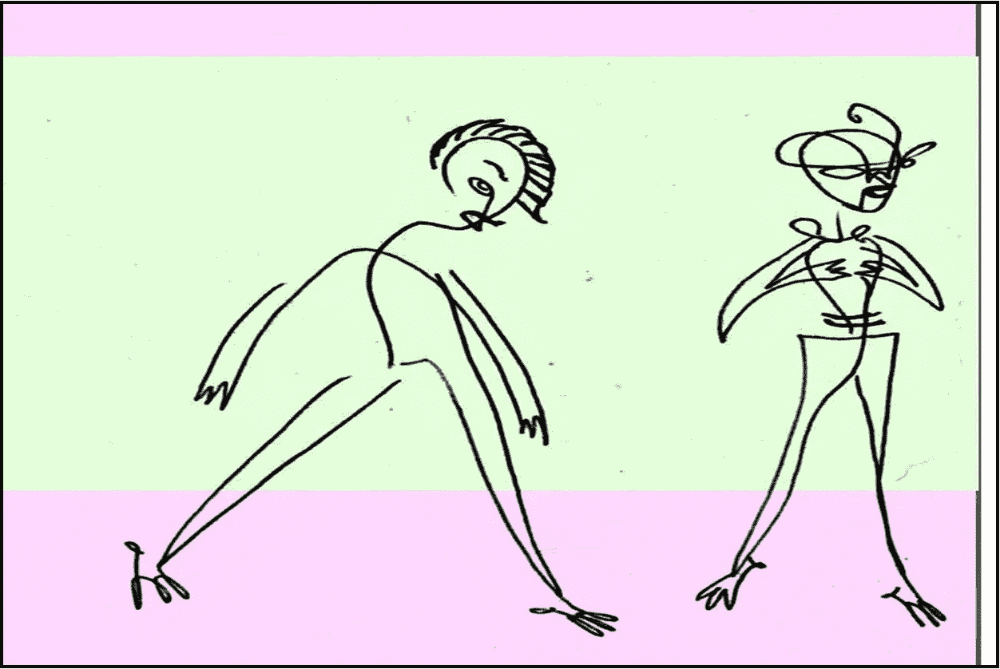
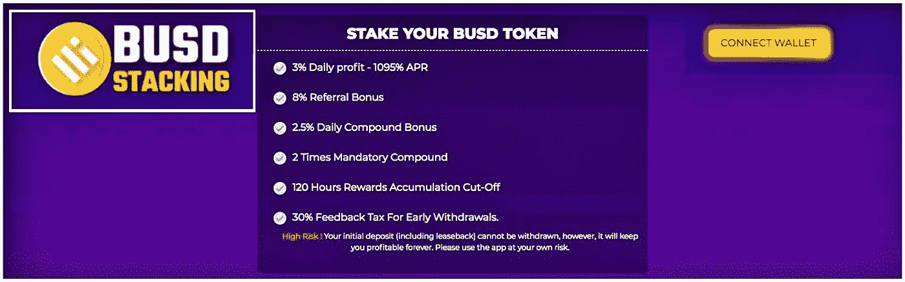
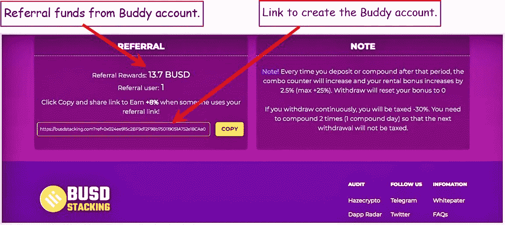
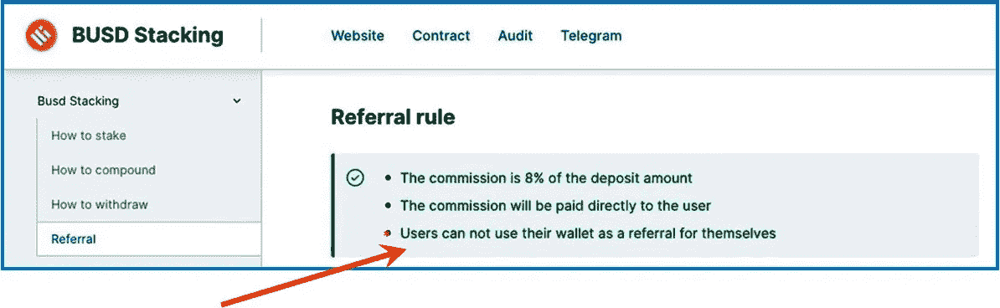
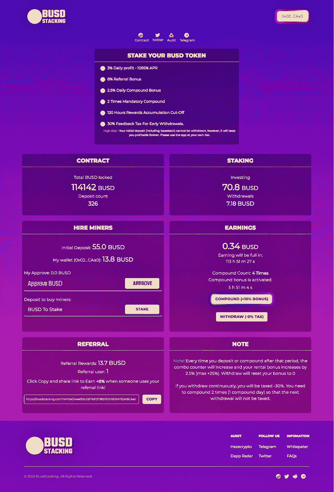
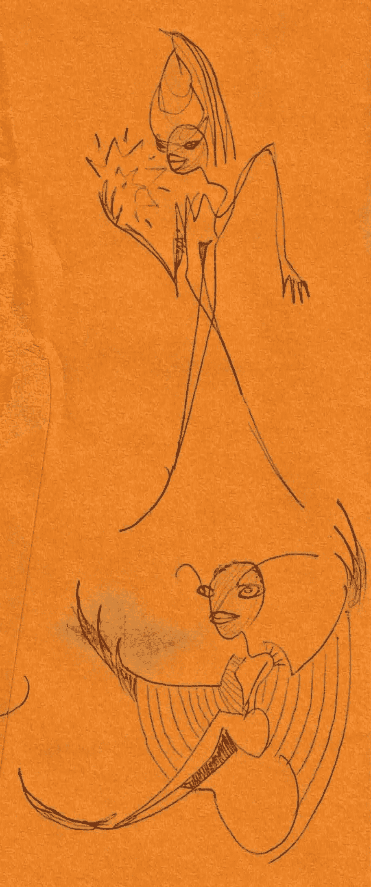

# 我通常按规则玩，但是…

> 原文：<https://medium.com/coinmonks/i-usually-play-by-the-rules-however-fdaf77d191b2?source=collection_archive---------18----------------------->

## 优化投资:每个 ROI 的主要和伙伴钱包帐户-零钱加密赌注协议

I’m always glad to share; however, sometimes you just want to be your own Buddy…

在这个快节奏的加密丛林的角落里，人们必须意识到每一块钱。失去辛苦赚来的现金真糟糕！它教会我们在投资前考虑项目的每一个部分，而不是被吸引到华而不实的首页。在我掏钱之前，我想对一个项目有足够的了解，让我对它感到舒服和自信。

以这些 ROI crypto miner 投资项目为例，它们的日回报率高得离谱。在我贪婪的头脑中，他们声称的每日回报数字太诱人了，如果不迈出第一步，也许只是更近一点点，我就不会轻易放弃。我肯定被烧伤过，很多次。然而，我在投资它们方面也做得很好，所以我不会对它们都打折扣。

> 我探索和剖析新的口袋变化加密赌注协议。我要么把它们拆开，要么决定投资这个项目，鼓励它们的可持续性和持久性。很少有矿工会升到最高层；那些是我正在寻找的。

优化对这些赌注平台的投资的一种方法是对相同 miner 协议上的不同账户使用不同的钱包。称为我的主要和好友帐户，他们都服务于非常免费和有益的目的。

就像任何一个口袋变密码矿工一样，你[不会直接跳进](/@jebalucas/diving-head-first-into-pocket-change-crypto-miner-protocols-581a03ade2fc)。你先研究它，[寻找危险信号&弱点](/coinmonks/dipping-a-toe-into-cryptos-pocket-change-miners-398f2995c61d)。待办事项清单很长…对于每个项目，我已经阅读了所有我能阅读的书面信息，&研究了来自与矿工相关的智能合同的区块链分析/信息。后续步骤…

## 主要账户

满意之后，我用 50-60 美元创建了我的试水账户**主账户**，或者规定的最低金额。在我准备好之前再投资已经被证明是一个坏主意。

> 学习耐心对我来说并不容易；看着数千美元被带入虚拟的风中，然后通过一个有缺陷的加密矿工项目消失，我立刻学会了耐心。

我观察 50 美元的主要帐户一周，玩这个网站，计算每天的投资回报率与承诺的回报相比，等等。如果有可能在那个星期提取任何资金，这取决于矿工，我这样做是为了看看它是否/如何工作。

## 好友帐户

由于这个项目看起来相当可靠和聪明，我(从其他口袋零钱矿工项目)凑了 100 美元或更多来创建第二个，**好友账户**，这将是从主账户的推荐。

每个矿工的推荐奖金不同。我将使用我最新的 fav miner，[BUSDStacking.com](https://busdstacking.com?ref=0x2c38B81a649ff4bF4F515Cef7216d52834B30d63)作为例子。当另一个投资者使用你的推荐链接时，BusdStacking 提供 8%的推荐奖励。我在那里有一个账户，所以点击链接&加入协议将为我提供推荐奖金。

BUSDStacking.com 没有炫目的、会让人发狂的闪光灯，也没有看起来疯狂的淘金者标志。只是单纯的投资。平台提供合理的 3%回报&易于导航。优化 8%推荐的收益是另一个极好的优势。

## 它是如何工作的

下图是 BusdStacking 仪表板的一部分，显示了我在打开好友帐户并收到推荐后的回报。

This is the Primary account, with $50 to start. Once comfortable with the miner, the Buddy account comes next…

快速计算:从我的好友账户中推荐 13.70 美元，8%的推荐奖励，意味着我在好友账户中存入了 171 美元(Busd)(真)。总是&迅速地，来自伙伴帐户的推荐奖金为主要帐户提供全部投资回报。

> 上面的例子很好:最初，主要帐户只有 55 个 Busd。一周后&加上 13.7Busd 的好友推荐，到目前为止我已经获得了 24%的投资回报率。而且才过了一周——甜蜜的被动收入……

现在拿着奖金 13.70 美元&你可以把它放回你的口袋。我最初这样做是为了快速收回我的初始投资。然而，如果你对这个项目很有信心，再投资会把钱变成更多的钱。就这样…

## 更多的爱

除了推荐之外，我还利用我的主账户和好友账户来优化我的投资。

我把钱包错开，这样一个在周末支付，另一个在周三支付。

当我不小心把一个钱包掏空太多时，我会用另一个钱包付油费。

我不断地和伙伴钱包复合&从主钱包里拿尽可能多的钱，或者反过来，取决于我想下注多少和我想装进口袋多少…

请记住，这涉及到需要两个不同的钱包-每个加密矿工帐户一个。因此，你在这个领域投入越多，拥有 2 个、3 个或更多钱包将变得越重要。我最喜欢的钱包是 BitKeep 和 Metamask，它们配合得很好。如果需要的话，我可以很容易地从一家给另一家寄一美元，这很有帮助。

Nobody gets hurt. I usually play by the rules. Sometimes not. It’s your money…

## 麻烦来了…

不完全是。我通常遵守规则，除非他们很蠢。我见过上面列出的规则:

> *用户不能将自己的钱包用作推荐人。

我考虑为什么这对于协议来说如此重要，我可以想出一个理由。

加密矿工需要生存，新的投资者为此做出了贡献。显然，他们的目标是鼓励尽可能多的投资者加入该协议。推荐奖金有助于这一点。

> 然而，通过推荐奖金保留一点我自己的钱也让我忠于协议。

为了在这个秘密丛林的角落生存，有时你必须打破一些规则。我们的目标不仅仅是生存，而是茁壮成长，活到明天再玩…

Thx 阅读。很高兴有你**跟我来……**

# 不要脸的塞。

I like [BusdStacking](https://busdstacking.com?ref=0x024ee915c2BF9d12F98b750119051A752e18CAa0) & feel it will do well. Less than 3 weeks old, I’ve invested into it a few times & have withdrawn funds too. Above is the dashboard for my Primary account. It’s nicely easy to navigate…

> *一些活跃的&多产的矿工被链接在这里。T* ***他从所有帖子的链接被删除时，我不再觉得这是一个坚实的投资。***

 [## BUSD 堆叠

### 用你的 BUSD 代币做赌注！busdstacking.com](https://busdstacking.com?ref=0x024ee915c2BF9d12F98b750119051A752e18CAa0) 

“聪明人”是我一直关注的另一家矿商，很有潜力。一场[深潜就在这里](/coinmonks/new-5-roi-crypto-miner-staking-platform-with-next-gen-sustainability-features-1401006b376f)…敬请期待。

 [## ToTheSmart

### 玩游戏赚取建立在币安智能链区块链上的采矿农场。购买矿工，开采 MineToken，并将其兑换为…

tothesmart.com](https://tothesmart.com/?ref=0x024ee915c2BF9d12F98b750119051A752e18CAa0) 

我鼓励只玩你不需要的东西。在放弃你辛苦挣来的零花钱之前，请把这次谈话当作你整体研究的一小部分。

谢谢你走到这一步。我希望你能在这篇关于我们生活的疯狂的密码世界的观点文章中找到一些有价值的东西。

我哥们什么都画！我称之为他的账本系列。我喜欢下面的场景…

Buddies…

> 交易新手？尝试[加密交易机器人](/coinmonks/crypto-trading-bot-c2ffce8acb2a)或[复制交易](/coinmonks/top-10-crypto-copy-trading-platforms-for-beginners-d0c37c7d698c)