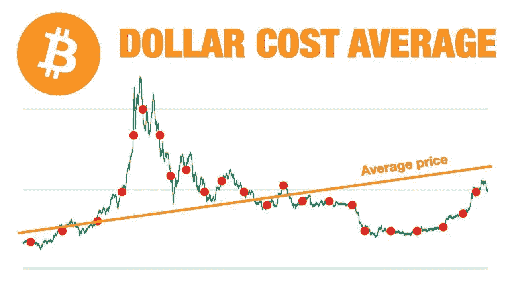

# 我将在熊市中为这些加密货币做 DCA

> 原文：<https://medium.com/coinmonks/i-will-made-dca-in-bear-market-for-these-cryptocurrencies-72cf0dbdb640?source=collection_archive---------10----------------------->

Source photo [dollar cost average — Bing images](https://www.bing.com/images/search?view=detailV2&ccid=c2INhuKp&id=A760508F99ABE90B6C15C5CFD99CAD7BDDC9D0BA&thid=OIP.c2INhuKp9HbngilP26az-gHaEK&mediaurl=https%3a%2f%2fmiro.medium.com%2fmax%2f2560%2f1*BjXOU9lmW2i13jcNdFphLA.jpeg&cdnurl=https%3a%2f%2fth.bing.com%2fth%2fid%2fR.73620d86e2a9f476e782294fdba6b3fa%3frik%3dutDJ3XutnNnPxQ%26pid%3dImgRaw%26r%3d0&exph=720&expw=1280&q=dollar+cost+average&simid=607999938815227333&FORM=IRPRST&ck=9ECBB801F9065F52C45A680A3A2D1768&selectedIndex=3&ajaxhist=0&ajaxserp=0)

# 比特币(BTC)

就加密货币而言，没有比第一个加密货币更好的选择了，它自诞生以来一直处于市场的顶端。

在实现的那一刻，比特币的市值为 1 万亿美元，占加密货币总市值的三分之一。结果，是一个…