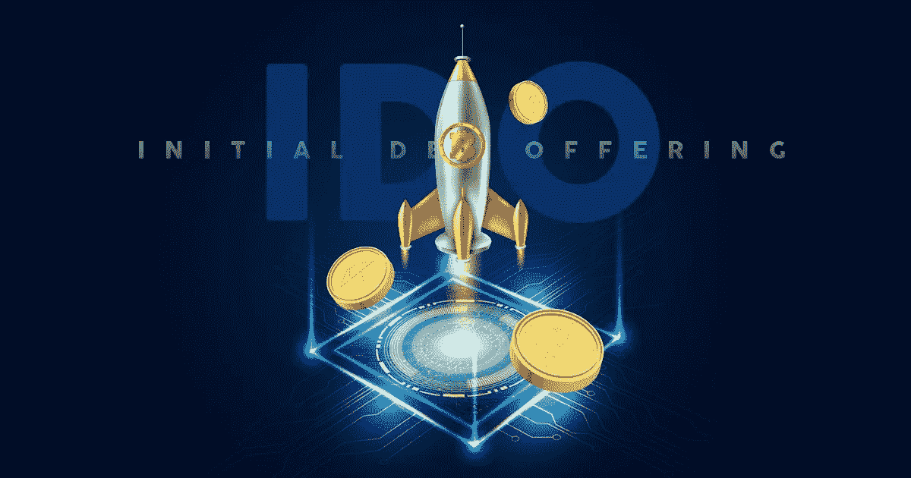

# I do Token launch pad:I do Token 会让 web3 加密项目一枝独秀吗？

> 原文：<https://medium.com/coinmonks/ido-token-launchpad-will-the-ido-tokens-make-web3-crypto-projects-outshine-e43961b84a55?source=collection_archive---------29----------------------->

Source:appdupe

瑞普托正慢慢进入人们的日常生活。如今，它们正成为人们谈论的话题。因此，许多国家在正常的商业交易和购买中将密码合法化。加密货币为许多初创公司和未来的企业家在区块链科技领域工作铺平了道路。此外，许多人正在进入加密领域，因为它的利润率很高。随着 [**区块链科技**](https://www.globenewswire.com/en/news-release/2022/08/05/2493303/0/en/Monkey-Inu-Joins-the-IDO-Era-with-a-Token-Presale.html) 的成长，给密码领域带来了很多变化和好处。

那么它是如何帮助创业者和创业公司获得资本的呢？使用 IDO Token Launchpad 开发，解决方案非常简单。自从 cryptos 的大肆宣传以来，已经开始了许多用于筹款的加密平台开发服务。 [***IDO Token Launchpad 开发***](https://www.appdupe.com/ido-token-launchpad-development?utm_source=google&utm_medium=medium&utm_campaign=monika) 是在密码领域获利的途径之一。

# 🔥**首次发行 DEX 简介**

首次分散交易所发行是一种为新的加密项目和初创公司筹集资金的方法。IDO 在分散流动性交易平台上发布代币或硬币，并为加密项目和创业公司筹集资金。这种众筹方式需要一个平台来操作它的所有流程，这就是 IDO Launchpad 的用武之地。IDO 令牌代表加密货币或法定货币中具有实时价值的任何资产。IDO launchpad 是一个软件平台，它建立并运行一个分散的令牌市场。开发 IDO 方法是为了稳定 ICO 模型的缺点。

# 🔥**I do 是如何工作的？**

简单来说， [**IDO 是一种众筹**](https://www.outlookindia.com/business-spotlight/bhero-com-a-crypto-platform-that-skyrockets-investor-aspirations-news-198824) 的方式，帮助项目所有者获得开发其密码项目所需的资金。与 ico 相比，大多数人更喜欢 IDO 平台，因为它们具有分散的交换功能，还能为代币提供即时流动性。此外，当代币被用来交换流动性时，投资者会获得巨大回报。流动性有助于使 DEX 平台的流程顺畅无阻。首先，当项目和它的白皮书一起被提出时，它被标记化了。一旦为项目创建了令牌，它将在 DEX 平台上列出。该项目的代币将以低价送给感兴趣的投资者。为项目筹集的资金将被分配到流动资金池。一旦该项目是活的，池开放交易。投资者可以交易代币来获得更高的利润。为了平稳平台中的交易过程，大多数项目通过分配一部分资金向 DEX 提供流动性。

## 🔥**如何推出你的 IDO？**

💡**规划商业战略**

制定一个计划，说明你将如何推出你的令牌。你的项目旨在解决什么，资金分配，你的代币将在哪个区块链上开发，代币的营销服务，最后，代币势头的维持。制定一个从开始到结束的计划，即使是在你的代币发行之后

💡**创建营销宣传材料**

投资者投资于你的项目，他们希望确保你的项目是一个成功的项目，并将为他们带来利润。为了提供这种安全性，您的加密项目应该有一个网站和一份白皮书。有了网站，很容易把一个项目品牌化，而且体现了专业性。白皮书为感兴趣的投资者提供了项目的必要信息。你的项目的网站和白皮书增加了资助你的加密项目的机会。

💡**使用 DEX 发射台**

访问一个 IDO launchpad，如果你的项目符合平台的必要要求，它就会批准一个 IDO。

 [## 推广您久负盛名的 NFT 市场——顶级 NFT 营销解决方案

### 把你的 NFT 市场提升到一个更高的纬度有那么难吗？也许你可以通过制作…

medium.com](/coinmonks/promote-your-prestigious-nft-marketplace-top-nft-marketing-solutions-6e8849e53bf2) 

💡**创建一个密码**

多年来，推出加密货币的过程变得如此简单和容易。有了一些关于密码如何工作的技术知识，以及你想要用来启动你的密码的发射台，你就大功告成了。挑战在于让投资者投资你的加密项目。

成功完成 IDO 和令牌生成事件(TGE)后，launchpad 会列出用于交易的令牌。上市可以在自动做市商(AMM)如 PancakeSwap 或 Sushiswap 中查看。

💡**发行代币并筹集资金**

一旦 TGE 举行，感兴趣的投资者将收到代币。然后对要投资的项目进行拍卖。一旦项目获得了所需的资金，就可以部署了。

## 🔥**如何开发你的 IDO Launchpad？**

🏷️When:如果你有一个开始做某事的想法，首先要做的就是对它进行更多的研究。只有到那时你才会对它有更多的了解。当你决定开发一个 IDO Launchpad 时，深入了解它，并决定你要用什么区块链来建造你的 Launchpad。 [**IDO launchpad**](https://economictimes.indiatimes.com/industry/banking/finance/top-ido-launchpads-for-2022-boostx-bounce-and-paid-network/articleshow/90288521.cms) 可以在以太坊区块链、币安智能链(BSC)区块链网络，或者多边形区块链技术上开发。

🏷️Create:你的项目白皮书。您的项目白皮书应该详细介绍您将要开发的 IDO launchpad。这应该是一个很好的机会，因为它将对你的项目获得资金或项目的成功起到决定性的作用。

🏷️An IDO Launchpad 可以从头开始开发，也可以根据预先构建的模型进行定制。许多 IDO Launchpad 开发公司提供 Launchpad 开发和初始 DEX 提供 launchpad 服务。甚至 IDO 平台的白标解决方案也是可用的。

🏷️The 下一步是为你的 launchpad 创建令牌，并决定你的令牌应该包含什么功能。

🏷️After 发射台开发出来了，应该测试多次。人们需要确保该项目在各种测试用例上得到测试并通过，以便 launchpad 没有缺陷。

🏷️Deploying 你选择的区块链上的发射台是开发你的 IDO 发射台的最后一步。为了有一个平稳和成功的平台，频繁的升级和支持客户查询将是有益的。

## 🔥**I do launch pad 的特性**

对于一个**[**I do launch pad 平台**](https://www.appdupe.com/ido-token-launchpad-development?utm_source=google&utm_medium=medium&utm_campaign=monika) 能够顺利有效的工作，搭建一个高流量的平台，其特性起着重要的作用。同样，在开发 IDO Launchpad 时，需要记住 IDO Launchpad 的几个必要特性**

**✨打桩模块**

**✨Integrated 钱包**

**✨KYC 合规**

**✨Fast 令牌分配**

**✨Steady 游泳池管理**

**✨Immediate 贸易**

**✨Instant 现金流等。**

## **🔥**最终想法****

**如今，IDOs 往往是一种很好的众筹方法，可以为您的加密项目筹集资金。由于它们是分散的交易所产品，大多数人更喜欢它们。正如我们已经看到的， [**IDO launchpad**](https://readwrite.com/multiply-your-dividends-by-developing-your-own-ido-launchpad/) 是企业家和初创公司为他们的加密项目筹集资金的一个很好的方式，它也有自己的好处。由于 IDO 已经设法解决了 ICO 中的许多问题，它已经成为为您的项目获得资金的一个很好的方式，并且很快它将成为提升您的业务的一个更好的选择。**

> **交易新手？试试[密码交易机器人](/coinmonks/crypto-trading-bot-c2ffce8acb2a)或[复制交易](/coinmonks/top-10-crypto-copy-trading-platforms-for-beginners-d0c37c7d698c)**