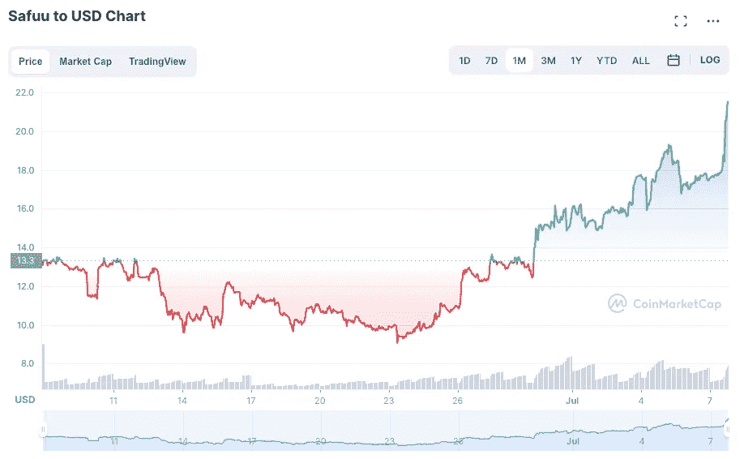
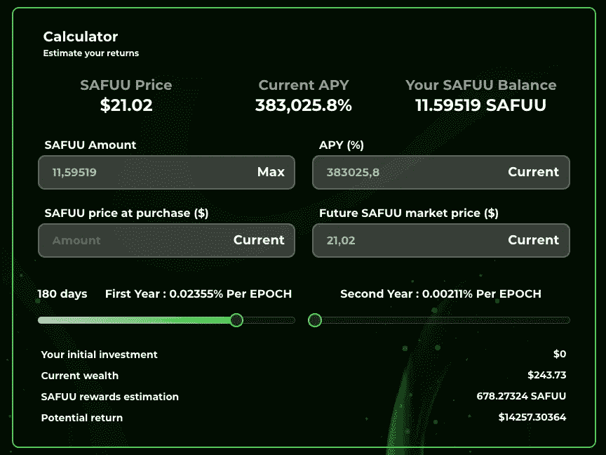

# 如果 Safuu 价格保持不变，我的 400 美元投资将在 12 月变成 14000 美元

> 原文：<https://medium.com/coinmonks/if-safuu-price-holds-my-400-investment-will-turn-to-14-000-by-december-61870b5545f0?source=collection_archive---------2----------------------->

## Safuu 令牌在 6 月份已经稳定下来了，能守住吗？

5 月 5 日，我在一个有风险的协议上打了个赌= >我尝试了 **Safuu**

我以 142.34 美元的价格买了 2.8235 个萨富币，总投资 403 美元。

我做了我的尽职调查，实际上写了一篇关于协议、团队、风险等的文章…

 [## 你应该投资萨福和它疯狂的 383，025%的 APY 吗？

### 这样的回报水平真的可持续吗？

medium.com](/@John_treadle/should-you-invest-in-safuu-and-its-crazy-383-025-apy-f7a74515f6e) 

Safuu 的当前价格是 21.02 美元，这是 Safuu 一个月的价格变化图。

Source: Coinmarketcap

价格在急剧下跌后已经稳定并回升。现在，它最近又开始上升了。

> 交易新手？试试[密码交易机器人](/coinmonks/crypto-trading-bot-c2ffce8acb2a)或者[复制交易](/coinmonks/top-10-crypto-copy-trading-platforms-for-beginners-d0c37c7d698c)

正如下面的帖子所解释的，巨大的 APY 是好的(Safuu 的 APY 为 383，025%)，但如果你没有基础令牌的价格稳定性，那么你的资本将会蒸发。

 [## 我在崩盘前投资了 1200 美元在 Safuu，Titano 和 Wonderland。这是他们的表现

### 3 个高风险、高 APY 协议并不比市场表现更差。我还学到了另一个宝贵的教训。

medium.com](/coinmonks/i-invested-1-200-in-safuu-titano-and-wonderland-before-the-crash-heres-how-they-performed-13eb06c45562) 

这已经发生在很多 DeFi 协议上了…

**现在的问题=>sa fuu 令牌触底了吗？**

大概不会。

原因是这些协议面临持续的抛售压力，而这些协议依赖于新投资者的定期流入。

这意味着，当信心高涨时，一切都很好，价格飙升，但当熊市开始时，下行螺旋会更加陡峭。

# **那么是时候进入萨夫了吗？**

我不做投资建议。我只是解释一下我的思考过程。

我认为在风险/回报和不对称方面。

400 美元的投资是我输不起的。

我也可以让这笔钱在一个账户里沉睡一年，而不必每天都查看。一劳永逸。

如果有一点点回报巨大的机会，我会很高兴。

看看下面的模拟。

# 我的投资在 12 月将价值 14，257 美元

如果我持有 Safuu 个月，价格保持稳定，这是一个模拟。

**我的投资将价值惊人的 14，257 美元**，对于 400 美元的初始风险来说，这是相当大的收益。这就是不断复利的魔力。

你可以运行的另一个简单计算是检查你需要多长时间收回你的钱。

> 以目前的 APY，你可以在一个月左右收回你的初始投资。

所以这取决于你。

我知道我在冒险。

如果你喜欢这个故事，并且愿意支持我(和其他成千上万的作家)，那么考虑一个 [*中型*](/subscribe/@John_treadle) [*订阅*](/subscribe/@John_treadle) *每月只需 5 美元或每年 50 美元。*

*或者你也可以决定给我买一个*[*Ko-Fi*](https://ko-fi.com/johntreadle)*。*