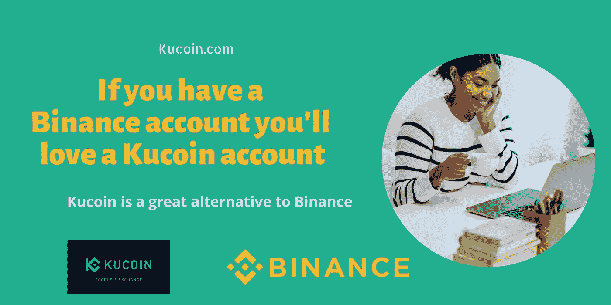

# 如果你有一个币安账户，你会喜欢一个库币账户

> 原文：<https://medium.com/coinmonks/if-you-have-a-binance-account-youll-love-a-kucoin-account-5c68b6037b32?source=collection_archive---------9----------------------->

*我并不想对这个标题太在意，但至少我引起了你的注意……*

Crypto 会一直存在。币安仍然是世界上最大的密码交易所。从多样的上市组合到多种多样的支付方式，币安彻底改变了加密领域。

*但是情况会变好吗？还是可以？*

是的，它可以，但有一个替代方案。像 Kucoin 这样的替代者正在逐渐占据 Altcoin 空间的所有权。

的确，一个币安账户是必须的，但是一个库币账户对你有用吗？太好了。！

因此，我想出了几个理由来解释为什么你可能比你想象的更需要一个 Kucoin 账户。

1.  KYC 是可有可无的——KYC 经常会非常忙碌。有时候你只是想快速交易。*(因为对于加密来说，时间就是一切)。*更糟糕的是，如果你是美国用户，你实际上没有资格申请 KYC。如果你在币安这样的平台上遇到 KYC 的问题，Kucoin 账户将是你最好的选择。

*Ps:我不是洗钱的粉丝*

**2。交易机器人** - Kucoin 对交易机器人很感兴趣。虽然 Crypto Grid 和 TWAP 机器人在币安很棒，但为什么不用 Kucoin 的交易机器人进行多样化呢？Kucoin 在现货网格、期货网格、智能再平衡和美元成本平均(DCA)中提供免费的交易机器人。

如果你还没有探索交易机器人，Kucoin 可能只是一个让你开始使用交易机器人的平台。*DCA 将是一个很好的起点。*

**3。IEOs** ***(首发上市)***——说到 IEOs，Kucoin 从来不会失败。通过 Kucoin spotlight，参与者可以在 KCS (Kucoin 的公用令牌)上下注，让用户有机会在一枚硬币在 Kucoin 上上市交易之前对其进行投资。

你猜怎么着，回顾一下之前在 Kucoin spotlight 上的项目，大多数硬币都有不错的投资回报率。

**4。多样的 Altcoin 选择** - Kucoin 在大多数用户中以 Altcoin 的多样性而闻名。如果你一直在寻找下一个加密宝石，那么 Kucoin 应该是你的最终选择。投资者通常会在 Kucoin 寻找新的加密宝石，并在它们在其他主要交易所上市之前进行投资。

**5。低交易费** - Kucoin 的交易费非常低，只有 0.1%。持有一些 KCS 代币会使交易费用降至 0.08%。

我的 [***推荐链接***](https://www.kucoin.com/ucenter/signup?rcode=rP1HTX2) *甚至更低，低至 0.06%，打八折。现在这是一笔好交易。谈个双赢！！*

**结论**

币安仍然是密码交易领域的市场领导者，但是分散投资并没有坏处。事实上，这是为了更好。Kucoin 帐户为您提供了一个理想的选择，让您从更广阔的角度来发展您的加密产品组合。

[***报名参加 Kucoin>>***](https://www.kucoin.com/ucenter/signup?rcode=rP1HTX2)*(获得 8 折优惠，支持我的中等账号；我会真心感激)*

Kucoin 目前有一个新的促销活动，给予新用户高达 500 美元的奖金。]

***查看我的其他文章:***

[*买入 Dip:现在就买的十大密码(2022)*](/coinmonks/buying-the-dip-top-10-cryptos-to-buy-now-2022-25437aaa3a68)

什么是 OCO 订单，它具体是如何工作的？(Kucoin)

[*【Kucoin】刚刚上市的新代币(7、8 月)*](/coinmonks/kucoin-just-listed-new-tokens-july-august-8c44def32442)

> 交易新手？尝试[加密交易机器人](/coinmonks/crypto-trading-bot-c2ffce8acb2a)或[复制交易](/coinmonks/top-10-crypto-copy-trading-platforms-for-beginners-d0c37c7d698c)