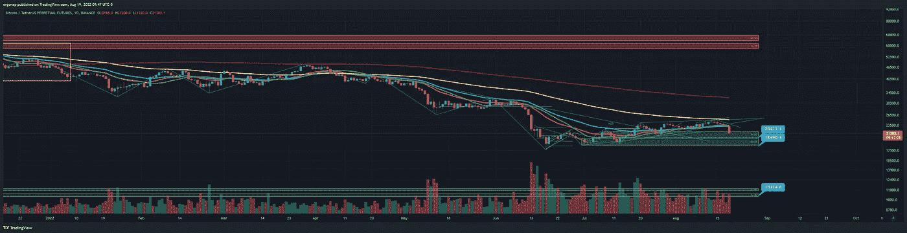
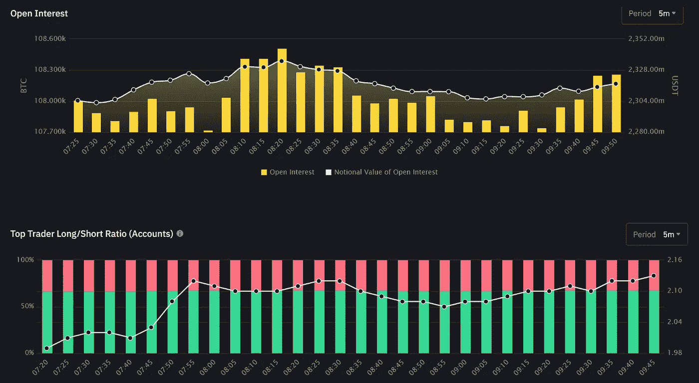

# 如果你认为事情是悲观的，我们才刚刚开始

> 原文：<https://medium.com/coinmonks/if-you-think-things-are-bearish-were-just-getting-started-52c0e0b43384?source=collection_archive---------48----------------------->

加密货币市场/比特币分析 2022 年 8 月 19 日

那么，有人能把握市场时机吗？预测下降？也许这个人。整整两天！[昨天](/coinmonks/another-days-review-bearishness-is-the-forecast-e9fef8d36103)和[前天](/coinmonks/this-move-down-looks-real-and-thats-dangerous-78cb6a1facf5)。我发誓我应该开始收费，但那不是我的风格。无论如何，对于那些关注我的东西并知道事情会下降(令人震惊)的人来说，要知道我们还有更大的空间。

我最喜欢的一个交易伙伴发表了一个很好的观点，试图预测 BTC 市场对间谍的时间。

 [## SPX BTC DCA for SP:SPX by evillz

### 白色方块表示与标准普尔 500 相比，DCA 国王的损失较大。大多数 FOMO 人都跑到了 ATH…

www.tradingview.com](https://www.tradingview.com/chart/SPX/1CpNNdPR-SPX-BTC-DCA/?fbclid=IwAR2Lkng44HCOS_Fl5fYBHX4Ai-o9dN3cG4qzJUaut05Lj8WLkjclisGjy1M) 

抱歉，现在不是投资者开心的时候。对交易者来说，**是快乐的时光，因为昨晚我赚了投资组合的 20%。添加一个小小的珍闻，在地图上画一些像样的东西，给你潜在的想法。它并没有画出什么特别的东西，只是我们之前测试过的历史底部。这可能是一个反弹点，或者他们可以打破(从而打破向下)**

yeah, this is…..not bullish, not really. [https://www.tradingview.com/x/2kki0uap/](https://www.tradingview.com/x/2kki0uap/)

一些特定的群体在这里尖叫着购买——看到我们开始接触的绿色条了吗？我知道这些团体，我是**不是**他们。

总之，继续。我们只是打破了下降的楔子，我们否定了半个月的移动价值。我们可以反弹，但是…我们不会。因为多头现在是如此疯狂邪恶，零售将再次进一步推动下跌。事实上，很快。好像我很快就要开一家。这才是真正的交易者做空市场。

tldr: we won’t

稍后我会发更多，但是是的。底部见。

> 交易新手？尝试[加密交易机器人](/coinmonks/crypto-trading-bot-c2ffce8acb2a)或[复制交易](/coinmonks/top-10-crypto-copy-trading-platforms-for-beginners-d0c37c7d698c)