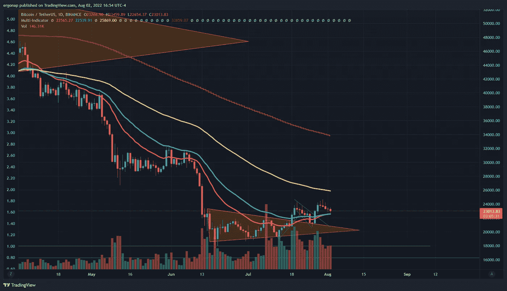
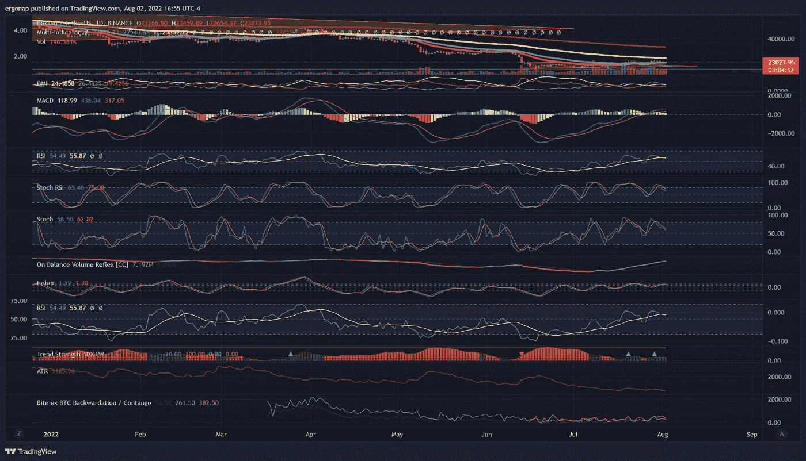
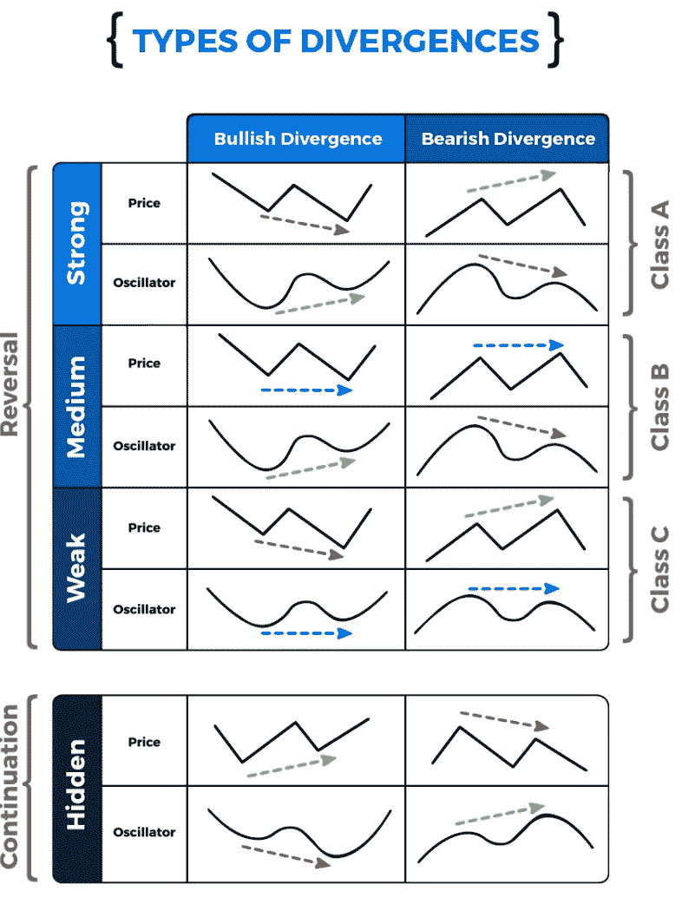
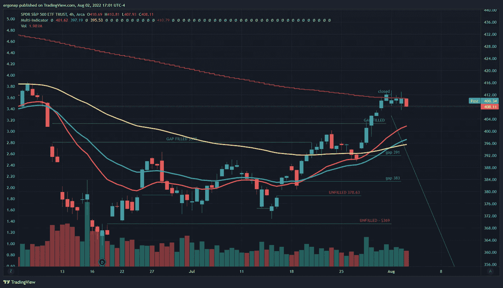
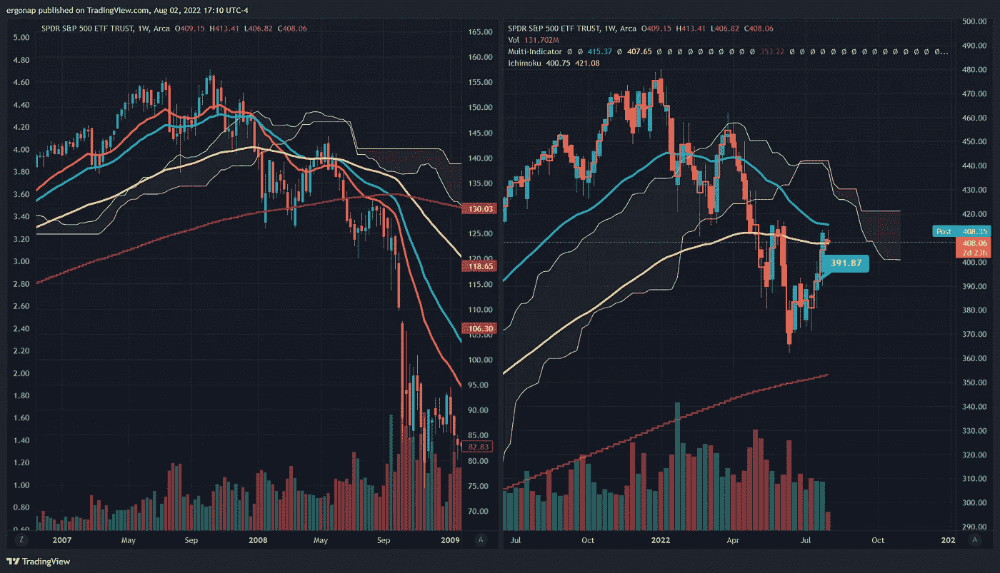

# 即使你不想听，我也会告诉你真相

> 原文：<https://medium.com/coinmonks/ill-tell-you-the-truth-even-if-you-don-t-want-to-hear-it-1b9946ab1eb5?source=collection_archive---------25----------------------->

比特币/密码货币市场分析 8/2

这真是又一个安静的日子。为什么？比特币并没有主宰这场表演。本周主要是关于间谍和所有正在进行的盈利公告。它也宣布了连续第五个熊市日。所以这并不是什么好消息。是的，我们正在短时间内创造更高的低点和更高的高点，但我们所处的通道可能会向下突破。我预计可能会有小幅波动，但可能不会以这个速度上涨。间谍大约在小时后保持中立(小幅波动)。我们应该看起来更乐观，但我们根本没有跟踪间谍。哈扎。这是我们自 4 月以来第一次测试间谍软件的抵抗力，嗯……我们可能会简单地超过它，然后进入更糟的状态。期货从绿色到红色月。

we could be on the cusp of a mostly improbable breakout, or the cusp of a drop. [https://www.tradingview.com/x/YgHHy9Aq/](https://www.tradingview.com/x/YgHHy9Aq/)

从现在开始，没有一个指标是好的和真正的看涨，成交量已经转移，macd 和方向性，但是……走势在哪里？啊，对。这就是问题所在。看，我们根本不用在市场上跟进。充其量这是一场激烈的竞争。简而言之，目前还不太乐观。你可以说这是一个看涨的分歧，但目前对我来说这是一个延伸。

we have lots of divergence. indicators going up, prices not. Movement is weak.[https://www.tradingview.com/x/loZxRBm7/](https://www.tradingview.com/x/loZxRBm7/)

I guess you can call it a medium bullish divergence in this example, but that isn’t saying much

but mah crypto?!? 👎 No. SPY. [https://www.tradingview.com/x/Q9wMnTvv/](https://www.tradingview.com/x/Q9wMnTvv/)

所以事实是——我真的不同意那些现在就想关注比特币的人，因为这一切都是间谍行为，宝贝。任何告诉你不这样做的人都是在阅读不存在的茶叶。事实上，这看起来很像 2008 年崩盘前。

2008 vs 2022\. It’ s a lot more similar than I’d like to see. [https://www.tradingview.com/x/XwS3hwGt/](https://www.tradingview.com/x/XwS3hwGt/) . Not exactly happy times if right now says anything.

因此，不同之处在于:它更看好上涨行情，移动平均线位于不同位置，但总体而言，除非突破，否则我们将关注周交叉下跌。

听起来这是一个冷静的好时机，直到被进一步证实。

> 交易新手？试试[加密交易机器人](/coinmonks/crypto-trading-bot-c2ffce8acb2a)或者[复制交易](/coinmonks/top-10-crypto-copy-trading-platforms-for-beginners-d0c37c7d698c)