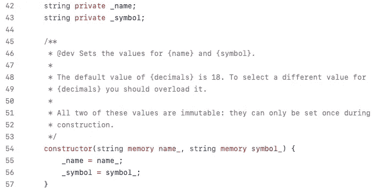

# 不可变字符串变量

> 原文：<https://medium.com/coinmonks/immutable-string-variables-2a35fc385a41?source=collection_archive---------8----------------------->

## 可靠性作弊

## …在编译器不支持它们之前使用它们

这是一篇关于 Solidity 编程语言的文章:一种用于为以太坊和其他兼容的区块链编写智能合约的特殊语言。

不可变变量是巨大的。它们实际上与编译时常数一样有效，但是它们的值可以在部署时设置。

一个重要的缺点是目前 Solidity 只支持原语类型的不可变变量，比如`uint`或者`bytes32`。让我们看看下面来自 OpenZeppelin 的代码:

[https://github.com/OpenZeppelin/openzeppelin-contracts/blob/master/contracts/token/ERC20/ERC20.sol#L42-L57](https://github.com/OpenZeppelin/openzeppelin-contracts/blob/master/contracts/token/ERC20/ERC20.sol#L42-L57)

`_name`和`_symbol`变量是在构造函数中设置的，并且永远不会改变，但是它们没有被声明为`immutable`，因为编译器不允许这样做。因此，读取这些变量的成本很高，初始化起来更费钱。

以下是一个可能有所帮助的诀窍:

这个简单的库有效地将一个短字符串(短于 32 字节)打包成一个`bytes32`值，该值可以存储在一个不可变的变量中。稍后，同一个库可以用来有效地将打包的`bytes32`值解包回正常的 Solidity 字符串。

> 交易新手？尝试[加密交易机器人](/coinmonks/crypto-trading-bot-c2ffce8acb2a)或[复制交易](/coinmonks/top-10-crypto-copy-trading-platforms-for-beginners-d0c37c7d698c)