# 非永久性损失:逐步演示(数学)EN: 02

> 原文：<https://medium.com/coinmonks/impermanent-loss-step-by-step-demonstration-math-95b1f66fa704?source=collection_archive---------16----------------------->

对于 Uniswap 这样的自动做市商(AMM ),非永久性损失是一个流行的概念。流动性提供者将初始金额放入两个代币中，并使它们可供交易者相互交易。非永久性损失是指当市场价格发生变化，相对价值较低的代币数量增加时发生的损失。它被定义为新代币组合的价值与维持初始组合(持有)的价值之间的百分比差异。

有很多很好的文章很好地解释了这个概念并提供了例子，但它们都给出了非永久性损失(IL)的公式，但没有提供推导过程:

让我们一步一步来看看如何得到它:

## 考虑

像 Uniswap 和 SushiSwap 这样的自动做市商协议基于一个非常简单的等式:

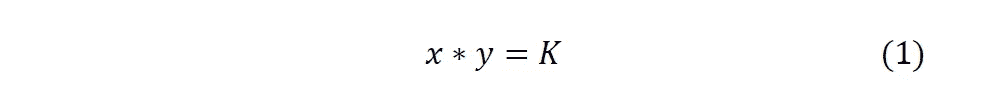

其中， **𝑥** 是资产的令牌数 **𝑋** ， **𝑦** 是资产的令牌数 **𝑌** ， **𝐾** 是池的常数积。

初始位置的值是:

两个令牌的等值被提供给池，因此:

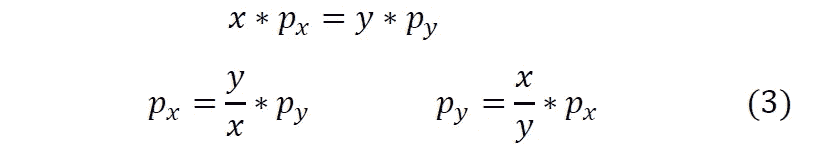

从 **(1)** 我们知道 **𝑥=𝐾/𝑦** ，同样 **𝑦=𝐾/𝑥** ，

替换为 **(3)** :

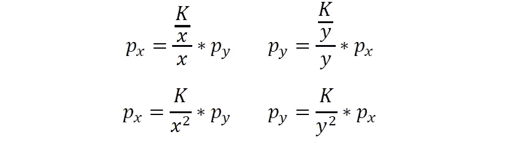

我们用**𝐾****𝑝𝑥****𝑝𝑦**来求解 **𝑥** 和 **𝑦** 。

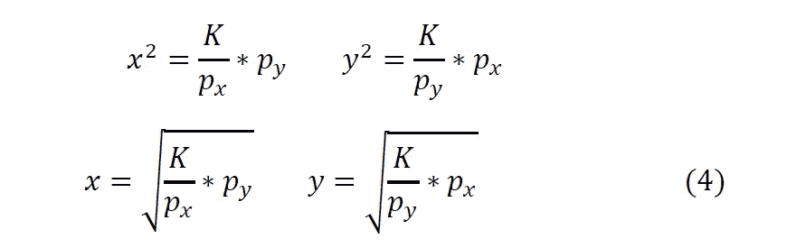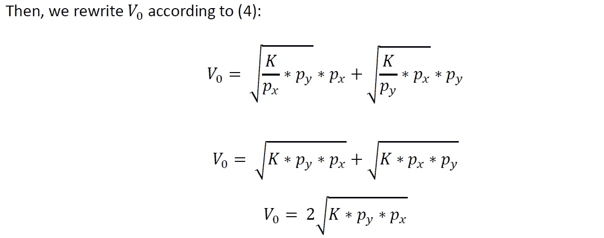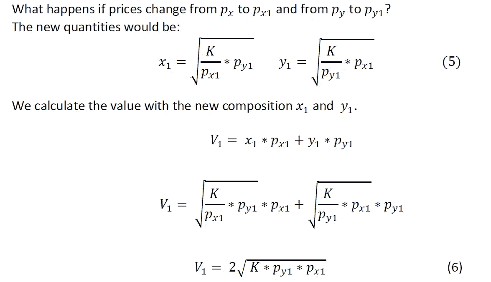

持有不改变数量时， **𝑥** 和 **𝑦** 保持不变。

因此，该值将为:

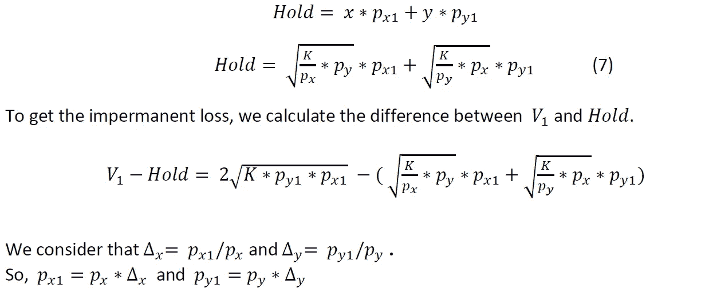

我们用百分比来计算:

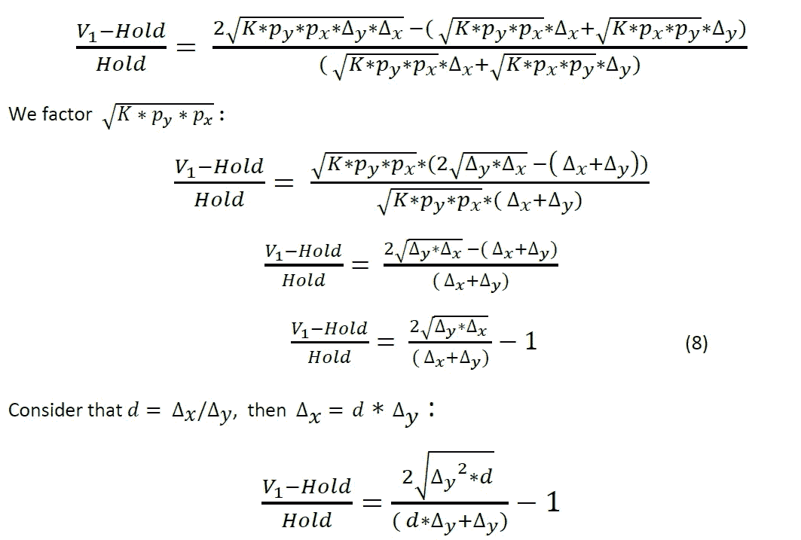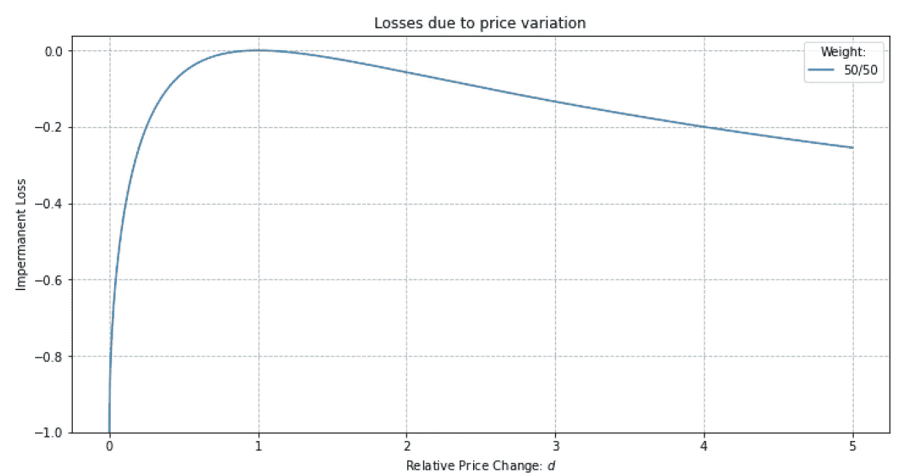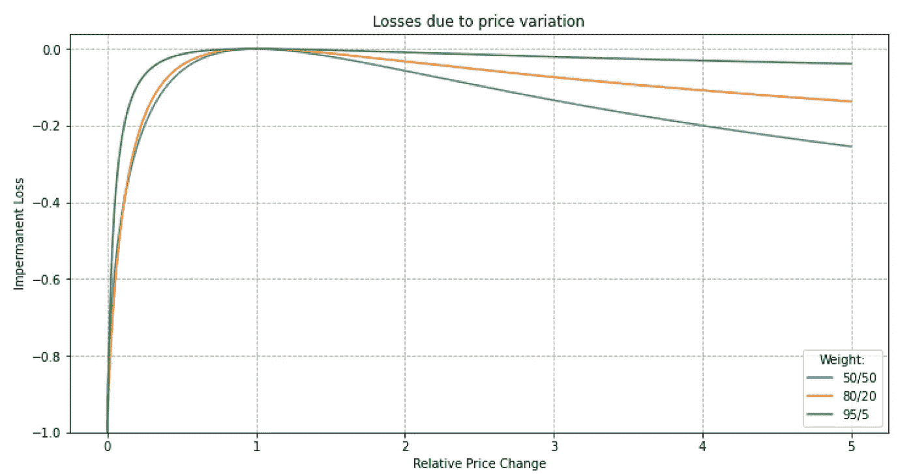

## 注释 02:

概括两个以上的令牌:

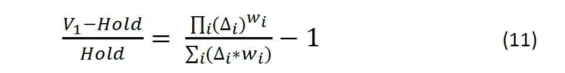

关于本文和数学计算的完整信息[在这里](https://github.com/Edwin-FernandezGrau/ImpermanentLoss-StepbyStep)(包括电子表格模拟)。

> 交易新手？在[最佳加密交易](/coinmonks/crypto-exchange-dd2f9d6f3769)上尝试[加密交易机器人](/coinmonks/crypto-trading-bot-c2ffce8acb2a)或[复制交易](/coinmonks/top-10-crypto-copy-trading-platforms-for-beginners-d0c37c7d698c)