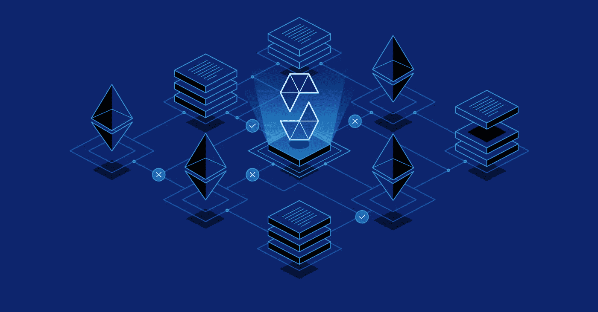

# 在 Solidity 智能合约中实现嵌套数组

> 原文：<https://medium.com/coinmonks/implementing-nested-arrays-in-solidity-smart-contracts-514e05d251b8?source=collection_archive---------3----------------------->

## 充分发挥结构、数组和映射的潜力



## 介绍

数组是面向对象编程中最流行的数据类型之一。根据定义，数组是一种在自身内部存储其他数据类型的多个变量的数据类型。在典型的面向对象编程中，数组非常强大，因为它们还可以将数组存储到几乎无限的级别。数组中的数组称为嵌套数组，是现实生活中数据的绝佳表示。

然而，Solidity 并不是真正的面向对象语言(它是 *contract* 面向的),它的数组定义不同。首先，solidity 中的数组只能接受单一的预定义数据类型的变量。因此，uint 数组只能接受 uint 值，string 数组只能接受 string 变量，等等。而实数组肯定不能在自身内部容纳其他数组。嵌套数组是不可能的。作为一个从 Java、Python 或 JavaScript 过渡到 Solidity 的程序员，一个迫在眉睫的问题是，我们究竟如何实现包含数组的数组来构建结构良好的链上元数据？答案很简单。我们结合了两种独特的数据类型，称为映射和数组结构。

## 什么是结构？

结构是用于定义记录的实体数据类型。换句话说，结构包含特定数量的变量，所有变量都是预先声明的数据类型。结构的声明如下所示:

```
struct People {
    string name;
    uint height_in_cm;
    bytes gender;
}
People memory yours_truly = People("Peter Ogwara", 155, "m"); 
```

因此，struct 声明仅仅给出了一个可以创建它的实例的模型，比如上面的 yours_tuly。

## 什么是映射？

映射是一种数据类型，它使一种数据类型的实例能够与另一种数据类型相匹配。例如，代表唯一用户 id 的 uint 可以与代表年龄的 uint 的地址或代表姓名的字符串配对。ERC 令牌使用该数据类型来记录每个地址的令牌余额。映射的声明和设置如下:

```
mapping(uint=>string) user_id_to_username;
uint id = 1;
user_id_to_username[id] = "peterogwara";
```

要调用映射中的信息，只需要第一个变量的值。例如，要使用上面的映射来获取 id 为 1 的用户的用户名，我们需要执行以下操作。

```
uint id = 1;
username = user_id_to_username[id] //This will return "peterogwara"
```

## 用结构组合数组和映射

有趣的部分来了。结构和映射可以组合！要创建一个一级嵌套数组，我们可以创建任何原始数据类型到结构的映射。继续上面定义的人员结构和惟一 id 的概念，下面是一个例子:

```
mapping(uint=>People) user_id_to_details;
```

这个唯一的 id 可以用来调用比单个用户名更多的细节。当然，任何数量的变量都可以添加到这个结构中，使它在定义一个人时更加全面。请注意，映射包括结构的特定名称(People)，而不仅仅是“struct”。

## 深入到更多层次

然而，假设我们想在他们的详细信息中包含每个人的技术堆栈列表和他们宠物猫的详细信息。我们必须再深入一层。这可以通过在 people 结构中为 tech 堆栈声明一个字符串数组来实现。不幸的是，我们不能在结构中包含结构，也不能在结构中包含嵌套映射。但是，我们可以为相同的目的构造单独的结构，并在原始结构中使用数组来跟踪它们，从而在 People 结构中创建 CatDetails 结构和 CatDetails 数组。我们的代码应该是这样的:

```
uint userCount;
string[] _techstack;
CatDetails[] _cats;struct People {
    string name;
    uint height;
    bytes gender;
    string[] tech_stack;
    CatDetails[] cats;
}
struct CatDetails {
    string name;
    uint age;
    string color;
}
mapping (uint=>People) user_id_to_details;
```

然后，通过首先声明最内部的数组并设置其值，然后对最外层的结构进行同样的操作，可以设置变量值。契约开始时声明的全局数组为函数内声明提供了一个指向的存储位置。

```
function setUser() public {
    uint userId = userCount++;
    string[] storage my_techstack = _techstack;
    my_techstack.push("Python");
    my_techstack.push("JavaScript");
    my_techstack.push("Solidity");
    CatDetails[] storage cats = _cats;
    CatDetails memory firstcat = CatDetails("Snuffles", 3, 'white');
    cats.push(firstcat);
        CatDetails memory secondcat = CatDetails("Garfield", 5, 'orange');
    cats.push(secondcat);
People memory yours_truly = People("Peter M. Ogwara", 155, "m", my_techstack, cats);
    user_id_to_details[userId] = yours_truly;
}
```

就这样，我们有了嵌套的数组/结构！调用数据非常简单，并且以传统的映射/结构/数组调用格式完成。例如，下面的行将返回用户#1 的第二只猫的名字。

```
return user_id_to_details[1].my_cats[1].name;
```

最后，在调用值之前，确保包含检查以确保索引存在。

**🌟欢迎提问！🌟**

*关注我了解更多区块链、Javascript、PHP、Python 或纯编程故事。*

[中](/@peterogwara) | [推特](https://twitter.com/petermarie_) | [Github](https://github.com/PeterMarie) | [亚马逊](https://www.amazon.com/author/peterogwara)

> 交易新手？尝试[加密交易机器人](/coinmonks/crypto-trading-bot-c2ffce8acb2a)或[复制交易](/coinmonks/top-10-crypto-copy-trading-platforms-for-beginners-d0c37c7d698c)