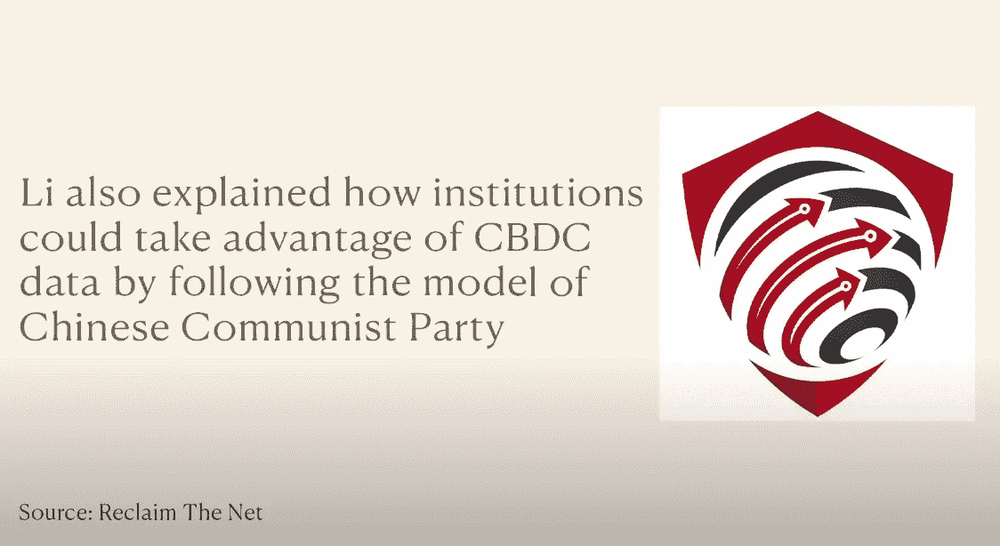

# *重要*你准备好迎接经济的数字化和 CBDCs 接管世界了吗？

> 原文：<https://medium.com/coinmonks/important-are-you-ready-for-the-digitization-of-the-economy-and-cbdcs-to-take-over-the-world-8531de5f5db8?source=collection_archive---------62----------------------->

这取决于你过去对 CBD 的研究程度。这篇文章可能会为你提供不同程度的新信息。但我确实认为，而且我不是轻率地说，观看视频可能是你能做的最重要的事情之一，以更好地了解我们正在走向的未来。

# 拉塞尔·布兰德谈 CBD

我知道，我知道这可能会令人震惊。我是说观看他的视频是最重要的事情之一。为了强调这一点，我想补充一点，我绝不是拉塞尔·布兰德的粉丝。事实上，我很可能完全站在事情的对立面。我觉得他很讨厌，也不好笑。希望这能凸显出我觉得这个视频有多有用。

简而言之，在视频中，他主要从英国的角度讲述了 CBDCs 的话题，因为他们最近又有了一位新首相。但是 CBDCs 是一种全球性的害虫，所以它们几乎是普遍存在的。当然，他也对一些言论开了一点玩笑。但我发现，我或多或少同意他在这个视频中所说的一切。这对我来说是一个巨大的冲击。我可能要给拉塞尔第二次机会。

这确实是一幅正在被描绘的可怕画面，可悲的是，这看起来将在不久的将来成为现实。正如我在上一篇文章中提到的，全球 195 个国家中，共有 112 个国家已经或正在研究 CBD。看起来不管我们喜不喜欢，他们都会来。

看完视频后你有什么想法？请在下面的评论区发表意见。如果你想支持我和我制作的内容，请考虑关注我，阅读我的其他帖子，或者为什么不两者都做。

网络上见！

图片提供者:截图自视频

> 交易新手？试试[加密交易机器人](/coinmonks/crypto-trading-bot-c2ffce8acb2a)或者[复制交易](/coinmonks/top-10-crypto-copy-trading-platforms-for-beginners-d0c37c7d698c)