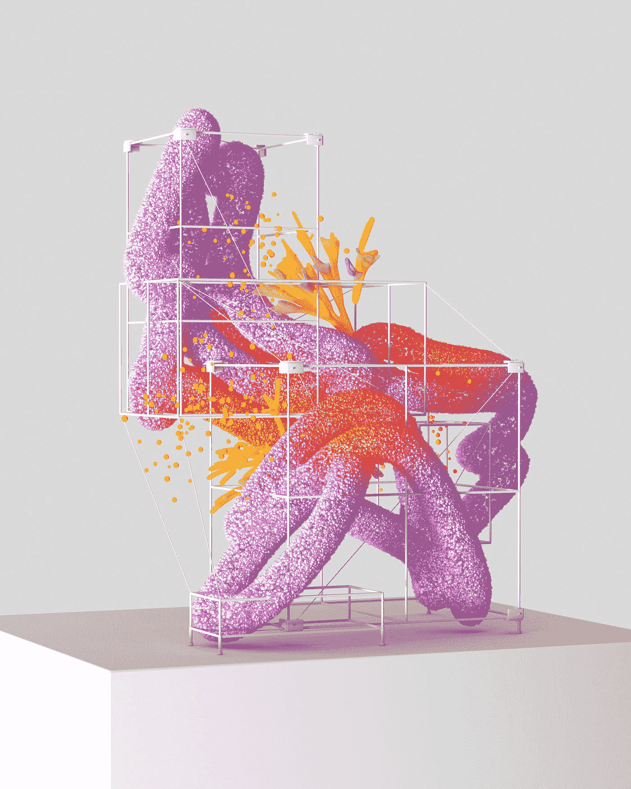

# 关于人工智能你必须知道的重要事情

> 原文：<https://medium.com/coinmonks/important-things-that-you-have-to-know-about-ai-6b5cb7e9885b?source=collection_archive---------25----------------------->

Photo by [Xu Haiwei](https://unsplash.com/@mrsunburnt?utm_source=medium&utm_medium=referral) on [Unsplash](https://unsplash.com?utm_source=medium&utm_medium=referral)

人工智能(AI)是一个快速增长的领域，有可能彻底改变我们生活的许多方面。在其核心，人工智能是计算机系统的发展，可以执行通常需要人类智能的任务，如学习，解决问题和决策。

有几种不同类型的人工智能，从狭义或弱人工智能(旨在执行特定任务)到强人工智能或通用人工智能(具有执行人类可以执行的任何智力任务的能力)。

人工智能最知名的应用之一是在机器学习领域，它涉及使用算法和统计模型，使计算机能够在没有显式编程的情况下从数据中“学习”。这导致了自动驾驶汽车、面部识别软件和智能个人助理(如苹果的 Siri 或亚马逊的 Alexa)的发展。

人工智能研究的另一个重要领域是自然语言处理(NLP)，它涉及到可以理解、解释和生成人类语言的计算机系统的开发。这导致了聊天机器人和语言翻译软件的发展，以及计算机分析和理解大量文本数据的能力。

今天人工智能面临的最大挑战之一是算法中的偏见问题。因为人工智能系统是在大型数据集上训练的，所以数据中存在的任何偏差都会反映在系统的输出中。这可能会导致面部识别软件中的种族或性别偏见，或者聊天机器人中有害刻板印象的放大等问题。

尽管面临这些挑战，人工智能仍有潜力在许多领域带来重大的积极变化，包括医疗保健、教育、交通等。随着该领域的不断发展和演变，解决这些挑战并确保人工智能的好处得到公平和道德的分配将变得非常重要。

## ***AI 能走多远:***

很难准确预测人工智能在未来能走多远，因为这是一个快速发展的领域，有许多未知因素。然而，在未来几年，人工智能有可能在几个关键领域取得重大进展:

*自动化:*人工智能已经被用于自动化许多以前由人类执行的任务，例如驾驶汽车和进行数据分析。随着人工智能技术的不断改进，它很可能能够承担更广泛的任务，这可能会导致一些行业出现大量就业岗位。

*医疗保健:*人工智能有可能通过实现疾病的早期检测、预测患者的结果以及帮助制定个性化的治疗计划来彻底改变医疗保健行业。

教育:人工智能可用于个性化和优化学生的学习体验，提供量身定制的反馈和改进建议。

*交通:*自动驾驶汽车已经在开发和测试中，人工智能很可能将在未来的交通中发挥主要作用。

*决策:*人工智能有潜力在广泛的背景下协助决策，从金融投资到灾难应对。

总体而言，人工智能将继续在广泛的领域取得重大进展，有可能导致重大的社会和技术变革。然而，重要的是要考虑这些进步的伦理影响，并确保以公平和有益于整个社会的方式实施这些进步。

## ***什么行业会受 AI 影响最大？***

AI 很可能会对许多不同的行业产生重大影响，很难预测哪一个会受到最大的影响。然而，一些可能受到人工智能重大影响的行业包括:

制造业:人工智能有可能使制造过程中的许多任务自动化，从而有可能提高效率和生产率。

*交通:*自动驾驶汽车和其他形式的自主交通工具已经在开发和测试中，人工智能很可能将在未来的交通中发挥主要作用。

*医疗保健:*人工智能有可能通过实现疾病的早期检测、预测患者的结果以及帮助制定个性化的治疗计划来彻底改变医疗保健行业。

*金融:*人工智能正被用于分析金融数据和做出投资决策，这可能会导致金融行业发生重大变化。

*零售:*人工智能正被用于改善客户服务和协助库存管理，有可能导致零售业的重大变革。

总体而言，人工智能很可能会对许多不同的行业产生重大影响，企业适应这些变化以保持竞争力将非常重要。

## ***因为 AI 会发生哪些负面的事情？***

人工智能的发展和扩散可能会带来一些负面影响:

*工作替代:*随着人工智能技术的改进和变得更加广泛，它很可能将能够自动化许多以前由人类执行的任务。这可能导致某些部门的大量工作岗位流失，有可能导致社会和经济混乱。

*算法中的偏差:* AI 系统是在大型数据集上训练的，数据中存在的任何偏差都会反映在系统的输出中。这可能会导致面部识别软件中的种族或性别偏见，或者聊天机器人中有害刻板印象的放大等问题。

*安全和隐私问题:*随着人工智能变得越来越普遍，它有可能被用来危及安全和侵犯隐私。例如，面部识别技术可用于在未经个人同意的情况下对其进行监控。

*伦理问题:*随着人工智能变得更加先进，它很可能将能够做出具有重大伦理影响的复杂决定。这就提出了谁应该对这些决定负责以及应该如何做出这些决定的问题。

总体而言，随着技术的不断发展，认真考虑人工智能的潜在负面后果并采取措施减轻这些风险非常重要。

Photo by [DeepMind](https://unsplash.com/@deepmind?utm_source=medium&utm_medium=referral) on [Unsplash](https://unsplash.com?utm_source=medium&utm_medium=referral)

## ***艾的历史***

人工智能(AI)的概念有着悠久而复杂的历史，可以追溯到许多世纪以前。以下是人工智能发展过程中一些重要里程碑的简要概述:

19 世纪晚期:“人工智能”一词是由约翰·麦卡锡创造的，他被认为是人工智能之父之一。

20 世纪 50 年代:人工智能领域在达特茅斯学院的一次会议上正式成立，麦卡锡和其他研究人员在会上讨论了创造能够思考和学习的机器的可能性。

1956 年:“机器学习”一词是由阿瑟·塞缪尔创造的，他开发了第一批机器学习算法之一。

1966 年:第一个人工智能聊天机器人 ELIZA 由 Joseph Weizenbaum 开发。

1971 年:肯·汤普森开发出第一个国际象棋计算机程序“国际象棋 4.5”。

20 世纪 80 年代:第一批专家系统的开发，这些专家系统是可以解决特定领域复杂问题的人工智能程序，如诊断医疗状况或分析金融数据。

90 年代:开发出第一批自动驾驶汽车，第一批网络搜索引擎，如 AltaVista 和 Yahoo！，均已推出。

2000 年代:机器学习算法的发展，如支持向量机和决策树，导致人工智能的重大进步。

2010 年代:基于人工神经网络的深度学习算法的使用，导致自然语言处理和图像识别等领域取得重大进展。

总的来说，人工智能的历史由一系列重要的里程碑标志着，这些里程碑导致了我们今天拥有的复杂人工智能系统的发展。

## AI 和机器学习是一回事？

人工智能(AI)和机器学习是相关但不同的领域。人工智能是指开发能够执行通常需要人类智能才能完成的任务的计算机系统，如学习、解决问题和决策。

机器学习是人工智能的一个子集，涉及使用算法和统计模型，使计算机能够在没有显式编程的情况下从数据中“学习”。机器学习算法分析数据，从中学习，并根据所学做出预测或决策。

换句话说，机器学习是实现 AI 的一种方法，但并不是所有的 AI 都涉及机器学习。还有其他实现人工智能的方法，如基于规则的系统和专家系统，它们依赖于显式规则和人类知识，而不是从数据中学习。

总的来说，人工智能和机器学习是相关但不同的领域，机器学习是实现人工智能的一种方法。

## 谁可以学习机器学习？

机器学习是一个对任何对计算机科学、数学和统计学感兴趣的人都开放的领域。学习机器学习没有具体的教育要求，尽管这些学科的背景可能会有所帮助。

要学习机器学习，你将需要很好地理解 Python 或 R 等编程语言，以及微积分和线性代数的基础知识。你还应该熟悉统计概念，如概率和假设检验。

有许多资源可用于学习机器学习，包括在线课程、教科书和研讨会。一些大学和学院还提供机器学习或数据科学等相关领域的学位课程。

总的来说，任何对机器学习感兴趣并愿意投入时间和精力学习的人都可以研究这个领域。拥有计算机科学、数学和统计学的坚实基础会有所帮助，但这些技能可以通过自学或正规教育项目来学习。

> 交易新手？试试[加密交易机器人](/coinmonks/crypto-trading-bot-c2ffce8acb2a)或者[复制交易](/coinmonks/top-10-crypto-copy-trading-platforms-for-beginners-d0c37c7d698c)