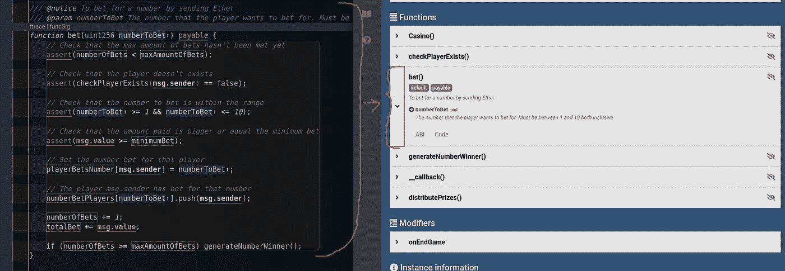

# 提高评论的可靠性

> 原文：<https://medium.com/coinmonks/improving-comments-in-solidity-2656f93943fb?source=collection_archive---------52----------------------->

我们可以改进函数的注释，这样就可以获得关于合同的简单文档。我们将使用 markdown 文档注释来编写一个简短的文档以及源代码。

ref:[https://docs . solidy lang . org/en/develop/NAT spec-format . html](https://docs.soliditylang.org/en/develop/natspec-format.html)

```
/// [@notice](http://twitter.com/notice) Constructor that's used to configure the minimum bet per game and the max amount of bets
/// [@param](http://twitter.com/param) _minimumBet The minimum bet that each user has to make in order to participate in the game
/// [@param](http://twitter.com/param) _maxAmountOfBets The max amount of bets that are required for each game
function Casino(uint _minimumBet, uint _maxAmountOfBets) {
    owner = msg.sender;if (_minimumBet > 0) minimumBet = _minimumBet;
    if (_maxAmountOfBets > 0 && _maxAmountOfBets <= LIMIT_AMOUNT_BETS)
        maxAmountOfBets = _maxAmountOfBets;// Set the proof of oraclize in order to make secure random number generations
    oraclize_setProof(proofType_Ledger);
}
```

**1。功能简述**

我们可以用`@notice`给函数一个简短的描述，让读者知道这个函数是做什么的。

```
/// [@notice](http://twitter.com/notice) Constructor that's used to configure the minimum bet per game and the max amount of bets
```

我们可以选择使用`@author`来指定写合同的人。

```
pragma solidity ^0.8.0;

import "hardhat/console.sol";
/*
* @author John
* @notice Hello World First Smart Contract example
*/
contract WavePortal {

    constructor() {
        console.log("Hello World Smart Contract Example"); // inline comments
    }

}
```

**2。参数简短描述**

我们可以使用`@param`来给出这个函数需要的参数的细节。

通过这样做，功能参数被链接到`@param`定义。

```
*/// @param _minimumBet The minimum bet that each user has to make in order to participate in the game**/// @param _maxAmountOfBets The max amount of bets that are required for each game*
```

**3。剩下的一行注释**

现在，对于其余的注释，我们可以使用常规的`//`来指定对该行内容的注释。

```
*// Check that the amount paid is bigger or equal the minimum bet*assert(msg.value >= minimumBet);
```

**4。其余多行注释**

现在，对于其他需要简短描述的多行注释，我们可以使用下面的方法。

```
/*
   * This is a multi-line comment in solidity
   * It is very similar to comments in C Programming
*/
```

# 生成文档

现在我们为什么做上面的事情是因为我们可以从这个丰富的源代码中生成文档。



enriched documentation

例如，为了生成文档，有一个名为 [solmd](https://modex.tech/developers/idiana96/solmd/src/1f57900bad1bcf55c9c4e0324c915ea3b6c4a437/README.md) 的工具，它为可靠性合同生成轻量级降价文档。

> 交易新手？试试[加密交易机器人](/coinmonks/crypto-trading-bot-c2ffce8acb2a)或者[复制交易](/coinmonks/top-10-crypto-copy-trading-platforms-for-beginners-d0c37c7d698c)