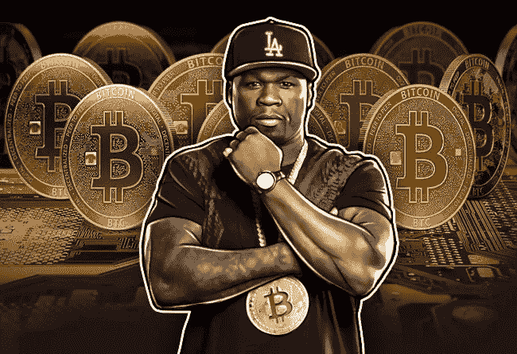
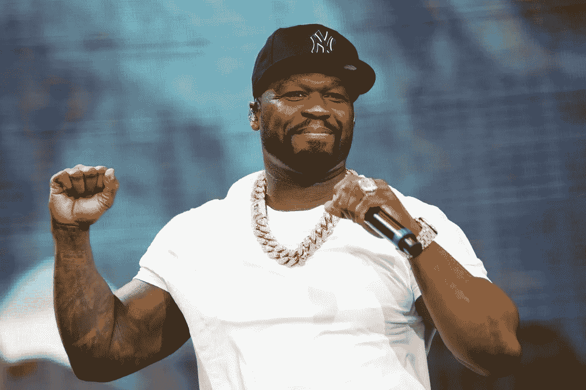
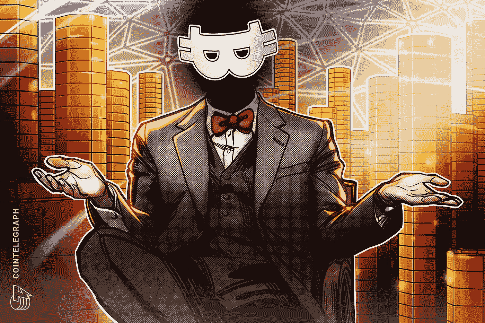

# 2014 年，这位说唱歌手以 4700 万美元的价格卖出了 40 万美元。

> 原文：<https://medium.com/coinmonks/in-2014-50-cent-the-rapper-traded-47m-for-400k-1dd93e245a0e?source=collection_archive---------17----------------------->

He had the foresight, or not quite?

不要做 50 美分做的事。

在世界上所有的事情中，想象一下从一个世界闻名的黑帮说唱歌手那里学到一课，他有远见但错过了一个巨大的机会。

事实证明，50 Cent 早在 2014 年就有远见地接受了比特币。

那是 8 年前。

远早于 BTC 价值 67.6 万美元的历史高点。

早在所有炒作和下跌之前。

2014 年，你可能只知道 5 种硬币的名字。

现在有超过 20000 种加密货币存在。

50 美分和他的比特币是怎么回事？

名人八卦网站 TMZ 报道，50 美分，真名柯蒂斯杰克逊，在同意接受不稳定的数字货币支付他的第五张专辑后，获得了大约 700 比特币。2014 年 6 月《动物雄心》上映时，一个比特币价值 662 美元。”

他后来澄清说，这些 BTC 在到达他的账户之前已经兑换成美元。

这相当于 40 万美元。

所以严格来说，他从未拥有过任何 BTC。

如果他留着这些 BTC，而不是马上卖掉，这些硬币将价值近 1700 万美元。

如果他选择保留比特币而不是现金就好了。

50 Cent, the world-famous rapper, is worth around $40M.

谁会想到你 8 年前做的一个简单的决定值这么多钱？

你得向他的远见致敬。

他是第一批接受比特币交换音乐的知名音乐家之一。

他足够聪明，认识到比特币可能会成为未来的某种东西。

要是他足够相信它，真的能保住 BTC 就好了。

因此，理论上，在纸面上和事后看来，50 美分用 1700 万美元换来了微不足道的 40 万美元。

在比特币峰值 6.75 万美元的时候，这个数字超过了 4720 万美元

哎哟。

No one knows who exactly is Satoshi Nakamoto, the supposed founder of Bitcoin.

这是什么意思？

我们现在全押比特币了吗？

我们现在开始对每个人都说好了吗？

我们要把毕生的积蓄都投入到每一个可能成为比特币杀手的代币上吗？

不完全是。

但是在你喜欢的事情上进行小规模的、有计划的投资确实是值得的，即使你并不完全相信它们。

对事物的大计划有点信心。

脚踏实地，但在可能的情况下，偶尔冒点险。

但是不要因为担心错过机会而自杀。

那将是无止境的。

活下去，在逆境中生存，彻底研究，做明智的选择。

-

你听说过 2014 年的比特币吗？

-

#创业#商业#创业#成长#成功#社交媒体#文化#创业#战略#机遇#风险#btc #eth

> 交易新手？试试[加密交易机器人](/coinmonks/crypto-trading-bot-c2ffce8acb2a)或者[复制交易](/coinmonks/top-10-crypto-copy-trading-platforms-for-beginners-d0c37c7d698c)