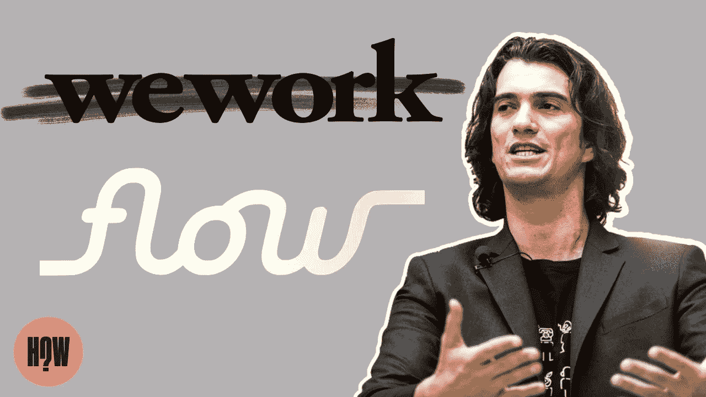
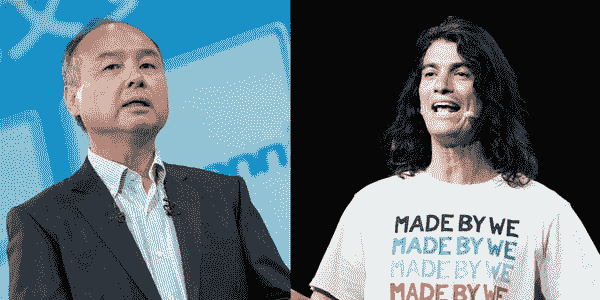

# 在 3 个月内，亚当·诺伊曼筹集了近 5 亿美元。

> 原文：<https://medium.com/coinmonks/in-3-months-adam-neumann-raised-nearly-half-a-billion-dollars-86d9ed228418?source=collection_archive---------27----------------------->

Adam Neumann’s New Startup Flow Gets Backing From Andreessen Horowitz to the tune of $350M, for a startup that doesn’t even have a product or a clear proposition.

如果有谁能最快筹集到最多资金的世界纪录，那将是亚当·诺伊曼先生创造的。

亚当·诺伊曼刚刚打破了熊市期间在最短时间内筹集最多资金的世界纪录。

他是创业史上最伟大的表演者。

当代筹款魔术师的绝对天才。

一个迷人的巫师，仅仅通过制造头条新闻就能让整个创业和技术世界陷入一片火海。

亚当的新创公司 Flow 刚刚从 a16z 获得了 3.5 亿美元。

甚至不要问我“心流”是做什么的，我甚至认为亚当还不太了解它。

我在不同的社交媒体上看到了这么多关于白人男性毒性的帖子，亚当不应该有第二次机会，马克·安德森如何犯了一个严重的错误，甚至 Wework 的失败也被卷入了争论。

我们明白了，记者们讨厌他，每个人都在大肆渲染这个故事并提出质疑。

如此多的尖酸刻薄、争议、混乱和观点满天飞，对健康没有好处。

也许这就是预期的效果？

轰动一时，无论好坏，宣传就是宣传。

**Masayoshi Son, the founder of SoftBank, became one of them in 2017 with an initial outlay of $4.4 billion in a deal valuing WeWork at $20 billion.**

是的，亚当确实因为他的管理不善和所谓的恶作剧搞砸了我们的工作。

他的怪异举动和可疑行为确实上了新闻。

但是不像来自 Theranos 的伊丽莎白·霍姆斯明显犯了罪，他真的做错或违法了吗？

如果是这样，他应该在监狱里。

但他不是。

据我所知，管理不善和判断失误不属于可判入狱的罪行。

但市场肯定会处理好这件事，没有人会相信他会管理另一家公司，对吗？

a16z:拿着我的啤酒。

3.5 亿美元的流量是 a16z 有史以来最大的个人支票。

对于一家成立仅几个月、没有产品、吸引力、收入和客户的公司来说，这一切算什么？

闻起来有点臭。

亚当真的有那么好吗？

好吧，即使他是，他值得一场 3.5 亿美元的赌注吗？

a16Z 是不是看到了我们都没看到的东西？

重复创业者是不是更好的选择？

我曾经认为，对创始人来说，最重要的是信任。

因为别人不信任你怎么会给你钱呢？

WeWork founder Adam Neumann’s Flowcarbon raises $70 million from a16z, token sale.

结果证明我大错特错了。

你不需要信任。

你只需要成为亚当。

让我们缩小一下，看看我们错过了什么。

也许对 a16z 有意义。

Adam 是一位重复创始人，用 Wework 改变了游戏规则，并拥有运营价值数十亿美元的独角兽的经验。

你永远也不会在创始人身上发现这一点。

不管你喜不喜欢，尽管估值从 470 亿美元降至 90 亿美元，但 Wework 仍在生存。

对于 a16z 来说，流量有可能增加 10 倍甚至 50 倍。

当你有价值数十亿的底池时，即使是 1 赔 2 也是你不想错过的。

我怀疑无论亚当对心流做了什么，它都将与加密和区块链紧密相关。

看着吧。

-

亚当·诺依曼(Adam Neumann)新成立的产品前期创业公司(Flow)融资 3.5 亿美元，对你来说有意义吗？

-

# startups # business # startupx # growth # success # social media # culture # web 3 # strategy # adamneumann # Adam # flow # flow carbon # a16z # marcandre essen # eth # BTC # crypto #区块链#亿万

> 交易新手？试试[加密交易机器人](/coinmonks/crypto-trading-bot-c2ffce8acb2a)或者[复制交易](/coinmonks/top-10-crypto-copy-trading-platforms-for-beginners-d0c37c7d698c)