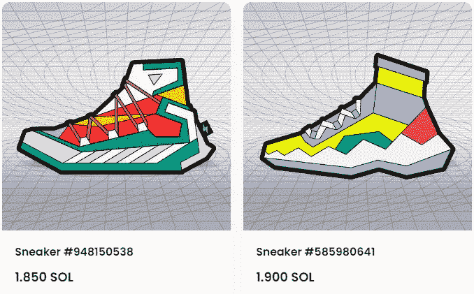

# 熊市中，有的跌了 96%，有的一天暴涨 2200 倍

> 原文：<https://medium.com/coinmonks/in-the-bear-market-some-fell-96-and-some-skyrocketed-2-200-times-in-a-day-ef92f671ad32?source=collection_archive---------22----------------------->

今天加密市场又跌了。曾经炙手可热的明星公链项目 SOL 跌破 10 美元。

SOL 的历史高点是去年 11 月的 259.9 美元，到今天已经跌了 96%。

> 不知道什么时候买卖 cryp，试试[复制交易](http://coincodecap.com/go/bityard)。

受 FTX 雷雨的影响，SOL 持续下跌，加上整个熊市的影响，跌个没完没了。10 美元可能不是最低点，可能更低。

上半年 LUNA thunderbolt 直接从 119 美元跌到几乎为零。虽然 2.0 升级保存了，但是现在维持在 1 美元，留个纪念。

不知道索尔会不会成为第二个露娜？

SOL drops below $10

SOL 持续走低，索拉纳生态也受到影响。

例如，DeGods，一个 NFT 的项目，在一段时间内特别被 FOMO 排除在外。

DeGods 最初的铸造价是 6.3 索尔，楼面价一度涨到 700 多索尔，目前的价格是 480 索尔，总共成交了 280 多万索尔，是索拉纳链条上最顶级的 NFT 项目。

最近的公告说，它将被桥接到 ETH 链上。看来 SOLANA 公链还不足以支撑项目的继续发展。

NFT DeGods on the SOL chain

索拉纳上有过很多辉煌的项目，比如跑鞋 STEPN，几个月从起步到零，完成了一个牛熊。

入场费以前是 1000 多美元，现在鞋子的地板价只有 20 美元，GMT 价格也从 4 美元的高点降到了现在的 0.25，降幅高达 93%。

谁也没想到，一个曾经红极一时的项目，会这么快归零，现在跑着挣钱的人少之又少。

STEPN running shoes floor price 1.85SOL

当然，市场上也有逆势者，比如这位来自日本的 NFT，今天刚推出 Live Like A Cat。

几个小时前白名单铸造价是 0.001 ETH，现在地板价涨到了 2.2 ETH，涨了 2200 倍，一共成交了 408 个 ETH，又是一个圈内神话。

只有极少数人赶上过两千多次，但在低迷熊市，能拉动市场的项目是可以出圈的。

不知道谁会接手，但不妨碍它成为熊市话题。火爆可能是短暂的，但也说明熊市对流量和营销都不差。

NFT that rose 2,200 times in one day

有玩家整理了 2013 年以来 BTC 年初和年末的价格。2022 年，BTC 将下降 64%以上。

2022 年初的价格是 46000 多美元，现在的价格是 16666，下降了三分之二。

如果参考历史数据，明年可能会有一个 4 年周期的回升，但明年年中很有可能会出现大幅下跌，跌破今年最低点 15476，然后迎来下一个牛市周期。

BTC Annual Price List

从比特币挖矿成本来看，挖矿一个 BTC 的成本是 19k，目前市场价是 16k，已经到了停工价。不知道有多少矿工能撑下去。

上周，美国最大的矿业公司 Core Scientific 申请破产。熊市持续的时间越长，关闭的煤矿就会越多。

Bitcoin mining costs and market prices

矿主的成本越来越高，价格越来越低；但对于用户来说，也可能是抄底的机会。

有玩家整理了比特币抄底指数，目前为 0.319，适合抄底。相比年初的 4 万多美元，现在价格确实更低了，前提是我们看好加密市场的未来。

如果明年市场回暖，现在就是入市时机。做时间的朋友很难，会经历起起落落，但如果放在更长的时期来看，这些都只是小波澜。

Bitcoin bargain index

这一次，市场上关于社交媒体的讨论越来越少。没有人知道熊市会持续多久。大家都在观望，等待机会。

有人暂时离开市场，有人转行寻找其他机会，还有很多人对市场失去信心。

未来的不确定性太多，谁也不知道今天留在市场好还是离开好。如果选择留下，真的要好好考虑一下游戏性和运营。

以上只是我个人观点，没有投资建议。我是楚小莲，我正在关注元宇宙和 web3。

> 加入 Coinmonks [电报频道](https://t.me/coincodecap)和 [Youtube 频道](https://www.youtube.com/c/coinmonks/videos)了解加密交易和投资

# 另外，阅读

*   [如何购买 Monero](https://coincodecap.com/buy-monero) | [IDEX 评论](https://coincodecap.com/idex-review) | [BitKan 交易机器人](https://coincodecap.com/bitkan-trading-bot)
*   [CoinDCX 评论](/coinmonks/coindcx-review-8444db3621a2) | [加密保证金交易交易所](https://coincodecap.com/crypto-margin-trading-exchanges)
*   [红狗赌场评论](https://coincodecap.com/red-dog-casino-review) | [Swyftx 评论](https://coincodecap.com/swyftx-review) | [造币厂评论](https://coincodecap.com/coingate-review)
*   [Bookmap 评论](https://coincodecap.com/bookmap-review-2021-best-trading-software) | [美国 5 大最佳加密交易所](https://coincodecap.com/crypto-exchange-usa)