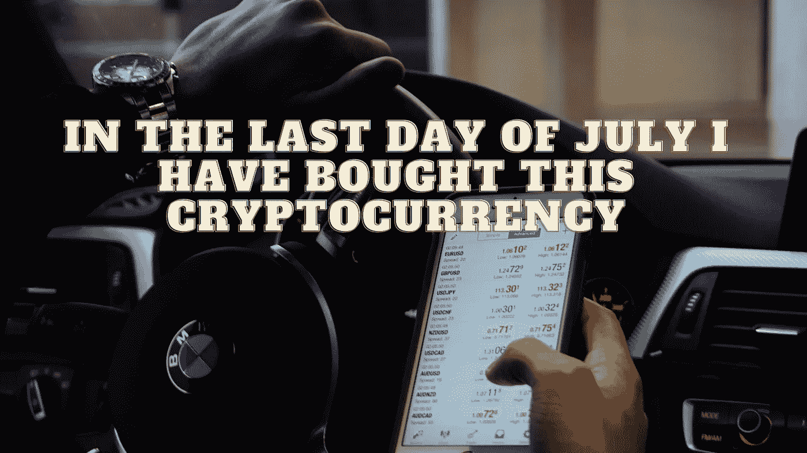

# 在七月的最后一天，我买了这个加密货币。你怎么想呢?

> 原文：<https://medium.com/coinmonks/in-the-last-day-of-july-i-have-bought-this-cryptocurrency-what-do-you-think-4d597981870f?source=collection_archive---------14----------------------->

Source photo Pexels.com

Cardano 被广泛认为是现存最有前途的加密货币之一。当它第一次发行时，它完全是另一种野兽。

卡尔达诺是少数几个检查所有盒子的区块链网络之一，在谈到区块链的未来时没有明显的缺陷，这无法对以太坊或比特币做出说明。